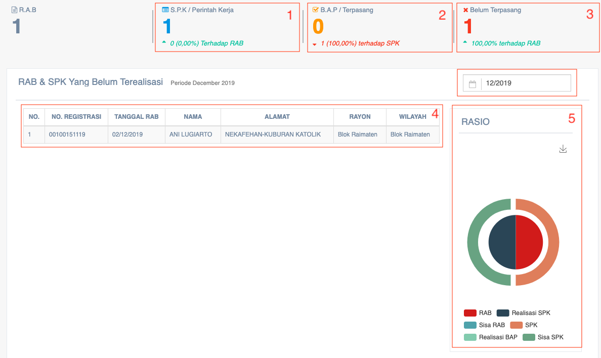
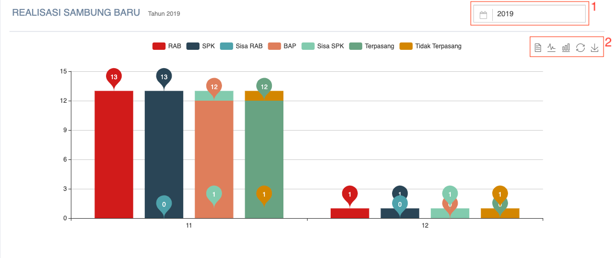

= Menampilkan Laporan SPK dan BAP Realisasi Sambungan Baru

Laporan SPK dan BAP realisasi sambungan baru dapat ditampilkan dengan dengan mengakses fitur *SPK & BAP Samb. Baru* pada _dropdown menu_ *Distribusi* yang termasuk dalam Aspek Pelayanan.

SPK dalam fitur ini adalah singkatan dari Surat Perintah Kerja. Proses pembuatan SPK dimulai dari RAB rincian anggaran biaya. Jika RAB sudah dibuat, maka bagian perencanaan akan menginformasikan bagian distribusi untuk pemasangan.

Bagian distribusi membuat surat perintah kerja SPK, jika sudah dipasang akan dibuatkan BAP (Berita Acara Pemasangan) yang ditanda tangani oleh pelanggan di pelanggan. Pada fitur ini, juga akan ditampilkan RAB & SPK yang belum terealisasi seperti gambar di bawah ini. 

Selain tabel RAB & SPK yang belum terealisasi, fitur ini juga menampilkan halaman realisasi sambung baru yang bisa diubah ke bentuk teks, diagram garis, dan batang. Lebih jelasnya, bisa dilihat melalui gambar di bawah ini. 

1. Kolom *Range Tahun* digunakan untuk memilih data rentang waktu (periode tahun) dari data yang akan ditampilkan
2. Ikon *Text* digunakan untuk menampilkan data realisasi sambung baru dalam bentuk tabel informasi berisi teks
3. Ikon *Line* digunakan untuk menampilkan data realisasi sambung baru dalam bentuk tabel informasi berisi diagram garis
4. Ikon *Bar* data realisasi sambung baru dalam bentuk tabel informasi berisi diagram batang
5. Ikon *Restore* digunakan untuk mengembalikan grafik realisasi sambung baru seperti sebelumnya
6. Ikon *Save* digunakan untuk menyimpan data realisasi sambung baru yang telah dimasukkan ke dalam sistem