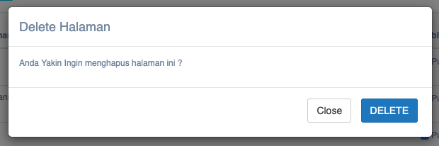

= Mengelola Informasi Web PDAM

Informasi web PDAM dapat diatur dengan dengan mengakses fitur *Konten Web* pada _dropdown menu_ *Info Pelanggan* yang termasuk dalam Aspek Pelayanan. Berikut adalah gambar tampilan fitur konten web beserta keterangannya.

== Dashboard

*Dashboard* digunakan untuk menampilkan halaman awal yang akan ditampilkan pada halaman web utama.

== *Menu*

Pada Menu terdapat 2 pilihan fitur *Urutan Menu* dan *Konten Menu*.

=== *Urutan Menu*

Urutan Menu digunakan untuk mengatur tampilan menu web

Berikut langkah - langkah untuk mengatur tampilan menu pada Web:

1. Pada *Daftar Menu*, pilih halaman yang akan diatur tampilan menunya
2. Kemudian pada kolom *Selected Menu*, Anda bisa mengatur letak menu yang akan ditampilkan di menu web dengan cara _drag_ and _drop_ pilihan menu
3. Setelah sudah diatur untuk tampilan tata letak menu, klik tombol *Simpan*.

=== *Konten Menu*

Pada *Konten Menu*, terdapat beberapa fitur beserta penjelasannya.

1. Tombol *Tambah Halaman* digunakan untuk menambah halaman menu
2. Kolom *Search* digunakan sebagai pencarian konten yang dimaksud
3. Kolom *Publish* digunakan untuk merilis konten
4. Terdapat 3 pilihan pada kolom _Action_, yaitu *Edit, Delete,* dan *Home Builder*

.*Tambah Halaman*
[%collapsible]
====
Digunakan untuk menambah halaman baru. Berikut langkah - langkah untuk menambahkan Konten Menu:

1. Klik tombol *Tambah Halaman*
2. Pada Form Halaman tambahkan judul, pilih gambar, deskripsi, dan centang kolom publish halaman pada web jika ingin menampilkan deskripsi pada halaman web
+

3. Kemudian pada form SEO, masukkan URL Link Akses, Meta Title, Meta Keyword, dan Meta Deskripsi
+

4. Lalu klik tombol *Simpan* pada form Informasi Halaman.
+

====

.*Edit*
[%collapsible]
====
Digunakan untuk mengubah data setiap halaman. Berikut langkah - langkah untuk melakukan perubahan pada halaman web

1. Klik tombol *Edit* pada kolom _action_
+

2. Kemudian lakukan perubahan judul, ganti gambar, ubah deskripsi, dan centang publish halaman pada web jika ingin ditampilkan pada halaman web
3. Pada form SEO ubah URL Link, Meta Title, Meta Keyword, dan Meta Deskripsi
4. Lalu klik tombol *Simpan* pada form Informasi Halaman.
====

.*Delete*
[%collapsible]
====
Digunakan untuk menghapus data halaman. Berikut langkah - langkah untuk melakukan hapus halaman pada web:

1. Pilih halaman yang akan dihapus pada daftar Judul Halaman
2. Kemudian klik tombol *Delete* pada kolom _Action_
3. Maka akan muncul pop up konfirmasi, kemudian pilih tombol *Delete*.
+

====

== Slider
Slider digunakan untuk menampilkan dan mengedit halaman konten.

image::../images-dasbor/dasbor-pelayanan-informasi-web-pdam-9.png[align="center"]

Pada fitur Slider, Anda bisa melakukan *Tambah Slider, Edit,* dan *Delete*.

1. *Tambah Slider*
+
Digunakan untuk menambahkan slider baru. Semua _field_ pada Form Slider seperti Judul dan Gambar harus diisi. Untuk _field_ Deskripsi Singkat dan ceklis Publish Slider pada web optional untuk diisi. Jika _field_ sudah diisi, maka langkah berikutnya adalah klik tombol *Simpan*.

2. *Edit*
+
Digunakan untuk mengubah data slider. Semua _field_ pada form slider dapat diubah. Untuk judul, deskripsi singkat, dan ceklis publish slider pada web bersifat optional untuk diisi.
+
3. *Hapus*
+
Digunakan untuk menghapus data slider.

== Post Artikel

Post Artikel digunakan untuk menambahkan artikel pada website.

Pada fitur Post Artikel, Anda bisa melakukan *Tambah Artikel, Edit,* dan *Delete*.

1. *Tambah Artikel*
+
Digunakan untuk menambahkan artikel pada web. Semua _field_ pada form artikel seperti judul artikel, gambar, kategori, dan deskripsi harus diisi. Untuk ceklis Publish Halaman pada web boleh diisi boleh tidak.
+
Sedangkan _field_ pada Form SEO URL link tidak wajib diisi. Namun _field_ meta title, meta keyword, dan meta deskripsi wajib diisi. Setelah semua _field_ diisi, pada form informasi halaman dapat di klik tombol *Simpan*.

2. *Edit*
+
Digunakan untuk mengubah artikel pada halaman web. Semua _field_ pada form artikel seperti judul, gambar, kategori, deskripsi singkat dapat diubah.
+
Sedangkan ceklis publish pada web bersifat optional untuk diubah. Untuk semua _field_ form SEO URL link tidak wajib untuk diisi, sedangkan _field_ meta _title_, meta _keyword_, dan meta deskripsi dapat diubah.

3. *Delete*
+
Digunakan untuk menghapus artikel.

== Galeri Photo

Galeri Photo digunakan untuk menyimpan gambar kegiatan yang ada di PDAM.

Pada fitur Galeri Photo, Anda bisa melakukan *Tambah Galeri, Edit,* dan *Delete*. Berikut langkah - langkah untuk menambahkan galeri:

1. *Tambah Galeri*
+
Digunakan untuk menambahkan galeri foto pada web. Semua _field_ pada form galeri seperti judul galeri, tanggal foto, dan gambar harus diisi

2. *Edit*
+
Digunakan untuk mengubah data pada menu galeri foto. Semua _field_ seperti judul, tanggal foto, dan gambar dapat diubah

3. *Hapus*
+
Digunakan untuk menghapus data galeri foto

== Data Perusahaan

Data Perusahaan digunakan untuk menampilkan seluruh data perusahan yang menjadi partner dan mitra dari PDAM.

Pada menu Data Perusahaan terdapat 4 fitur, yaitu *Profile, Pegawai Tanda Tangan, Mitra,* dan *Unit*.

1. *Profile*
+
Digunakan untuk menampilkan profil perusahaan.
+

+
Pada fitur profile, Anda dapat sekaligus mengubah data profile. Semua _field_ pada form profile perusahaan seperti nama perusahaan, alamat perusahaan, logo _image_, nomor telepon, nomor fax, koordinat latitude, email, logo kabupaten/kota, motto, nama kabupaten/kota, koordinat longitude, alamat web/situs, facebook, dan instagram dapat diubah.

2. *Pegawai Tanda Tangan*
+
Digunakan untuk menampilkan data pegawai seperti nama pegawai, jabatan, dan nomor pegawai.
+
image::../images-dasbor/dasbor-pelayanan-informasi-web-pdam-13.png[align="center"]
+
Pada fitur Pegawai Tanda Tangan, Anda dapat melakukan *Tambah Staff TTD, Edit,* dan *Delete*.

3. *Tambah Staff TTD*
+
Digunakan untuk menambahkan data pegawai. Semua _field_ pada form pegawai tanda tangan seperti nama pegawai, jabatan pegawai, dan nomor pegawai wajib diisi. Jika salah satu _field_ kosong, maka data tanda tangan pegawai tidak berhasil disimpan.
+
. *Edit*
+
Digunakan untuk mengubah data pegawai. Semua _field_ pada data pegawai dapat diubah.
+
. *Delete*
+
Digunakan untuk menghapus data pegawai.

4. *Mitra*
+
Digunakan untuk menampilkan daftar mitra PDAM
+

+
Pada fitur Mitra, Anda dapat melakukan *Tambah Mitra, Edit,* dan *Delete*.
+
. *Tambah Mitra*
+
Digunakan untuk menambahkan mitra baru PDAM. Semua _field_ pada form mitra seperti nama dan logo mitra harus diisi. Jika salah satu tidak diisi maka data tidak berhasil disimpan.
+
. *Edit*
+
Digunakan untuk mengubah data mitra PDAM. Semua _field_ pada form mitra seperti nama dan logo mitra bisa diubah.
+
. *Delete*
+
Digunakan untuk menghapus data mitra PDAM.

5. *Unit*
+
Digunakan untuk menampilkan daftar unit/cabang PDAM
+

+
Pada fitur Unit, Anda dapat melakukan Tambah *Unit, Edit,* dan *Delete*.
+
. *Tambah Unit*
+
Digunakan untuk menambahkan unit/cabang pada daftar PDAM. Semua _field_ pada form unit seperti nama unit, email unit, telp unit, fax unit, alamat unit, koordinate latitude, dan koordinat longitude harus diisi. Jika salah satu _field_ tidak diisi maka data unit tidak berhasil disimpan
+
. *Edit*
+
Digunakan untuk mengubah data unit/cabang pada daftar PDAM. Semua _field_ pada form unit seperti nama unit, mail unit, telp unit, fax unit, alamat unit, koordinate latitude, dan koordinat longitude dapat diubah.
+
. *Delete*
+
Digunakan untuk menghapus data unit/cabang pada daftar PDAM.

6. *Pengaturan*
+
Pada menu pengaturan terdapat 3 fitur, yaitu *Web Setting, Master Media,* dan *Tata Letak TTD*
+
. *Web Setting*
+

+
Digunakan untuk mengatur tata letak tampilan halaman website.
+
Pada fitur *Web Setting*, Anda dapat mengatur zona waktu, tata letak galeri, tampilan website (seperti ukuran tampilan web dan warna utama web), mengaktifkan tampilan _underconstruction_ ketika website sedang dalam proses _deploy_, dan menampilkan _pop up_.
+
. *Master Media*
+

+
Digunakan untuk menampilkan seluruh gambar media utama pada halaman web.
+
Pada fitur master media, Anda dapat melakukan *Tambah Media, View,* dan *Hapus*.
+
[arabic]
.. *Tambah Media*
+
Digunakan untuk menambahkan foto/media baru pada halaman web. Semua _field_ pada form media seperti media title dan media image harus diisi. Jika tidak diisi maka data media tidak dapat disimpan.
+
.. *View*
+
Digunakan untuk melihat tampilan foto/media dalam tampilan yang lebih besar.
+
.. *Hapus*
+
Digunakan untuk menghapus foto/media pada daftar master media.
+
. *Tata Letak TTD*
+
Digunakan untuk menampilkan daftar tata letak tanda tangan. Pada fitur tata letak ttd, anda dapat melakukan *Tambah Tata Letak Tanda Tangan, Edit,* dan *Delete*.
+
[arabic]
.. *Tambah Tata Letak Tanda Tangan*
+

+
Digunakan untuk menambahkan tanda tangan baru dan mengatur tata letak tanda tangan di baris ke berapa. Semua _field_ seperti Judul TTD dan form Baris harus diisi. Jika salah satu _field_ tidak diisi maka TTD tidak akan berhasil disimpan.
+
.. *Edit*
+
Digunakan untuk mengubah tata letak tanda tangan.
+
.. *Delete*
Digunakan untuk menghapus tanda tangan.