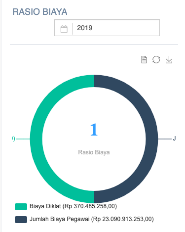

= Menampilkan Data Biaya Pendidikan dan Diklat Pegawai

Data biaya pendidikan dan diklat pegawai dapat diakses melalui _dropdown_ *Kinerja SDM*, kemudian klik pada pilihan *Ratio biaya diklat*. Rasio biaya pendidikan dan pelatihan ini digunakan untuk mengukur kepedulian perusahaan untuk mendanai dalam hal peningkatan kemampuan pegawai. Indikator ini untuk mengetahui sejauh mana manajemen PDAM mempunyai apresiasi dalam mengupayakan pegawainya agar kompeten. Rasio biaya diklat memiliki bobot 0.04.

== Biaya Diklat terhadap Biaya Pegawai

== Standar Penilaian Ratio Biaya

|===
|Standar |Nilai
|> 10 (%)|5
|7.5 - < 10 (%)|4
|5 - < 7.5 (%)|3
|2.5 - < 5 (%)|2
|< 2.5 (%)|1
|===
