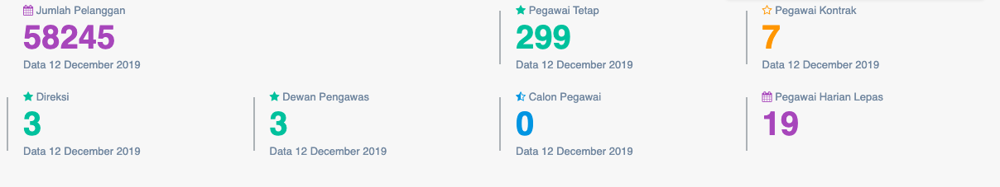
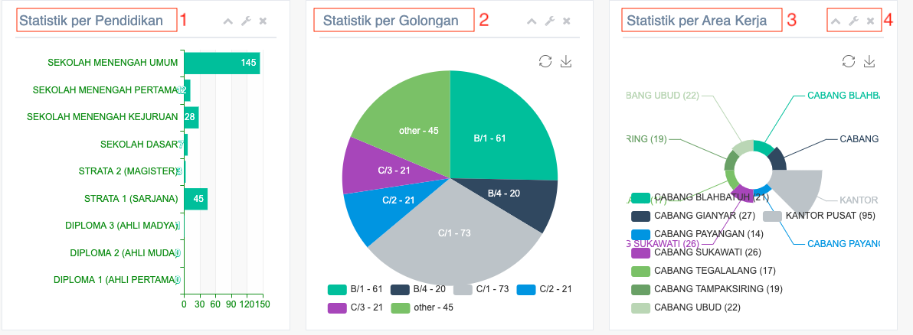

= Menampilkan Data Efisiensi Kinerja Pegawai

Fitur pegawai menampilkan rasio yang didapatkan dari indikator kinerja, yang dapat diakses melalui _dropdown_ *Kinerja SDM*, kemudian klik pada pilihan *Pegawai*. Indikator ini digunakan untuk mengukur efisiensi pegawai PDAM terhadap pelanggan.

Rasio pegawai terhadap 1000 pelanggan, untuk mengukur efisiensi penggunaan tenaga kerja dalam melayani setiap 1000 pelanggan. Rasio jumlah memiliki bobot 0.07.

== Rasio jumlah pegawai/1000 pelanggan 

== Standar Penilaian Pegawai

|===
|  *Standar Kota*  | *Nilai* | *Standar Kabupaten* | *Nilai*
|< 6 orang   | 5     |     < 8 orang     | 5    
|> 6 - 8 orang | 4     |   > 8 - 10 orang  | 4
|> 8 - 10 orang | 3     |  > 10 - 12 orang  | 3
|> 10 -12 orang | 2     |  > 12 - 14 orang  | 2
|> 12 orang   | 1     |     > 14 orang    | 1
|===

Berdasarkan data yang telah diperoleh, berikutnya halaman akan menampilkan gambar statistik per pendidikan, golongan, dan area kerja seperti yang bisa dilihat di bawah ini. 

