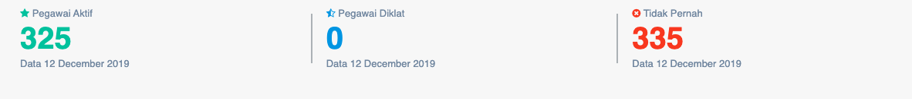
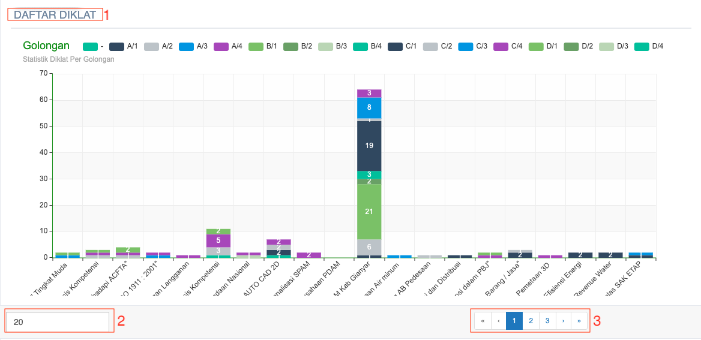

= Menampilkan Data Rasio Diklat Pegawai

Fitur ini menampilkan rasio diklat yang didapatkan dari indikator kinerja, yang dapat diakses melalui _dropdown_ *Kinerja SDM*, kemudian klik pada pilihan *Ratio Diklat*. Selain itu, data lain yang ditampilkan meliputi pegawai aktif, pegawai diklat, dan tidak pernah. 

Ratio pendidikan dan pelatihan pegawai, mengukur kepedulian perusahaan untuk meningkatkan kompetensi pegawai. Indikator ini digunakan untuk menilai tingkat kompetensi pegawai PDAM. Rasio Diklat pegawai jumlah memiliki bobot 0.04.

|===
|*Standar* |*Nilai*
|> 80 (%)| 5
|60 - < 80 (%)| 4
|40 - < 60 (%)| 3
|20 - < 40 (%)|2
|< 20 (%)|1
|===

Selain menampilkan gambar rasio diklat, fitur ini juga menampilkan daftar diklat dalam bentuk grafik. Berikut adalah gambar tampilan yang dimaksud beserta keterangannya. 

1. Daftar diklat menampilkan statistik diklat berdasarkan golongan 
2. *Data range* bisa diatur sesuai dengan interval yang diinginkan 
3. Tombol *page* untuk menampilkan statistik daftar diklat di periode sebelumnya
