= Menu Modul Dasbor

1. Aspek Keuangan
+
.Menu Billing & Loket
[%collapsible]
====
Menu *Billing & Loket* digunakan untuk memantau secara real time penerimaan dan pendapatan rekening air dan non air. Menu Billing & Loket memiliki beberapa fitur, antara lain: 

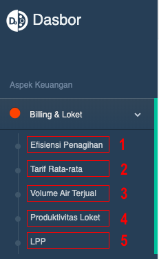

1. Efisiensi Penagihan
2. Tarif Rata-Rata
3. Volume Air Terjual
4. Poduktivitas Loket
5. LPP
====
+
.Menu Akuntansi
[%collapsible]
====
Menu *Akuntansi* digunakan untuk memantau secara _real time_ pembukuan dan laporan rekapitulasi secara periodik, Menu ini memiliki beberapa fitur, antara lain: 

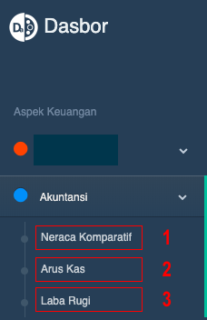

1. Neraca Komparatif
2. Arus Kas
3. Laba Rugi
====
+
.Menu Kinerja Keuangan
[%collapsible]
====
Menu *kinerja keuangan* digunakan untuk memantau dan mengecek data, antara lain: 

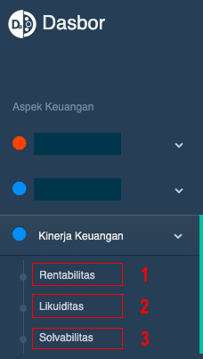

1. Rentabilitas
2. Likuiditas
3. Solvabilitas
====

2. Aspek Pelayanan
+
.Menu Info Pelanggan
[%collapsible]
====
Menu *Info Pelanggan* termasuk dalam kategori aspek pelayanan, terdiri dari 3 fitur utama, meliputi: 

1. Info Tagihan
2. Pengaduan
3. Konten Web
====
+
.Menu Bacameter
[%collapsible]
====
Menu *Bacameter* digunakan untuk memantau, melihat, atau mengecek produktivitas baca dan petugas secara _real time_ 

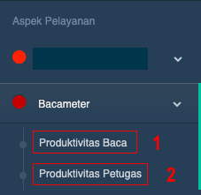
====
+
.Menu Hublang
[%collapsible]
====
Salah satu menu yang terdapat di kategori aspek pelayanan adalah *hublang*, singkatan dari (Hubungan Pelanggan) yang digunakan untuk memantau kinerja layanan dalam hal tingkat penyelesaian aduan dan pertumbuhan pelanggan

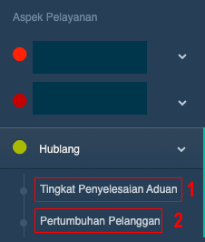
====
+
.Menu Perencanaan
[%collapsible]
====
Menu *Perencanaan* terdiri dari 2 fitur utama, yaitu RAB & realisasi dan SPK evaluasi & pengawasan SR.

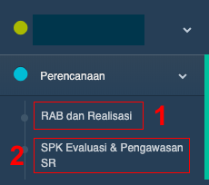
====
+
.Menu Distribusi
[%collapsible]
====
Menu *Distribusi* terdiri dari 2 fitur utama yaitu SPK & BAP Sambungan Baru dan SPK & BAP Pemeliharaan. 2 fitur tersebut muncul sesuai dengan kebutuhan menu distribusi setiap wilayah.

Masing-masing fitur pada menu distribusi akan menampilkan data sesuai dengan waktu yang dipilih. Adapun tampilannya berbentuk tabel, rasio, dan grafik (diagram batang).

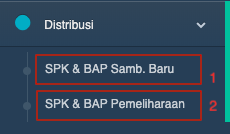
====
+
.Menu Gudang
[%collapsible]
====
Menu *Gudang* digunakan untuk pencatatan stok barang, baik yang masuk maupun keluar gudang. Hanya ada 1 fitur dalam menu ini yaitu stok barang.

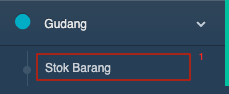
====

3. Aspek Operasional
+
.Menu Produksi Air & NRW
[%collapsible]
====
Menu *Produksi Qir & NRW* hanya terdiri dari 1 fitur saja, yaitu beban pemakaian bahan instalasi dan kimia. NRW adalah singkatan dari _non revenue water_.  Dalam menu ini , terdapat 1 fitur yang diberi nama beban pemakaian bahan instalasi dan kimia

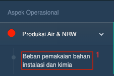
====
+
.Menu Kinerja Operasional
[%collapsible]
====
Menu *Kinerja Operasional* terdiri dari 5 fitur utama, meliputi efisiensi produksi, kehilangan air, jam operasi layanan, tekanan air pada sambungan pelanggan, dan pergantian/kalibrasi meter.

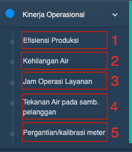
====

4. Aspek Sumber Daya Manusia
+
.Menu Kinerja SDM
[%collapsible]
====
Menu *Kinerja SDM* termasuk dalam kategori aspek Sumber Daya Manusia. Terdiri dari 3 fitur utama, meliputi pegawai, ratio diklat, dan rasio biaya diklat

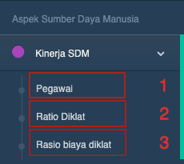
====

5. Manipulasi Data
+
.Menu Data Aspek
[%collapsible]
====
Menu *Data Aspek* terdiri dari 3 fitur, meliputi data kependudukan, data kelengkapan aspek, dan data user. Menu data aspek termasuk dalam layanan manipulasi data.

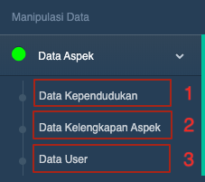
====