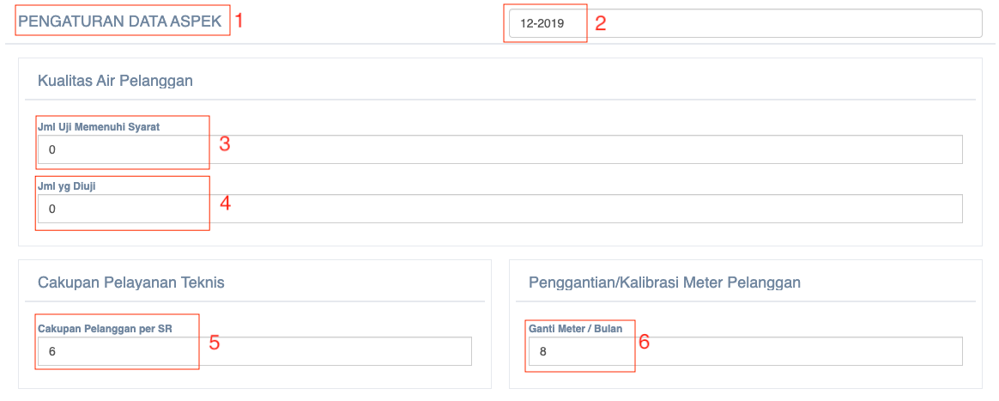
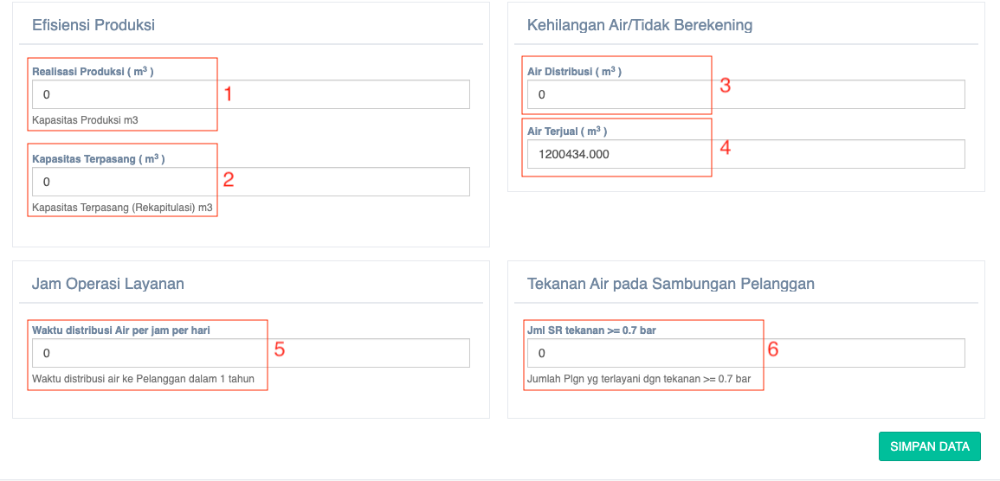

= Menampilkan dan Mengubah Kelengkapan Data Aspek

Fitur ini dapat diakses dengan klik pada _dropdown_ *Data Aspek* kemudian klik pada pilihan *Data Kelengkapan Aspek*. Berikut adalah gambar tampilan data kelengkapan aspek beserta langkah-langkah untuk mengubah datanya.

1. *Tanggal* dapat diubah pada kolom yang telah disediakan
2. *Kualitas air pelanggan* dilihat berdasarkan *jumlah uji memenuhi syarat* dan *jumlah yang diuji*
3. *Jumlah yang diuji* diisi sesuai dengan data yang sebenarnya
4. *Cakupan pelayanan teknis* diisi dengan *data cakupan pelanggan per SR*
5. User dapat mengubah atau mengganti *kalibrasi meter pelanggan* pada kolom yang tersedia 

Selanjutnya, bagian yang harus diisi adalah efisiensi produksi, kehilangan air/tidak berekening, jam operasi layanan, dan tekanan air pada sambungan pelanggan. Lebih detailnya bisa dilihat melalui gambar dan penjelasan di bawah ini.

1. Pada bagian efisiensi produk, ada 2 data yang harus diisi, yaitu *realisasi produksi (m3)* dan *kapasitas terpasang (m3)*
2. *Kapasitas terpasang* diisi dengan *data rekapitulasi m3*
3. Pada bagian *air/tidak berekening*, ada 2 data yang harus diisi, yaitu *air distribusi (m3)* dan *air terjual (m3)*
4. Pastikan untuk mengisi kolom *air terjual (m3)* sesuai dengan data nyata, jangan dibiarkan kosong (0)
5. Kolom *waktu distribusi air per jam per hari*  diisi dengan waktu distribusi air ke pelanggan dalam kurun waktu 1 tahun
6. Pada bagian *tekanan air pada sambungan pelanggan*, isi kolom Jumlah SR tekanan >= 0.7 bar
7. Tekan tombol *SIMPAN DATA* untuk menyimpan perubahan data yang telah dilakukan.