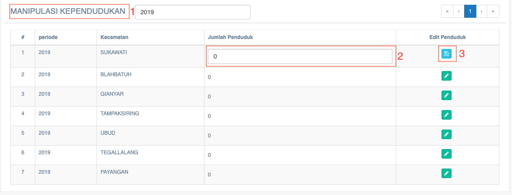

= Mengelola Data Kependudukan

Fitur ini dapat diakses dengan klik pada _dropdown_ *Data Aspek* kemudian klik pada pilihan *Data Kependudukan*. Berikut adalah gambar tampilan data kependudukan beserta keterangannya.

1. Pada tabel *manipulasi kependudukan*, informasi yang tersaji berupa nomor, periode, kecamatan, jumlah penduduk, dan edit penduduk
2. *Jumlah penduduk* diisi sesuai dengan data yang ada
3. *Data kependudukan* bisa diubah, caranya dengan menekan tombol *edit* di kolom Edit Penduduk
