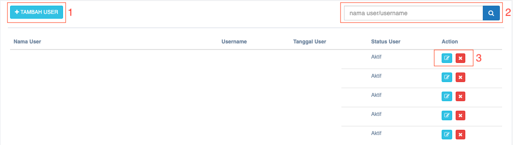
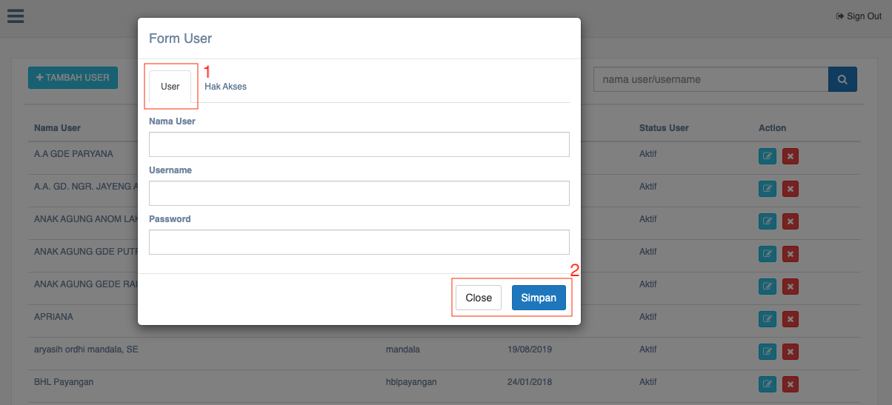
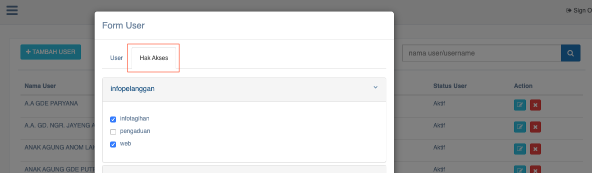

= Mengelola Data User

Fitur ini dapat diakses dengan klik pada _dropdown_ *Data Aspek* kemudian klik pada pilihan *Data User*. Admin dapat menambahkan dan mengedit data user dengan mudah. Berikut adalah gambar tampilan data user beserta langkah-langkah untuk mengelolanya.

1. Tombol *tambah data* digunakan untuk menambahkan data user baru
2. Pencarian nama/username lebih mudah jika diketikkan melalui kolom yang tersedia seperti poin no. 2 pada gambar di atas
3. Tombol *edit* digunakan untuk mengubah data user yang sudah dimasukkan, meliputi nama user, username, tanggal user, dan status user
4. Tombol *close* digunakan untuk menutup _action_ edit tanpa proses penyimpanan data

Setelah memahami fungsi fitur secara mendetail, berikut adalah langkah-langkah yang dibutuhkan untuk menambahkan data user. 

1. Pertama, klik tombol *tambah data* 
2. Selanjutnya, akan muncul _pop up form_ user
3. Pilih section user untuk diisi sesuai dengan informasi yang dibutuhkan, meliputi *nama user*, *username*, dan *password* 
4. Tekan tombol *close* untuk menutup pop up form user (tanpa proses penyimpanan) 
5. Tekan tombol *simpan* untuk menyimpan data yang sudah diisi

Setelah mengisi section user, selanjutnya pilih section hak akses dan isilah sesuai dengan informasi yang dibutuhkan, seperti yang bisa dilihat melalui gambar di bawah ini. 

1. Setelah _pop up form_ user muncul, pilih _section_ *hak akses*
2. Selanjutnya, layar akan menampilkan daftar menu pada sistem _Dashboard_
3. Pilih menu yang dibutuhkan, lalu beri tanda *ceklis* sebagai penanda *hak akses* yang akan diberikan. Misalnya, di menu *infopelanggan*, hak akses yang dipilih adalah *infotagihan* dan *web*