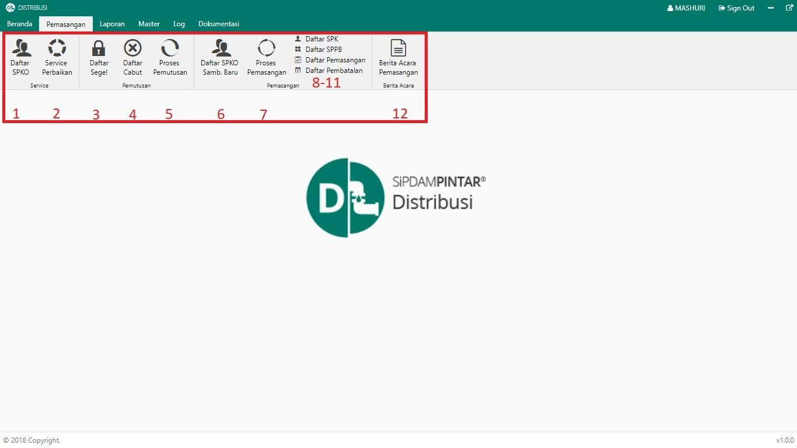
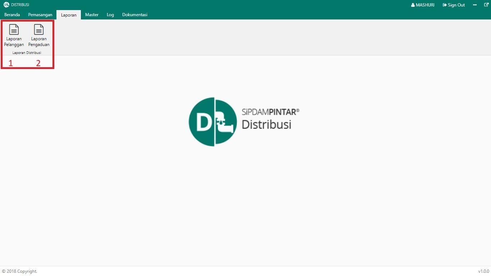
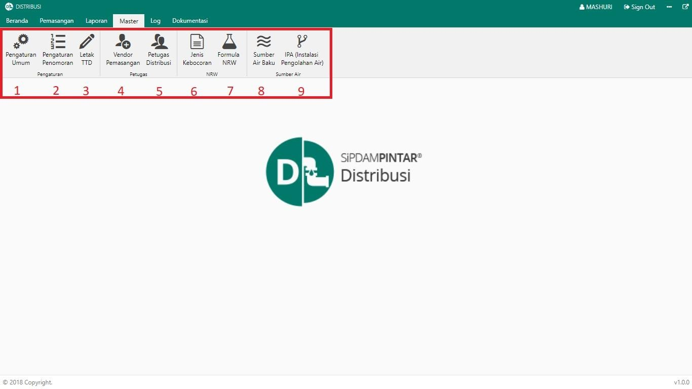

= Menu Modul Distribusi (Web Version)

Dalam modul ini terdapat tiga (3) menu utama, yaitu:

.*Menu Pemasangan*
[%collapsible]
====

Berikut penjelasan ikon pada Menu Pemasangan :

1. Ikon *Daftar SPKO* digunakan untuk menampilkan data pengaduan service yang selanjutnya akan dibuatkan Surat Perintah Kerja (SPK) untuk dikerjakan di lapangan
2. Ikon *Service Perbaikan* menyedikan daftar pengaduan service/perbaikan yang siap dilakukan ke lapangan berdasarkan SPK yang telah dibuat sebelumnya. Pada menu ini, petugas juga dapat menambahkan permintaan barang ke gudang serta foto instalasi, rumah, dan meteran pelanggan yang di-_service_ beserta tanggal _service_, sebagai bahan untuk pembuatan BA (Berita Acara).
3. Ikon *Daftar Segel* digunakan untuk menampilkan data pengaduan segel karena yang selanjutnya akan dibuatkan Surat Perintah Kerja (SPK) untuk dikerjakan di lapangan.
4. Ikon *Daftar Cabut* digunakan untuk menampilkan data pengaduan cabut yang selanjutnya akan dibuatkan Surat Perintah Kerja (SPK) untuk dikerjakan di lapangan.
5. Ikon *Proses Pemutusan* menyediakan daftar pengaduan segel dan tutup yang siap dilakukan service ke lapangan berdasarkan SPK yang telah dibuat sebelumnya. Pada menu ini juga bisa menambahkan permintaan barang ke gudang serta foto instalasi, rumah dan meteran pelanggan yang di service serta tanggal, sebagai bahan untuk membuat Berita Acara (BA)
6. Ikon *Daftar SPKO Sambungan Baru* digunakan untuk menampilkan data pengaduan sambungan baru yang selanjutnya akan dibuatkan Surat Perintah Kerja (SPK) untuk dikerjakan di lapangan.
7. Ikon *Proses Pemasangan* menyediakan daftar sambungan baru yang siap dilakukan _service_ ke lapangan berdasarkan SPK yang telah dibuat sebelumnya. Pada menu ini, petugas juga dapat menambahkan rumah dan meteran pelanggan yang di-_service_ serta tanggal, sebagai bahan untuk membuat Berita Acara (BA)
8. Ikon *Daftar SPK* digunakan untuk menampilkan daftar SPK atas pengaduan yang telah dibuat sebelumnya serta pada menu ini dapat dilakukan cetak ulang
9. Ikon *Daftar SPPB* digunakan untuk menampilkan daftar SPPB (Surat Perintah Pengambilan Barang) atas pengaduan yang telah dibuat sebelumnya serta pada menu ini dapat dilakukan cetak ulang
10. Ikon *Daftar Pemasangan* digunakan untuk menampilkan daftar pengaduan yang telah dilakukan pemasangan, namun belum dibuatkan Berita Acara (BA)
11. Ikon *Daftar Pembatalan* digunakan untuk menampilkan daftar pengaduan yang dibatalkan baik service, segel, cabut, pindah WM maupun pasang baru
12. Ikon *Berita Acara Pemasangan* digunakan untuk menampilkan daftar pengaduan yang telah dibuatkan BA sebelumnya
====

.*Menu Laporan*
[%collapsible]
====

Menu *Laporan* digunakan untuk menampilkan Laporan Distribusi PDAM. Pada menu ini, terdapat dua (2) kategori laporan yang dapat ditampilkan, yaitu Laporan Pelanggan dan Laporan Pengaduan.
====

.*Menu Master*
[%collapsible]
====

1. Ikon *Pengaturan Umum*  digunakan untuk melakukan pengaturan secara general
2. Ikon *Pengaturan Nomor* digunakan untuk pengaturan nomor pada Menu Master
3. Ikon *Letak Tanda Tangan* digunakan untuk mengatur tata letak TTD
4. Ikon *Vendor Pemasangan* digunakan untuk mengatur data vendor pemasangan
5. Ikon *Petugas Distribusi* digunakan untuk mengatur data petugas pada Bagian Distribusi yang disesuaikan berdasarkan cabangnya masing-masing
6. Ikon *Jenis Kebocoran* digunakan untuk mengatur data jenis kebocoran
7. Ikon *Formula NRW* digunakan untuk mengatur data formula _Non-Revenue Water (NRW)_
8. Ikon *Sumber Air* Baku digunakan untuk mengatur data lokasi sumber air baku yang digunakan oleh PDAM.
====