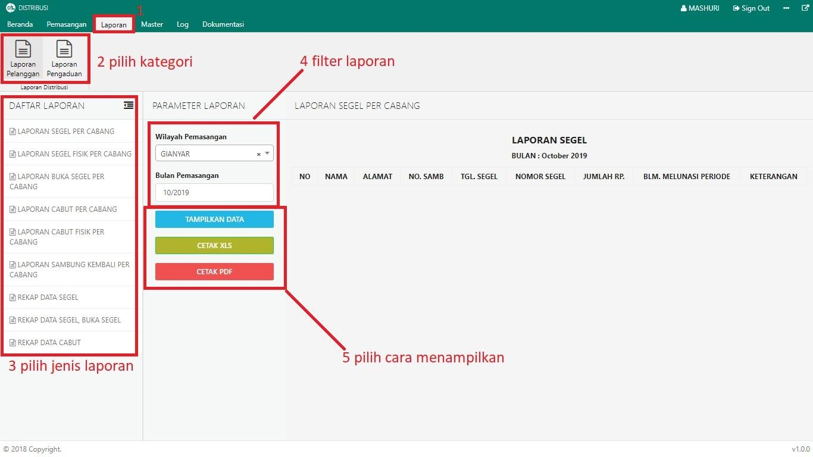

= Menampilkan Laporan

Terdapat dua kategori laporan yang disediakan oleh Modul Distribusi, yaitu Laporan Pelanggan dan Laporan Pengaduan. Untuk menampilkan masing-masing laporan, ikuti langkah-langkah berikut:

1. Pilih menu *Laporan*
2. Selanjutnya pilih kategori laporan
3. Pilih jenis laporan yang ingin Anda tampilkan
4. Masukan filter laporan
5. Selanjutnya, Anda dapat menampilkan data secara langsung dengan klik tombol *Tampilkan Data* atau Anda dapat mempresentasikan data tersebut ke dalam format Excel maupun PDF.