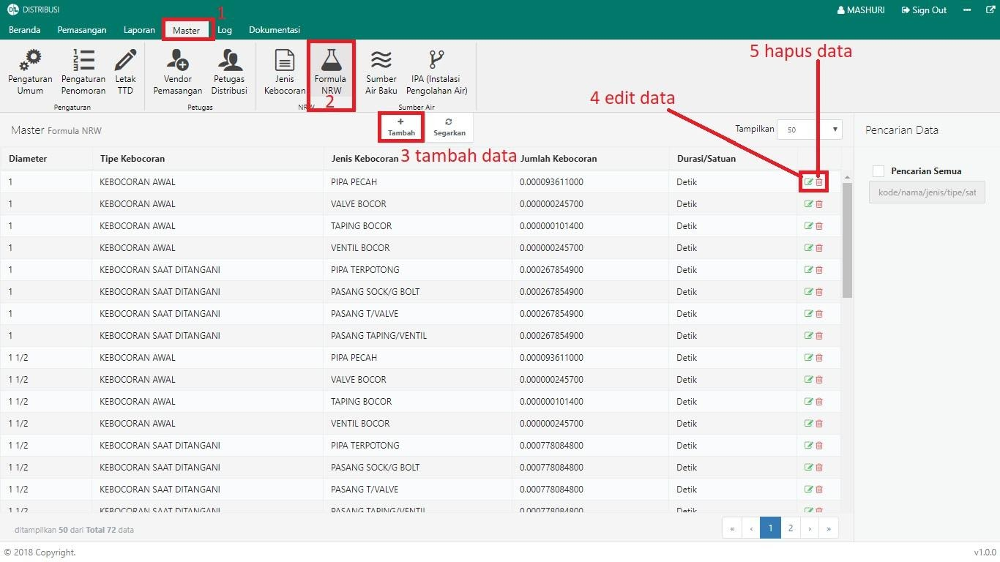
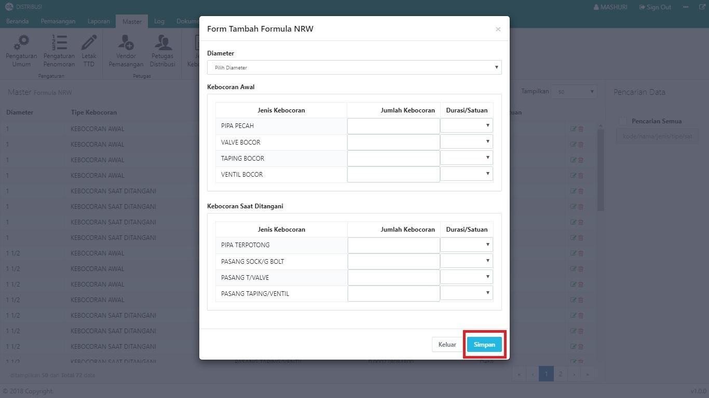
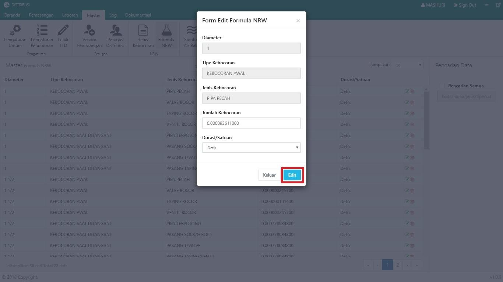
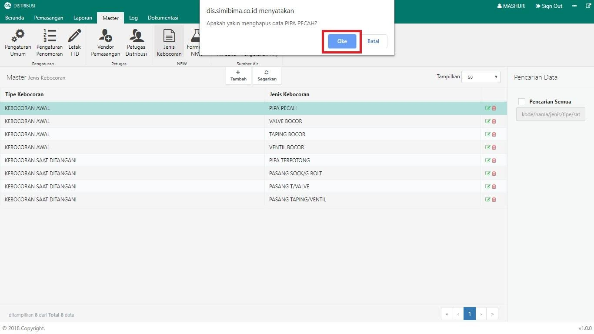

= Mengelola Data Formula NRW

NRW adalah kepenjangan dari _Non Revenue Water_ yang dapat juga disebut Air Tak berekening (ATR). NRW menunjukkan perbedaan jumlah air yang masuk ke sistem distribusi dengan air yang tercetak di rekening. Untuk mengelola formula datanya, ikuti langkah-langkah berikut:

1. Pilih menu *Master*
2. Klik pada ikon *Formula NRW*
3. Untuk menambahkan data formula NRW, klik tombol *Tambah* seperti poin 3 pada gambar di atas. Isi _form_ yang disediakan, kemudian klik tombol *Simpan* seperti pada gambar dibawah ini:
+

4. Untuk memperbarui data, klik ikon *Edit* seperti poin 4 pada gambar utama di atas. Selanjutnya, perbarui data sesuai kebutuhan, kemudian klik tombol *Edit*. Seperti pada gambar di bawah ini:
+

5. Untuk menghapus data, klik ikon *Hapus* seperti poin 5 pada gambar utama di atas. Sistem akan menampilkan _pop up_ konfirmasi. Untuk melanjutkan proses hapus, klik tombol *Oke* seperti pada gambar di bawah ini:
+
