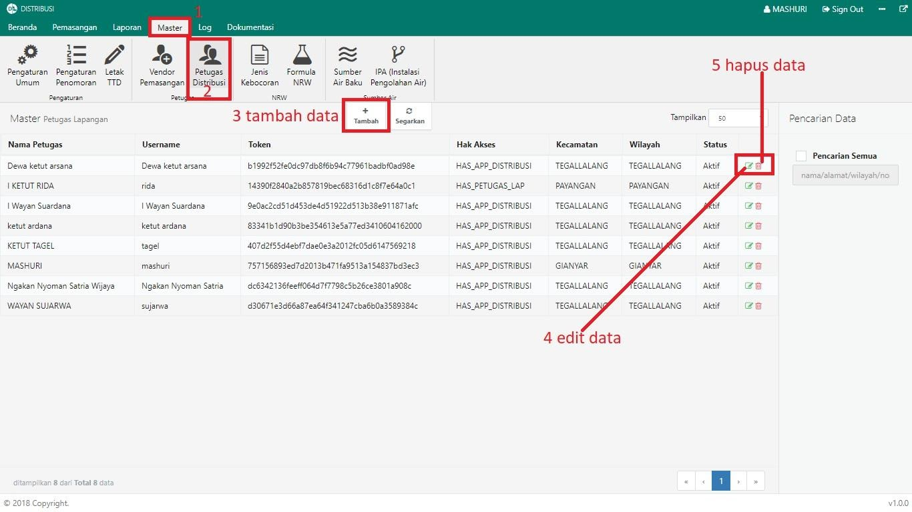

= Mengelola Data Petugas Distribusi

Dalam Modul Distribusi, Anda dapat melakukan pengelolaan data petugas distribusi, seperti menambah, memperbarui dan menghapus data. Ikuti langkah-langkah berikut untuk mengelola data:

1. Pilih menu *Master*
2. Klik pada ikon *Petugas Distribusi*
3. Untuk menambahkan data petugas distribusi, klik tombol *Tambah* seperti poin 3 pada gambar di atas. Isi _form_ yang disediakan, kemudian klik tombol *Simpan* seperti pada gambar dibawah ini:
+

4. Untuk memperbarui data, klik ikon *Edit* seperti poin 4 pada gambar utama di atas. Selanjutnya, perbarui data sesuai kebutuhan, kemudian klik tombol *Edit*. Seperti pada gambar di bawah ini:
+

5. Untuk menghapus data, klik ikon *Hapus* seperti poin 5 pada gambar utama di atas. Sistem akan menampilkan _pop up_ konfirmasi. Untuk melanjutkan proses hapus, klik tombol *Oke* seperti pada gambar di bawah ini:
+
