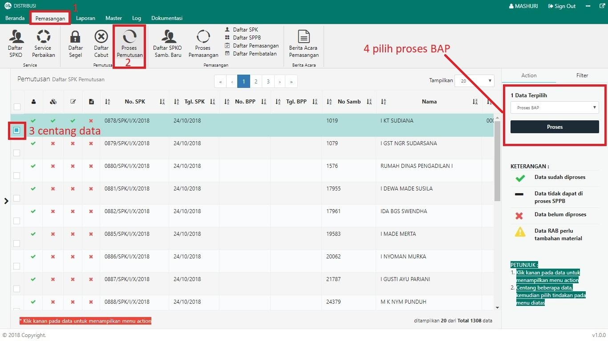
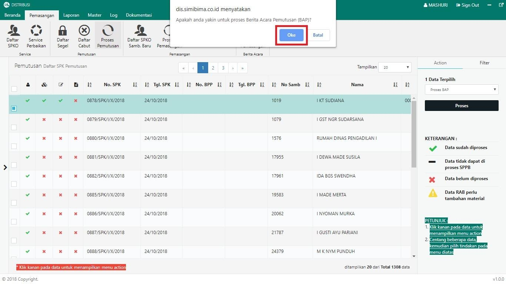

= Membuat Berita Acara Pemeriksaan (BAP) Pemutusan

Untuk membuat Berita Acara Pemeriksaan (BAP) Pemutusan, ikuti langkah-langkah berikut:

1. Pilih menu *Pemasangan*
2. Klik pada ikon *Proses Pemutusan*
3. Pilih data yang perlu dibuatkan BAP pemutusannya dengan memberikan tanda *Centang* seperti poin 3 pada gambar di atas
4. Setelah memilih data yang ingin diproses, pilih *Proses BAP* pada _dropdown_, kemudian klik tombol *Proses* pada tab Action untuk memproses BAP seperti pada poin 4 gambar di atas
5. Sistem akan menampilkan _pop up_ konfirmasi. Untuk melanjutkan proses BAP, klik tombol *Oke* seperti pada gambar di bawah ini:
+
