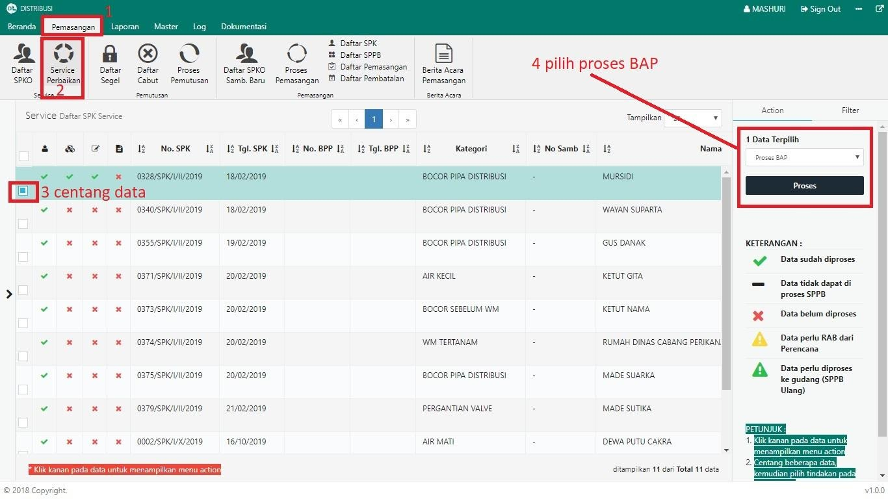

= Membuat Berita Acara Pemeriksaan (BAP) Service

Untuk membuat Berita Acara Pemeriksaan (BAP) Service, ikuti langkah-langkah berikut:

1. Pilih menu *Pemasangan*
2. Klik pada ikon *Service Perbaikan*. Jika terdapat pengaduan yang terdaftar, maka data otomatis akan muncul pada tabel
3. Pilih data yang perlu dibuatkan surat perintah pengambilan barang, dengan memberikan tanda *Centang* seperti poin 3 gambar di atas
4. Setelah memilih data yang ingin diproses, pilih *Proses BAP* pada _dropdown_, kemudian klik tombol *Proses* pada tab Action untuk memproses BAP seperti pada poin 4 gambar di atas
5. Selanjutnya, periksa dan lengkapi data sesuai proses perbaikan di lapangan. Jika data sudah lengkap, klik tombol *Simpan*.