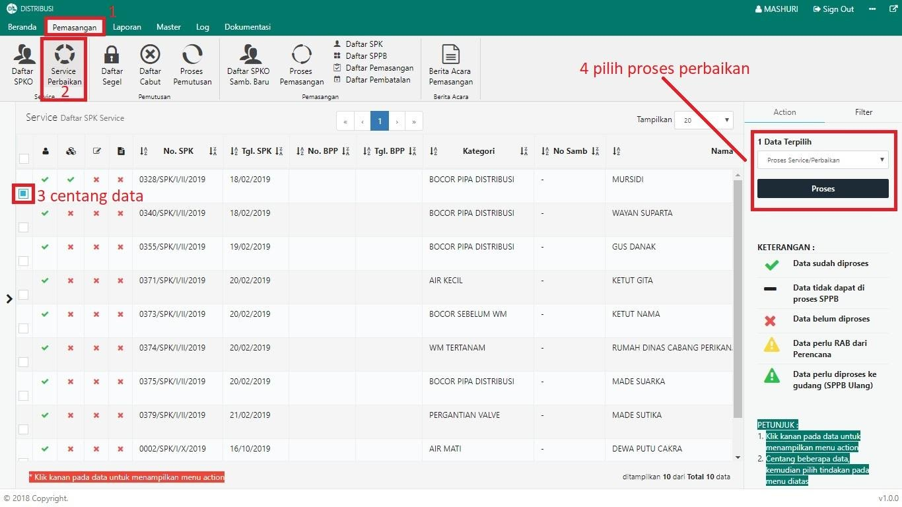
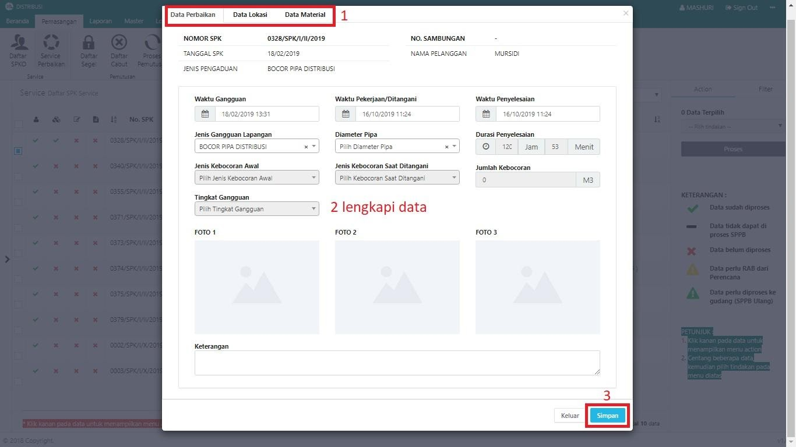
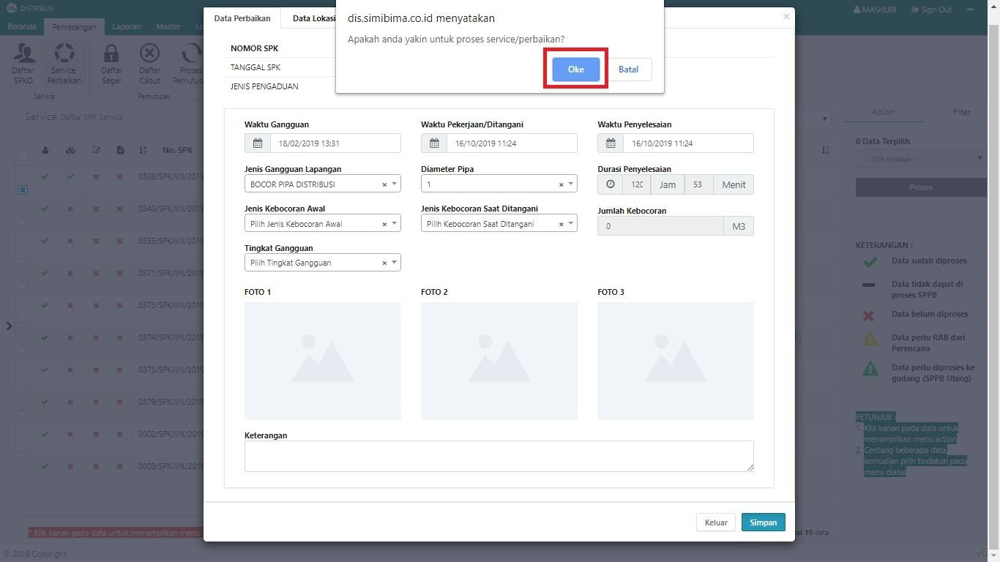
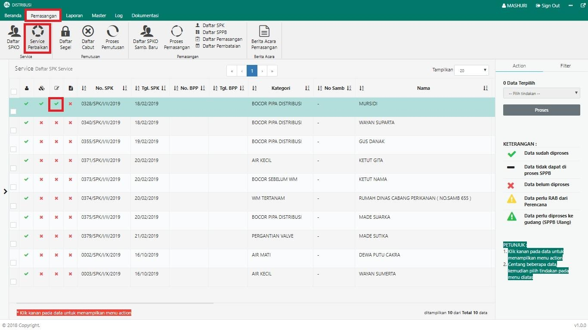

= Membuat Data Service Perbaikan

Untuk menambah data service atau perbaikan, ikuti langkah-langkah berikut:

1. Pilih menu *Pemasangan*
2. Klik pada ikon *Service Perbaikan*. Jika terdapat data terdaftar dalam pengaduan, maka data otomatis akan muncul pada tabel
3. Pilih data yang perlu dibuatkan surat perintah pengambilan barang dengan memberikan tanda *Centang* seperti poin 3 pada gambar di atas
4. Setelah memilih data yang perlu diproses, pilih *Proses Service/Perbaikan* pada _dropdown_, kemudian klik tombol *Proses* pada tab Action untuk memproses data service seperti pada poin 4 gambar di atas
5. Selanjutnya, periksa dan lengkapi data sesuai proses perbaikan di lapangan. Jika data sudah lengkap, klik tombol *Simpan* seperti pada gambar dibawah ini :
+

6. Sistem akan menampilkan _pop up_ konfirmasi. Untuk melanjutkan proses, klik tombol *Oke* seperti pada gambar di bawah ini:
+

7. Ketika proses pembuatan input data service perbaikan berhasil, data dapat dilihat pada tabel *Service Perbaikan* dengan status pada kolom proses perbaikan tercentang seperti pada gambar dibawah ini :
+
