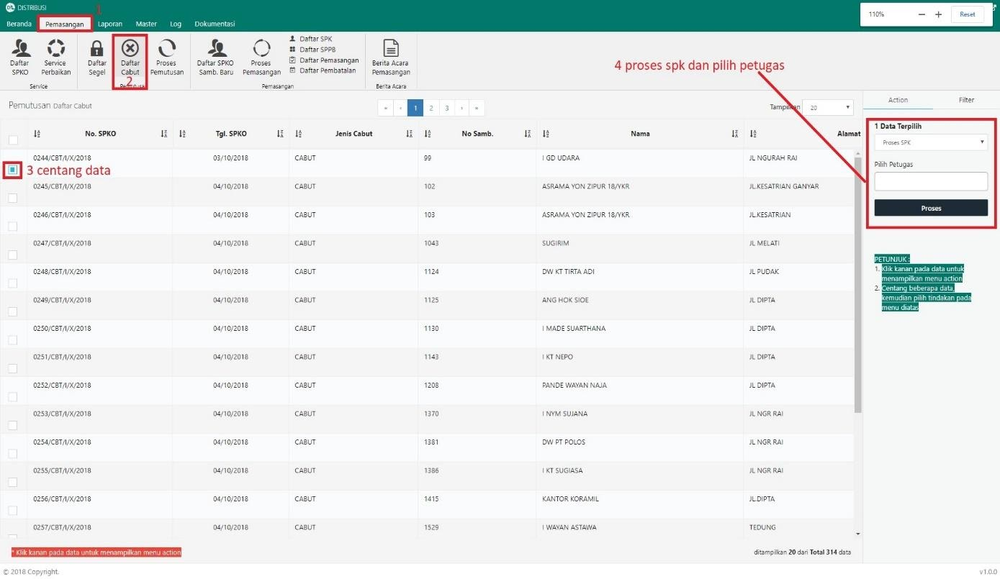
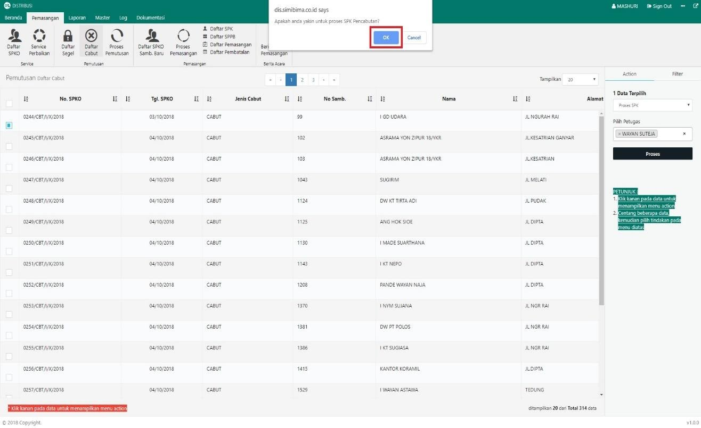

= Membuat Surat Perintah Kerja (SPK) Cabut

Untuk membuat Surat Perintah Kerja (SPK) Cabut, ikuti langkah-langkah berikut: 

1. Pilih menu *Pemasangan*
2. Klik pada ikon *Daftar Cabut*
3. Pilih data yang perlu dibuatkan surat perintah kerja cabut dengan memberikan tanda *Centang* seperti poin 3 gambar di atas
4. Setelah data dipilih, pilih *Proses SPK* pada _dropdown_ dan masukkan nama petugas, kemudian klik tombol *Proses* pada tab Action seperti pada poin 4 gambar di atas
5. Sistem akan menampilkan _pop up_ konfirmasi. Untuk melanjutkan proses SPK, klik tombol *OK* seperti pada gambar di bawah ini:
+
