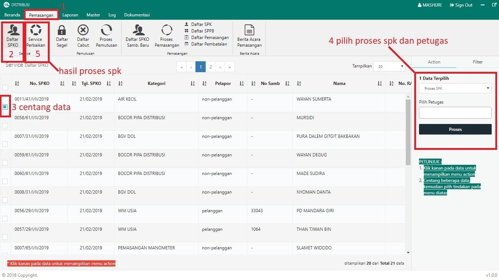

= Membuat Surat Perintah Kerja (SPK) Service

Untuk membuat Surat Perintah Kerja (SPK) Service, ikuti langkah-langkah berikut: 

1. Pilih menu *Pemasangan*
2. Klik pada ikon *Daftar SPKO*. Jika terdapat pengaduan yang terdaftar, maka data otomatis akan muncul pada tabel
3. Pilih data pengaduan yang perlu dibuatkan surat perintah kerja dengan memberikan tanda *Centang* seperti poin 3 pada gambar di atas
4. Setelah data dipilih, pilih *Proses SPK* pada _dropdown_ dan masukkan nama petugas, kemudian klik tombol *Proses* pada tab Action seperti pada poin 4 gambar di atas
5. Jika proses pembuatan surat perintah kerja berhasil, Anda dapat memeriksanya pada halaman *Service Perbaikan* pada menu *Pemasangan*, seperti poin 5 gambar di atas.
+
