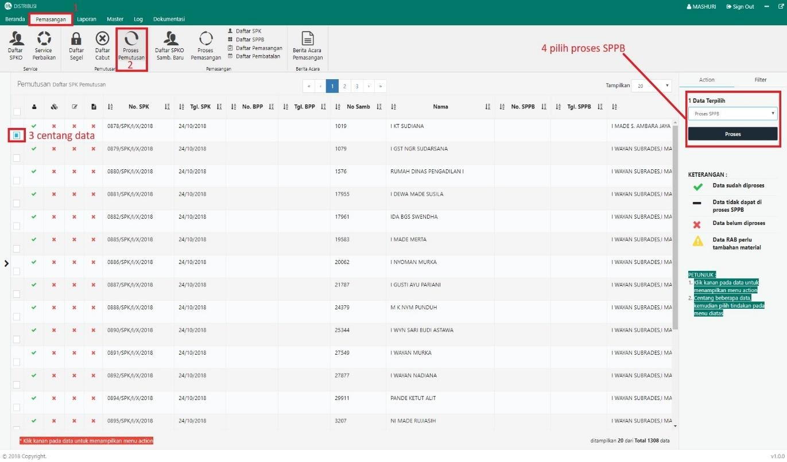
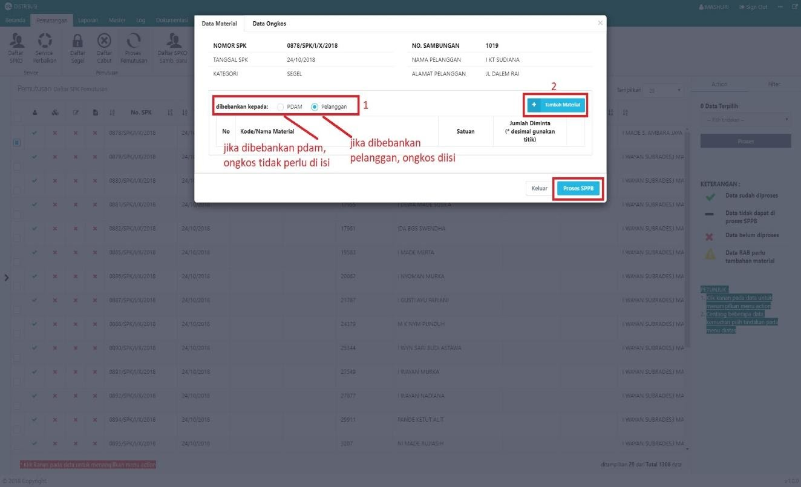
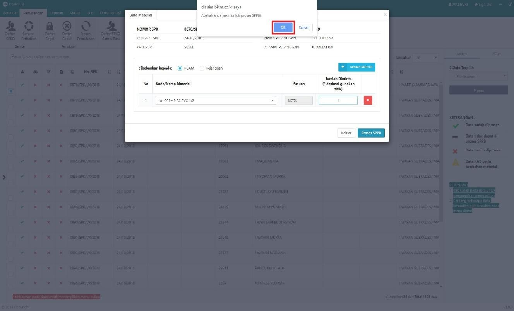
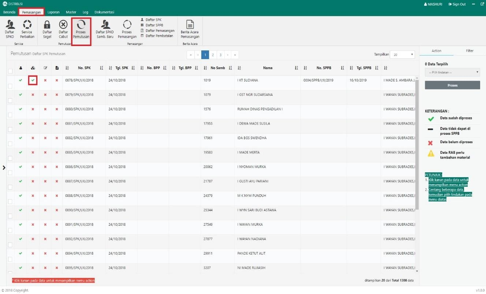

= Membuat Surat Perintah Pengambilan Barang (SPPB) untuk Pemutusan

Untuk membuat Surat Perintah Pengambilan Barang (SPPB) untuk Pemutusan, ikuti langkah-langkah berikut:

1. Pilih menu *Pemasangan*
2. Klik pada ikon *Proses Pemutusan*
3. Pilih data yang perlu dibuatkan SPPB pemutusan dengan cara memberi *Centang* seperti poin 3 gambar di atas.
4. Setelah data dipilih, pilih *Proses SPPB* pada _dropdown_, kemudian klik tombol *Proses* pada tab Action seperti pada poin 4 gambar di atas
5. Isi _pop up form_ yang disediakan. Jika proses pemutusan dibebankan kepada PDAM, maka tidak perlu memasukkan ongkos. Namun jika pemutusan dibebankan kepada pelanggan, ongkos perlu diisi. Jika semua data sudah dilengkapi, klik tombol *Proses SPPB* seperti pada gambar di bawah ini:
+

6. Sistem akan menampilkan _pop up_ konfirmasi. Untuk melanjutkan proses SPK, klik tombol *OK* seperti pada gambar di bawah ini:
+

7. Anda dapat memeriksa status proses pada halaman *Proses Pemutusan* pada menu *Pemasangan*, seperti gambar di bawah ini. Jika proses SPPB berhasil, maka kolom SPPB akan tercentang.
+
