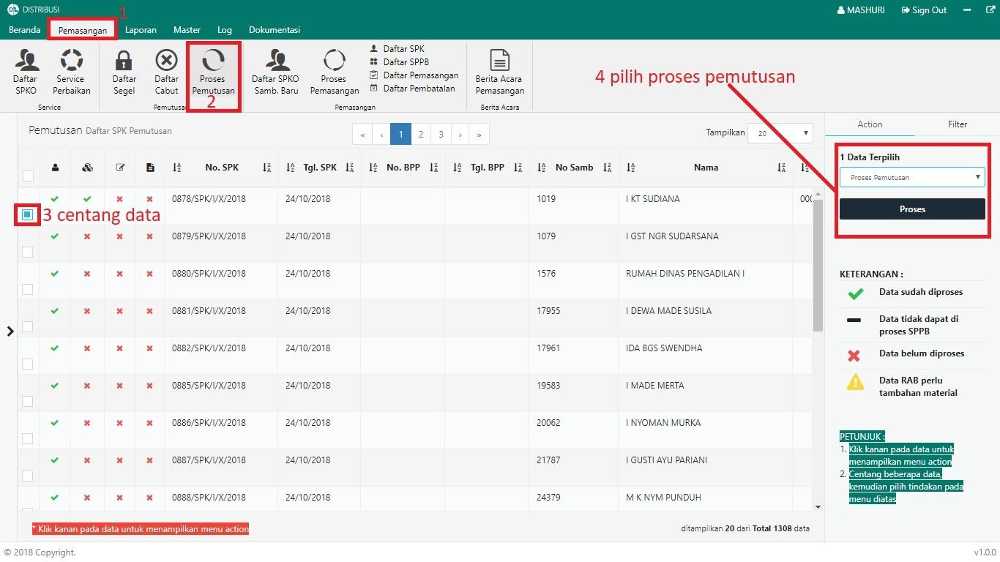
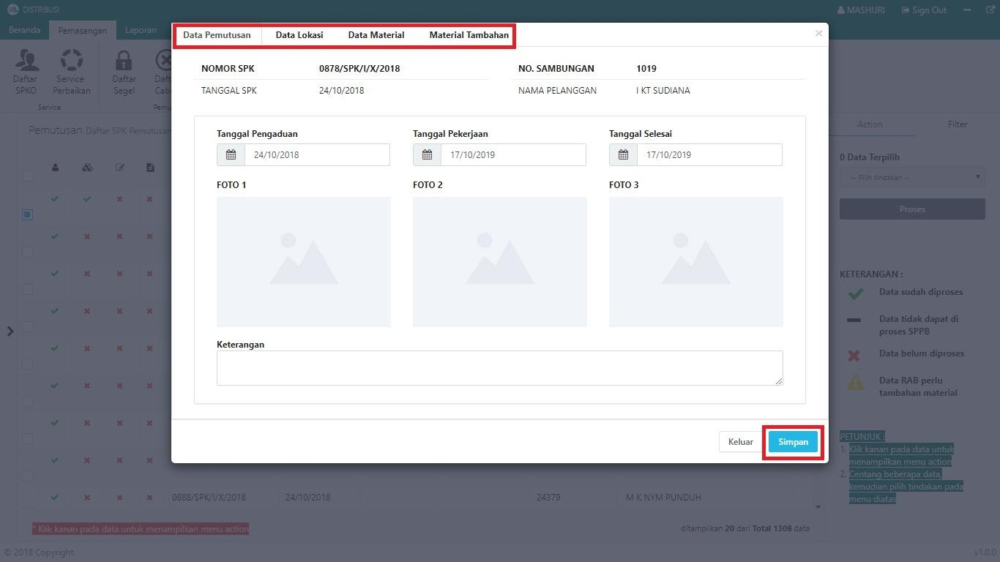
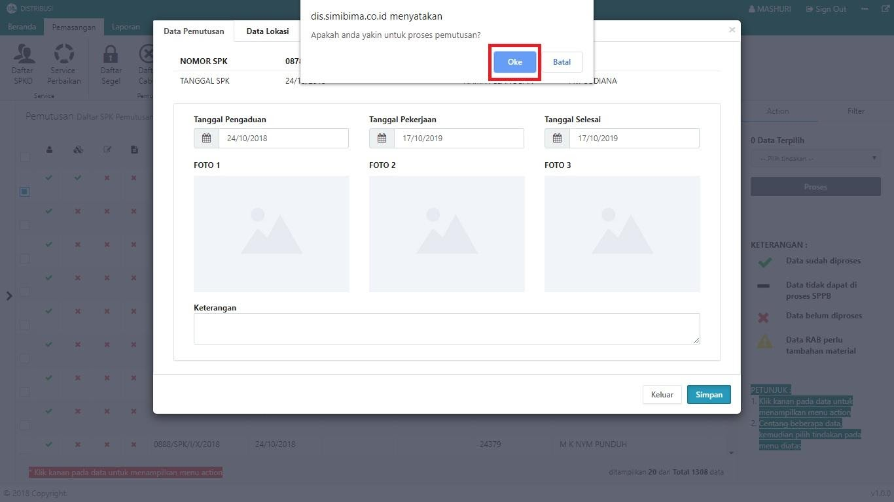
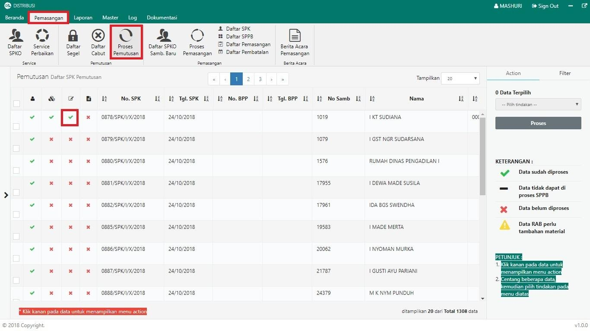

= Memproses Pemutusan

Untuk memproses pemutusan, ikuti langkah-langkah berikut:

1. Pilih menu *Pemasangan*
2. Klik pada ikon *Proses Pemutusan*
3. Pilih data yang perlu dilakukan proses pemutusan dengan memberikan tanda *Centang* seperti poin 3 pada gambar di atas
4. Setelah data dipilih, pilih *Proses Pemutusan* pada _dropdown_, kemudian klik tombol *Proses* pada tab Action seperti pada poin 4 gambar di atas
5. Lengkapi data pada *form* baik data pemutusan, data lokasi, data material, maupun material tambahan. Jika form sudah terisi, klik tombol *Simpan* seperti pada gambar di bawah ini :
+

6. Sistem akan menampilkan _pop up_ konfirmasi. Untuk melanjutkan proses pemutusan, klik tombol *Oke* seperti pada gambar di bawah ini:
+

7. Anda dapat memeriksa status proses pada halaman *Proses Pemutusan* pada menu *Pemasangan*, seperti gambar di bawah ini. Jika proses pemutusan berhasil, maka kolom pemutusan akan tercentang.
+
