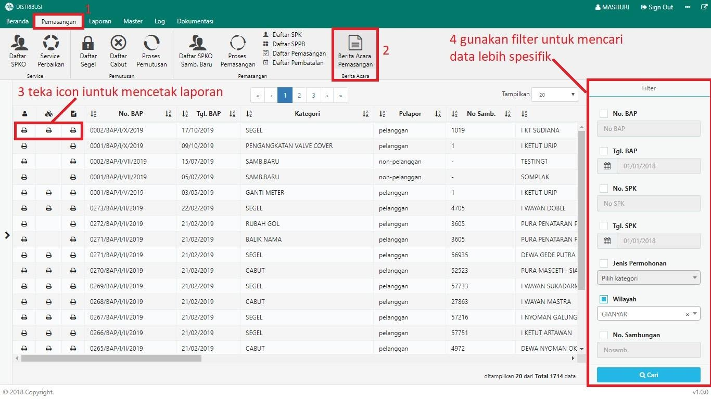
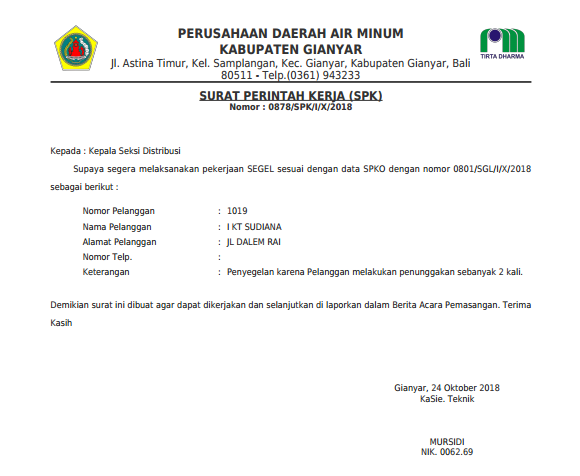
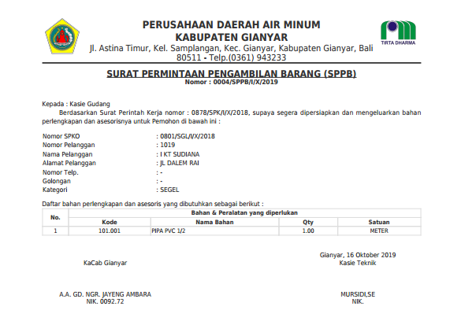
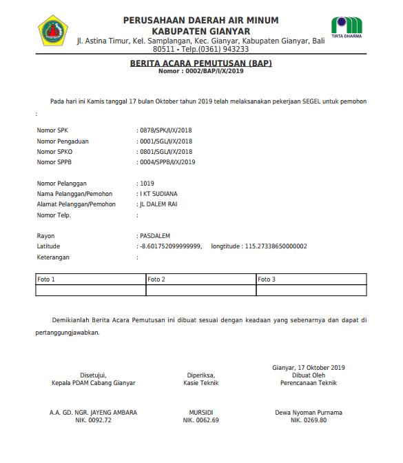

= Mencetak Laporan SPK, SPPB, dan BAP

Berikut adalah langkah-langkah untuk mencetak laporan SPK, SPPB dan BAP:

1. Pilih menu *Pemasangan*
2. Klik pada ikon *Berita Acara Pemasangan*
3. Klik ikon *Printer* pada baris dokumen yang perlu dicetak
4. Untuk mencari dokumen dengan lebih spesifik, Anda dapat menggunakan *Filter* pada bagian kanan halaman, seperti pada poin 4 gambar di atas
5. Berikut adalah contoh dokumen yang sudah dibuat dan siap dicetak
+
[loweralpha]
.. SPK
+

.. SPPB
+

.. BAP
+
