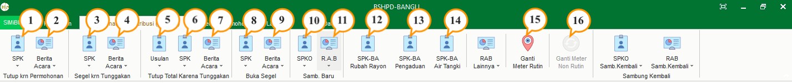

= Menu Modul Distribusi

Modul Distribusi mencakup empat (4) menu utama, yaitu:

.Menu Perencanaan & Distribusi
[%collapsible]
====

1. Ikon *SPK Tutup Karena Permohonan* untuk melihat daftar SPK Tutup Karena Permohonan yang telah dibuat. Menu ini digunakan untuk membuat SPK Baru,  mengoreksi dan menghapus SPK yang telah dibuat.
2. Ikon *Berita Acara Tutup Karena Permohonan* untuk melihat daftar Berita Acara Tutup Karena Permohonan yang telah dibuat. Menu ini digunakan untuk membuat Berita Acara baru, mengoreksi dan menghapus Berita Acara yang telah dibuat.
3. Ikon *SPK Segel Karena Tunggakan* untuk melihat daftar SPK Segel Karena Tunggakan yang telah dibuat. Menu ini digunakan untuk membuat SPK baru, mengoreksi dan menghapus SPK yang telah dibuat.
4. Ikon *Berita Segel Karena Tunggakan* untuk melihat daftar Berita Segel Karena Tunggakan yang telah dibuat. Menu ini digunakan untuk membuat Berita Acara baru, mengoreksi dan menghapus Berita Acara yang telah dibuat.
5. Ikon *Usulan Tutup Total Karena Tunggakan* untuk melihat daftar Usulan Tutup Total Karena Tunggakan secara individu maupun kolektif yang telah dibuat. Pada menu individu, Anda dapat membuat Usulan individu baru, mengoreksi dan menghapus Usulan individu yang telah dibuat. Sedangkan untuk kolektif hanya terdapat menambah Usulan Kolektif baru dan mengoreksi Usulan kolektif yang telah dibuat.
6. Ikon *SPK Tutup Total Karena Tunggakan* untuk melihat daftar SPK Tutup Total Karena Tunggakan yang telah dibuat. Menu ini digunakan untuk membuat SPK baru, mengoreksi dan menghapus SPK yang telah dibuat.
7. Ikon *Berita Acara Tutup Total Karena Tunggakan* untuk melihat daftar Berita Acara Tutup Total Karena Tunggakan yang telah dibuat. Menu ini digunakan untuk membuat Berita Acara baru, mengoreksi dan menghapus Berita Acara yang telah dibuat.
8. Ikon *SPK Buka Segel* untuk melihat daftar SPK Buka Segel yang telah dibuat. Menu ini digunakan untuk membuat SPK, mengoreksi dan menghapus SPK yang telah dibuat.
9. Ikon *Berita Acara Buka Segel* untuk melihat daftar Berita Acara Buka Segel yang telah dibuat. Menu ini digunakan untuk membuat Berita Acara baru, mengoreksi dan menghapus Berita Acara yang telah dibuat.
10. Ikon *SPKO Sambungan Baru* untuk melihat daftar SPKO Sambungan Baru yang telah dibuat. Menu ini digunakan untuk membuat SPK, mengoreksi dan menghapus SPK yang telah dibuat. Pada menu ini terdapat sub-menu Survey Kol. MBR yang disediakan untuk melakukan survey kolektif kepada MBR (Masyarakat Berpenghasilan Rendah).
11. Ikon *R.A.B Sambungan Baru* untuk melihat RAB sambungan baru yang telah dibuat. Pada menu ini, Anda dapat membuat RAB, mengoreksi, dan menghapus RAB yang telah dibuat. Anda juga dapat membuat RAB kolektif untuk MBR (Masyarakat Berpenghasilan Rendah).
12. Ikon *SPK-BA Rubah Rayon* digunakan untuk melihat daftar SPK-BA Rubah Rayon Pelanggan. Pada menu ini, Anda dapat melihat detail data dan mencetak SPK-BA Rubah Rayon.
13. Ikon *SPK-BA Pengaduan* untuk melihat daftar SPK dan Berita Acara Pengaduan dari pelanggan yang telah dibuat. Pada menu ini, Anda dapat membuat SPK dan Berita Acara, mengoreksi dan menghapus SPK dan Berita Acara yang telah dibuat.
14. Ikon *SPK-BA Air Tangki* untuk melihat daftar SPK dan Berita Acara Air Tangki yang telah dibuat. Pada menu ini, Anda dapat membuat SPK dan Berita Acara, mengoreksi dan menghapus SPK dan Berita Acara yang telah dibuat.
15. Ikon *Ganti Meter Rutin* digunakan untuk melakukan rotasi meter rutin, rotasi meter rutin dilakukan pdam selama 5 tahun (kurang lebih). Rotasi meter rutin ada 2 kategori, yaitu ada berdasarkan kelainan dan berdasarkan umur. Rotasi meter rutin berdasarkan kelainan adalah rotasi yang dilakukan berdasarkan kelainan dari bacameter. Jenis kelainannya sendiri ditentukan berdasarkan dengan kelainan yang ditentukan oleh pdam. Rotasi meter rutin berdasarkan umur, rotasi yang dilakukan berdasarkan umur meter, minimal 5 tahun. Menu ini memiliki beberapa fitur yakni penambahan daftar kelainan, Proses Berita Acara, dan penambahan data pelanggan.
16. Ikon *Ganti Meter Non Rutin* untuk melihat data Kelainan Meeter dan Rotasi Meter yang dilakukan oleh PDAM secara non-rutin. Menu ini memiliki beberapa fitur yakni penambahan daftar kelainan, Proses Berita Acara, dan penambahan data pelanggan.
====

.Menu Supervisi Permohonan
[%collapsible]
====

1. Ikon Daftar Tunggu Proses Data Supervisi menyediakan menu untuk supervisi dan validasi proses data yang sudah masuk dalam daftar.
====

.Menu Laporan
[%collapsible]
====
image::../images-distribusi/menu-laporan.png[align="center"]

1. Ikon *Pengaduan* menyediakan filter untuk mencari rekap laporan pengaduan yang dapat dilihat dengan format pdf
2. Ikon *Laporan Berita Acara* dan Lainya menyediakan filter untuk mencari rekap laporan, berita acara dan bon yang dapat dilihat dengan format PDF
3. Ikon *Penyelesaian Blokir* menyediakan filter untuk mencari rekap laporan penyelesaian yang dapat dilihat dengan format PDF
4. Ikon *Daftar Koreksi Rekening* menyediakan filter untuk mencari rekap daftar koreksi rekening penyelesaian yang dapat dilihat dengan format PDF
5. Ikon *Laporan Lainnya* menyediakan filter untuk mencari rekap laporan yang dapat dilihat dengan format PDF
====

.Menu Master Data
[%collapsible]
====

1. Ikon *Material* menyediakan menu untuk menampilkan data material yang digunakan. Pada menu ini, Anda dapat menambah daftar material baru, mengoreksi dan menghapus material yang telah dibuat.
2. Ikon *Ongkos* menyediakan menu untuk menampilkan ongkos/biaya saat melakukan kegiatan. Pada menu ini, Anda dapat menambah daftar ongkos/biaya baru, mengoreksi, dan menghapus ongkos/biaya yang telah dibuat.
3. Ikon *Paket Material Perencanaan* menyediakan menu untuk menampilkan paket material yang akan digunakan. Pada menu ini, Anda dapat menambah daftar paket material perencanaan baru, mengoreksi, dan menghapus paket material perencanaan yang telah dibuat.
4. Ikon *Paket Ongkos* menyediakan menu menyediakan menu untuk menampilkan paket ongkos saat melakukan kegiatan. Pada menu ini, Anda dapat menambah daftar paket ongkos baru, mengoreksi, dan menghapus  daftar paket ongkos baru yang telah dibuat.
5. Ikon *Paket RAB* menyediakan menu untuk menampilkan paket RAB yang saat melakukan kegiatan. Pada menu ini, Anda dapat menambah daftar paket RAB, mengoreksi, dan menghapus paket RAB yang telah dibuat.
6. Ikon *Jenis Nonair* menyediakan menu untuk menampilkan daftar ongkos jenis nonair yang akan dibebankan pada pelanggan. Pada menu ini, Anda dapat menambah daftar ongkos jenis nonair, mengoreksi, dan menghapus daftar ongkos jenis nonair yang telah dibuat.
====
