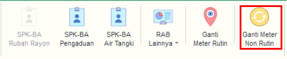
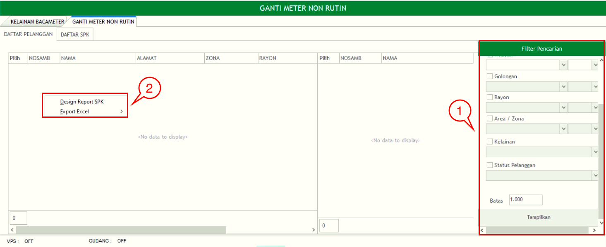
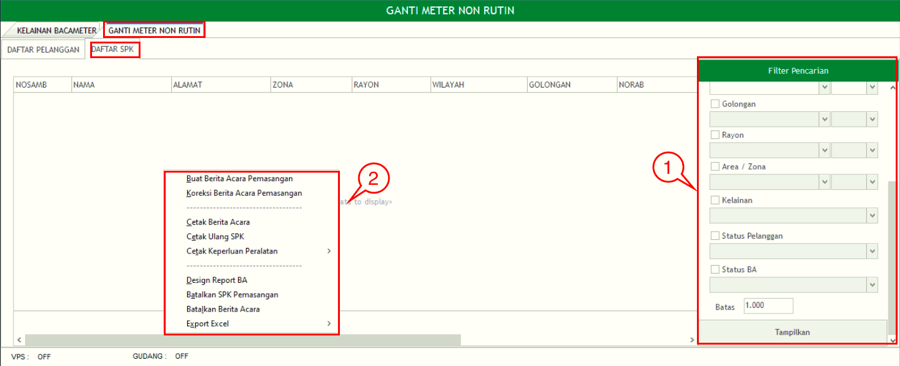
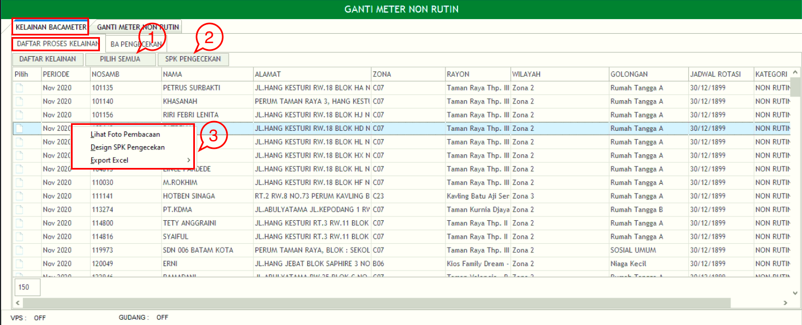
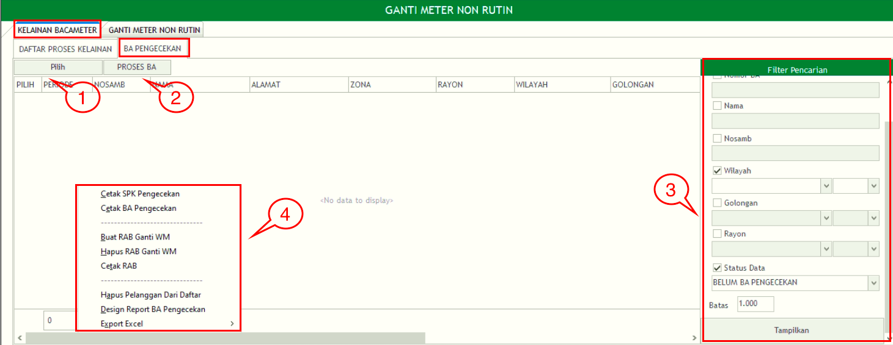

= Melakukan Ganti Meter Non Rutin

Fitur *Ganti Meter Non Rutin* dapat diakses dengan klik _icon_ sesuai gambar di atas. *Ganti Meter Rutin* memiliki 2 bagian utama, yaitu *Ganti Meter Non Rutin* dan *Kelainan Bacameter*. Berikut untuk detail masing-masing bagian :

== Ganti Meter Non Rutin

Bagian *Ganti Meter Non Rutin* memiliki 2 sub-bagian, yaitu *Daftar Pelanggan* dan *Daftar SPK*. Berikut adalah penjelasan masing-masing sub-bagian tersebut:

.*Daftar Pelanggan*
[%collapsible]
====
*Ganti Meter Non Rutin* memiliki 2 fungsi, yaitu *Filter Pencarian* dan _Action_ Klik Kanan. Berikut untuk penjelasan detail masing-masing fungsinya:

1. Filter Pencarian Ganti Meter Non Rutin Daftar Pelanggan
+
_Field_ *Filter* digunakan untuk mencari data Daftar Pelanggan sesuai dengan kebutuhan. Untuk melakukan pencarian data Daftar Pelanggan bisa dilakukan dengan cara mengisi _form_ sesuai kebutuhan, kemudian klik pada tombol *Tampilkan*.

2. *Action Menu saat diklik kanan*
+
Anda dapat melakukan klik kanan pada _row_ data Daftar Pelanggan untuk menampilkan _action_ menu. Berikut adalah penjelasan untuk masing-masing _action_ menu: 
+
.. *Design Report SPK* : digunakan untuk melakukan custom Report SPK pada data yang dipilih pada _list_ Daftar Pelanggan
.. *Export Excel* : Untuk melakukan _export_ data Daftar Pelanggan berupa file _Excel_
====

.*Daftar SPK*
[%collapsible]
====
*Daftar SPK* memiliki 2 fungsi, yaitu *Filter Pencarian* dan Klik Kanan _Action_. Berikut untuk penjelasan masing-masing fungsi tersebut:

1. *Filter Pencarian  Ganti Meter Non Rutin Daftar SPK*
+
_Field_ *Filter* digunakan untuk mencari data  Ganti Meter Non Rutin Daftar SPK  sesuai dengan kebutuhan. Untuk melakukan pencarian data  Ganti Meter Non Rutin Daftar SPK  bisa dilakukan dengan cara mengisi _form_ sesuai dengan kebutuhan, kemudian klik pada tombol *Tampilkan*.

2. *Action Menu saat diklik kanan*
+
Anda dapat melakukan klik kanan pada _row_ data Daftar SPK untuk menampilkan _action_ menu. Berikut adalah penjelasan untuk masing-masing action menu: 
+
.. *Buat Berita Acara Pemasangan* : digunakan untuk membuat berita acara pemasangan pada _list_ Daftar SPK yang dipilih
.. *Koreksi Berita Acara Pemasang* : digunakan untuk mengoreksi berita acara pemasangan pada Daftar SPK yang dipilih
.. *Cetak Berita Acara* : digunakan untuk mencetak Berita Acara pada SPK yang dipilih
.. *Cetak Ulang SPK* :  digunakan untuk melakukan cetak ulang pada SPK yang dipilih
.. *Cetak Keperluan Peralatan* : digunakan untuk mencetak Keperluan Peralatan pada SPK yang dipilih
.. *Batalkan SPK Pemasangan* : digunakan untuk melakukan pembatalan SPK Pemasangan pada SPK yang dipilih
.. *Batalkan Berita Acara* : digunakan untuk melakukan pembatalan Berita Acara pada SPK yang dipilih
.. *Export Excel* :  digunakan untuk _export_ data Daftar SPK pada  Ganti Meter Non Rutin Daftar SPK
=*.*
====

== Kelainan Bacameter

Bagian *Kelainan Bacameter* memiliki 2 fungsi, yaitu *Daftar Proses Kelainan* dan *BA Pengecekan*. Berikut adalah penjelasan masing-masing fungsinya :

.*Daftar Proses Kelainan*
[%collapsible]
====
*Kelainan Bacameter Daftar Proses Kelainan* memiliki 4 fungsi, yaitu *Pilih Semua, SPK Pengecekan, Filter Pencarian,* dan _Action_ Klik Kanan. Berikut untuk penjelasan detail masing-masing fungsinya:

1. *Pilih Semua Kelainan Bacameter Daftar Proses Kelainan*
+
Tombol *Pilih Semua* digunakan untuk memilih semua data yang ada dalam Daftar Proses Kelainan

2. *SPK Pengecekan Kelainan Bacameter Daftar Proses Kelainan*
+
Tombol *SPK Pengecekan* digunakan untuk menampilkan SPK Pengecekan pada data yang dipilih

3. *Action Menu saat diklik kanan*
+
Anda dapat melakukan klik kanan pada _row_ data Daftar Proses Kelainan untuk menampilkan _action_ menu. Berikut adalah penjelasan untuk masing-masing _action_ menu:
+
.. *Lihat Foto Pembacaan* : digunakan untuk menampilkan Foto Pembacaan pada data Daftar Proses Kelainan yang dipilih
.. *Design SPK Pengecekan* : digunakan untuk custome SPK Pengecekan pada data Daftar Proses Kelainan yang dipilih
.. *Export  Excel*: Untuk melakukan _export_ data Daftar Proses Kelainan  berupa file _Excel_
====

.*BA Pengecekan*
[%collapsible]
====
*Kelainan Bacameter BA* Pengecekan memiliki 4 fungsi, yaitu *Pilih, Proses BA, Filter Pencarian,* dan _Action_ Klik Kanan. Berikut untuk penjelasan detail masing-masing fungsinya:

1. *Pilih Kelainan Bacameter BA Pengecekan*
+
Tombol *Pilih* digunakan untuk memilih data dari daftar BA Pengecekan

2. *Proses BA Kelainan Bacameter BA Pengecekan*
+
Tombol *Proses BA* digunakan untuk memproses BA pada data yang dipilih dari _list_ BA Pengecekan

3. *Filter Pencarian Kelainan Bacameter BA Pengecekan*
+
_Field_ *Filter* digunakan untuk mencari data Kelainan Bacameter BA Pengecekan sesuai dengan kebutuhan. Untuk melakukan pencarian data Kelainan Bacameter BA Pengecekan bisa dilakukan dengan cara mengisi _form_ filter yang disediakan, kemudian klik pada tombol *Tampilkan*.

4. *Action Menu saat diklik kanan*
+
Anda dapat melakukan klik kanan pada _row_ data BA Pengecekan untuk menampilkan _action_ menu. Berikut adalah penjelasan untuk masing-masing _action_ menu:
+
.. *Cetak SPK Pengecekan* : digunakan untuk mencetak SPK Pengecekan pada data BA Pengecekan yang dipilih
.. *Cetak BA Pengecekan* : digunakan untuk mencetak BA Pengecekan yang dipilih
.. *Buat RAB Ganti WM* : digunakan untuk membuat RAB Ganti WM pada data yang dipilih
.. *Hapus RAB Ganti WM* : digunakan untuk menghapus RAB dan mengganti WM pada data yang dipilih
.. *Cetak RAB*: digunakan untuk mencetak RAB pada data yang dipilih
.. *Hapus Pelanggan Dari Daftar* : digunakan untuk menghapus pelanggan dari daftar sesuai dengan data yang dipilih
.. *Design Report BA Pengecekan* : digunakan untuk custom _Repot_ BA pengecekan yang dipilih sebelum dicetak
.. *Export Excel* : Untuk melakukan _export_ data BA Pengecekan berupa file _Excel_
====