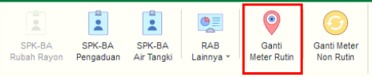
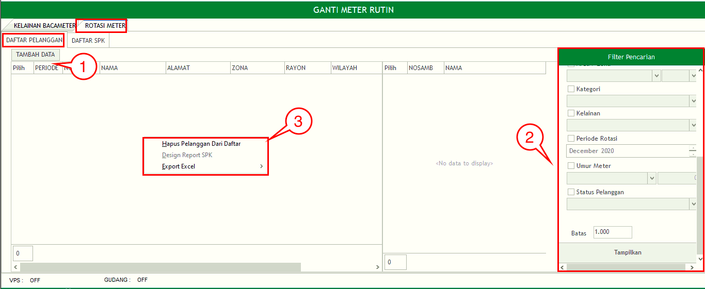
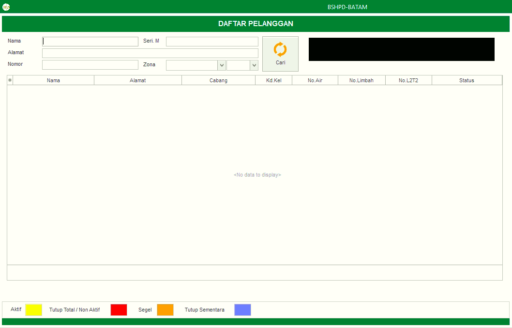
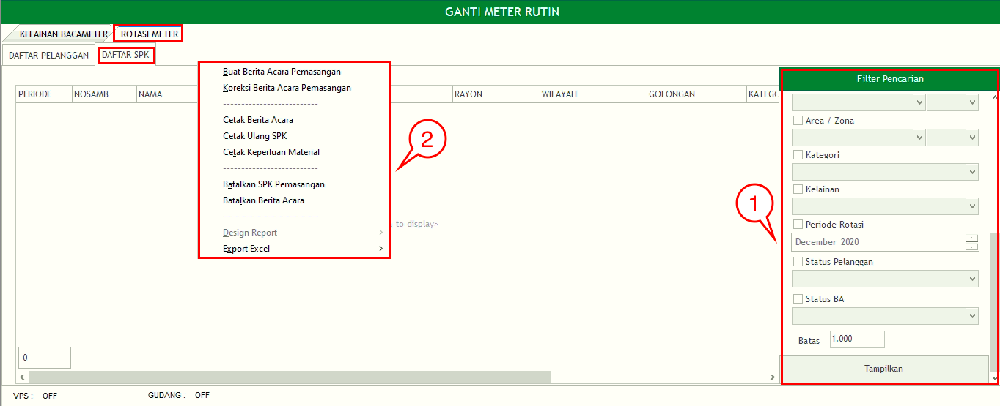
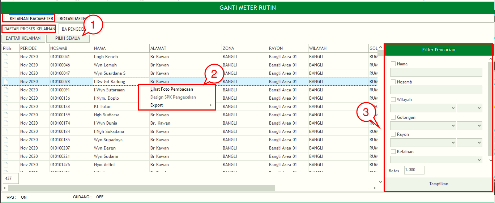
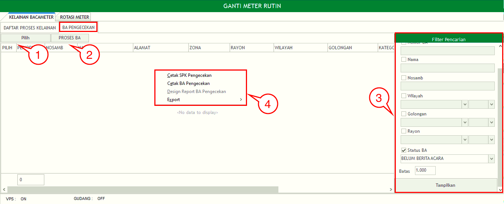

= Melakukan Ganti Meter Rutin

Fitur *Ganti Meter Rutin* bisa diakses dengan klik _icon_ sesuai gambar diatas. Ganti Meter Rutin memiliki 2 bagian utama, yaitu *Rotasi Meter* dan *Kelainan Bacameter*. Berikut untuk detail masing-masing:

== Rotasi Meter

Bagian Rotasi Meter memiliki 2 sub-bagian, yaitu *Daftar SPK* dan *Daftar Pelanggan* :

.*Daftar Pelanggan*
[%collapsible]
====
Rotasi Meter Daftar Pelanggan memiliki 3 fungsi, yaitu *Tambah Data*, *Filter Pencarian*, dan *Action Klik Kanan*. Berikut untuk penjelasan masing-masing fungsinya :

1. *Tambah Data Rotasi Meter Daftar Pelanggan*
+
Tombol *Tambah* digunakan untuk menambah data baru Rotasi Meter Daftar Pelanggan. Berikut cara untuk menambah data tersebut:
+

.. Untuk menambahkan data baru pada Rotasi Meter Daftar Pelanggan bisa dengan mencari Data Pelanggan dengan berdasarkan _field_ yang ada. Kemudian klik tombol *Cari* dan pilih data pelanggan yang akan ditambahkan

2. *Filter Pencarian Data Rotasi Meter Daftar Pelanggan*
+
_Field_ *Filter* digunakan untuk mencari data Rotasi Meter Daftar Pelanggan sesuai dengan kebutuhan. Untuk melakukan pencarian data, Anda dapat mengisi _form_ sesuai dengan _field_ yang sudah ditentukan, kemudian klik tombol _Tampilkan_.

3. *Action Menu saat diklik kanan*
+
Anda dapat melakukan klik kanan pada _row_ data Daftar Pelanggan untuk menampilkan _action menu_. Berikut adalah penjelasan untuk masing-masing _action menu_:
+
- *Hapus Pelanggan Dari Daftar* : digunakan untuk menghapus data pelanggan dari daftar pelanggan yang dipilih
- *Export Excel* : digunakan untuk melakukan _export_ daftar pelanggan ke dalam file Excel
====

.*Daftar SPK*
[%collapsible]
====
Bagian Rotasi Meter Daftar SPK memiliki 2 fungsi, yaitu *Filter Pencarian* dan *Klik Kanan Action*. Berikut untuk penjelasan masing-masing fungsinya :

1. *Filter Pencarian Rotasi Meter Daftar SPK*
+
_Field_ *Filter* digunakan untuk mencari data Rotasi Meter Daftar SPK sesuai dengan kebutuhan. Untuk melakukan pencarian data, Anda dapat mengisi _form_ sesuai dengan _field_ yang sudah ditentukan kemudian klik tombol *Tampilkan*.

2. *Action Menu saat diklik kanan*
+
Anda dapat melakukan klik kanan pada _row_ data Daftar SPK untuk menampilkan _action menu_. Berikut adalah penjelasan untuk masing-masing _action menu_: 
+
- *Buat Berita Acara Pemasangan* : digunakan untuk membuat berita acara pemasangan pada _list_ Daftar SPK yang dipilih
- *Koreksi Berita Acara Pemasang* : digunakan untuk mengoreksi berita acara pemasangan pada Daftar SPK yang dipilih
- *Cetak Berita Acara* : digunakan untuk mencetak Berita Acara pada SPK yang dipilih
- *Cetak Keperluan Material* : digunakan untuk mencetak Keperluan Material yang digunakan di lapangan pada data yang telah di-SPK-kan dan telah dibuatkan berita acara jika diinputkan material yang digunakan di lapangan.
- *Batalkan SPK Pemasangan* : digunakan untuk melakukan pembatalan SPK Pemasangan pada SPK yang dipilih
- *Batalkan Berita Acara* : digunakan untuk melakukan pembatalan Berita Acara pada SPK yang dipilih
- *Export Excel* : digunakan untuk _export_ data Daftar SPK pada Rotasi Meter
====

== Kelainan Bacameter

Bagian Kelainan Bacameter memiliki 2 sub-bagian, yaitu *Daftar Proses Kelainan* dan *BA Pengecekan* :

.*Daftar Proses Kelainan*
[%collapsible]
====
Kelainan Bacameter Daftar Proses Kelainan memiliki 4 fungsi yaitu *Pilih Semua*, *SPK Pengecekan*, *Filter Pencarian*, dan *Klik Kanan Action*. Berikut untuk penjelasan detail masing-masing fungsinya :

1. *Pilih Semua Kelainan Bacameter Daftar Proses Kelainan*
+
Tombol *Pilih Semua* digunakan untuk memilih semua data yang ada di dalam Daftar Proses Kelainan. 

2. *Action Menu saat diklik kanan*
+
Anda dapat melakukan klik kanan pada _row_ data Daftar Proses Kelainan untuk menampilkan _action menu_. Berikut adalah penjelasan untuk masing-masing _action menu_: 
+
- *Lihat Foto Pembacaan* : digunakan untuk menampilkan Foto Pembacaan pada data Daftar Proses Kelainan yang dipilih
- *Export* : Untuk melakukan _export_ data Daftar Proses Kelainan  berupa file Excel

3. *Filter Pencarian Kelainan Bacameter Daftar Proses Kelainan*
+
_Field_ *Filter* digunakan untuk mencari data Daftar Proses Kelainan sesuai dengan kebutuhan. Untuk melakukan pencarian data Daftar Proses Kelainan, Anda dapat mengisi _form_ sesuai dengan _field_ yang sudah ditentukan, kemudian Klik tombol *Tampilkan*.
====

.*BA Pengecekan*
[%collapsible]
====
Kelainan Bacameter BA Pengecekan memiliki 4 fungsi, yaitu *Pilih, Proses BA, Filter Pencarian*, dan *Klik Kanan Action*. Berikut adalah penjelasan masing-masing fungsinya :

1. *Pilih Kelainan Bacameter BA Pengecekan*
+
Tombol *Pilih* digunakan untuk memilih data dari daftar BA Pengecekan

2. *Proses BA Kelainan Bacameter BA Pengecekan*
+
Tombol *Proses BA* digunakan untuk memproses Berita Acara Pengecekan dari suatu data yang sebelumnya sudah dilakukan SPK Pengecekan

3. *Filter Pencarian Kelainan Bacameter BA Pengecekan*
+
_Field_ *Filter* digunakan untuk mencari data Kelainan Bacameter BA Pengecekan sesuai dengan kebutuhan. Untuk melakukan pencarian data, Anda dapat mengisi _form_ sesuai kebutuhan, kemudian klik tombol *Tampilkan*.

4. *Action Menu saat diklik kanan*
+
Anda dapat melakukan klik kanan pada _row_ data BA Pengecekan untuk menampilkan _action menu_. Berikut adalah penjelasan untuk masing-masing _action menu_:
+
- *Cetak SPK Pengecekan* : digunakan untuk mencetak SPK Pengecekan pada data BA Pengecekan yang dipilih
- *Cetak BA Pengecekan* : digunakan untuk mencetak BA Pengecekan yang dipilih
- *Export* : Untuk melakukan _export_ data BA Pengecekan berupa file Excel
====