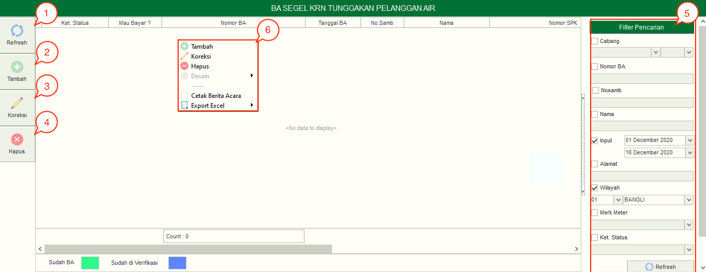

= Mengelola Berita Acara Segel karena Tunggakan

image::../images-distribusi/distribusi-BA-segel-karena-tunggakan-1.png[align="center"]

Berikut adalah penjelasan fungsi yang ada Berita Acara Segel karena Tunggakan Pelanggan Air:

1. *Refresh Berita Acara Segel karena Tunggakan Pelanggan Air*
+
Tombol *Refresh* digunakan untuk memperbarui data Berita Acara Segel karena Tunggakan Pelanggan Air yang mungkin belum masuk ketika data sudah di-_submit_.

2. *Tambah Berita Acara segel karena tunggakan pelanggan air*
+
Tombol *Tambah* digunakan untuk menambah data baru Berita Acara Segel karena Tunggakan Pelanggan Air. Berikut adalah cara untuk menambah data baru Berita Acara Segel karena Tunggakan Pelanggan Air:
+

[arabic]
. Untuk menambahkan data *Berita Acara Segel karena Tunggakan Pelanggan Air* baru. Isi _form_ yang tersedia pada menu *Tambah* data Berita Acara Segel karena Tunggakan Pelanggan Air
. Isi _Form_ *Saat Pelaksanaan*  dengan  informasi-informasi mengenai meter yang disegel.
. Kemudian tambahkan data pelaksana pada kolom *Pelaksana* untuk menentukan pelaksana penyegelan meter, klik tombol *Tambah* untuk menambahkan data petugas yang akan ditugaskan. Tombol *Hapus* digunakan untuk menghapus data petugas yang sudah ditambahkan.
. Klik tombol *Simpan* untuk menambahkan data Berita Acara Segel karena Tunggakan Pelanggan Air yang baru. Tombol *Batal* digunakan untuk melakukan _cancel_ pada data yang akan ditambahkan.

3. *Koreksi Berita Acara Segel karena Tunggakan Pelanggan Air*
+
Tombol *Koreksi* digunakan untuk melakukan koreksi pada data Berita Acara Segel karena Tunggakan Pelanggan Air. Untuk melakukan Koreksi, Anda dapat memilih data pada daftar, kemudian klik tombol *Koreksi*.

4. *Hapus Berita Acara Segel karena Tunggakan Pelanggan Air*
+
Tombol *Hapus* digunakan untuk menghapus data Berita Acara Segel karena Tunggakan Pelanggan Air dari daftar. Untuk menghapus data, Anda dapat memilih data pada daftar, kemudian klik tombol *Hapus*.

5. *Filter Berita Acara Segel karena Tunggakan Pelanggan Air*
+
_Field_ *Filter* digunakan untuk mencari data Berita Acara Segel karena Tunggakan Pelanggan Air sesuai dengan kebutuhan. Untuk melakukan pencarian data, Anda dapat mengisi _form_ sesuai dengan _field_ yang sudah ditentukan, kemudian klik pada tombol *Refresh*.

6. *Action Menu saat diklik kanan*
+
Anda dapat melakukan klik kanan pada _row_ data Berita Acara Segel karena Tunggakan Pelanggan Air untuk menampilkan _action menu_. Berikut adalah penjelasan untuk masing-masing _action menu_: 
+
- *Tambah*: Untuk menambah data Berita Acara Segel karena Tunggakan Pelanggan Air
- *Koreksi*: Untuk melakukan koreksi (edit) terhadap data Berita Acara Segel karena Tunggakan Pelanggan Air
- *Hapus*: Untuk menghapus data yang Berita Acara Segel karena Tunggakan Pelanggan Air yang dipilih
- *Cetak Berita Acara*: Untuk mencetak Berita Acara Segel karena Tunggakan Pelanggan Air
- *Export Excel*: Untuk _export_ data yang dipilih ke format Excel.