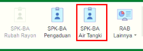
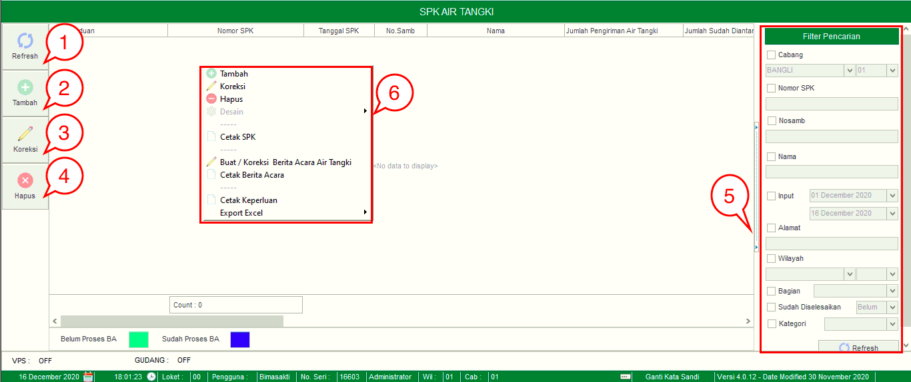
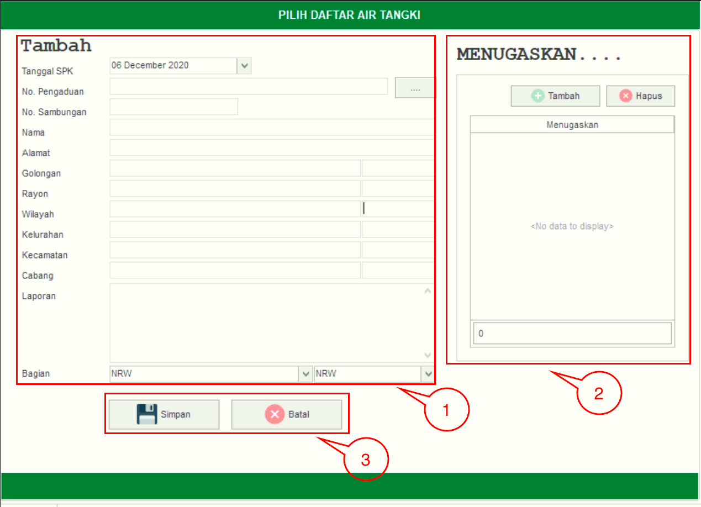

= Mengelola SPK-BA Air Tangki

Fitur ini digunakan untuk membuat SPK-BA Air Tangki. Ada 4 _action button_ yang bisa digunakan yaitu *Refresh*, *Tambah*, *Koreksi*, dan *Hapus*. Berikut adalah penjelasan masing-masing tombol dan fungsi yang ada dalam SPK-BA Air Tangki.

1. *Refresh SPK-BA Air Tangki*
+
Tombol *Refresh* digunakan untuk memperbarui data SPK yang mungkin belum masuk ketika data sudah di-_submit_.

2. *Tambah SPK-BA Air Tangki*
+
Tombol *Tambah* digunakan untuk menambah data baru. Berikut cara untuk menambah data baru SPK-BA Air Tangki:
+

[arabic]
. Tambah data SPK Air Tangki dengan klik _icon_ 3 titik untuk memilih Daftar Air Tangki yang inputkan petugas pelayanan yang akan dibuatkan SPK Air Tangki
. Kemudian tambahkan data petugas untuk menentukan penugasan, klik tombol *Tambah* untuk menambahkan data petugas yang akan ditugaskan. Tombol *Hapus* digunakan untuk menghapus data petugas yang sudah ditambahkan.
. Klik tombol *Simpan* untuk menambahkan data SPK-BA Air Tangki yang baru. Tombol *Batal* digunakan untuk melakukan _cancel_ pada data yang akan ditambahkan.

3. *Koreksi SPK-BA Air Tangki*
+
Tombol *Koreksi* digunakan untuk melakukan koreksi pada data SPK Air Tangki. Untuk melakukan koreksi, Anda dapat memilih data pada daftar, kemudian klik tombol *Koreksi*.

4. *Hapus SPK-BA Air Tangki*
+
Tombol Hapus digunakan untuk menghapus data SPK Air Tangki dari daftar. Untuk menghapus data, pilih data pada daftar terlebih dahulu, kemudian klik tombol *Hapus*.

5. *Filter Pencarian SPK-BA Air Tangki*
+
_Field_ *Filter* digunakan untuk mencari data SPK Air Tangki sesuai dengan kebutuhan. Untuk melakukan pencarian data, Anda dapat mengisi _form_ sesuai dengan _field_ yang sudah ditentukan, kemudian klik *Submit*.

6. *Action Menu saat diklik kanan*
+
Anda dapat melakukan klik kanan pada _row_ data SPK-BA Tangki Air untuk menampilkan _action menu_. Berikut adalah penjelasan untuk masing-masing _action menu_: 
+
- *Tambah* : Untuk menambah data SPK-BA Air Tangki
- *Koreksi* : Untuk melakukan koreksi (edit) terhadap data SPK-BA Air Tangki yang dipilih
- *Hapus* : untuk menghapus terhadap data SPK-BA Air Tangki yang dipilih
- *Cetak SPK* : Untuk mencetak SPK-BA Air Tangki sesuai dengan data yang dipilih
- *Buat / Koreksi Berita Acara Penyelesaian Aduan*: Untuk membuat dan mengoreksi berita acara penyelesaian aduan terhadap SPK-BA Air Tangki yang dipilih
- *Cetak Berita Acara* : Untuk mencetak Berita Acara sesuai dengan SPK-BA Air Tangki yang dipilih
- *Cetak Keperluan* : Untuk Mencetak Keperluan dari SPK-BA Air Tangki yang dipilih
- *Export Excel* : Untuk melakukan _export_ data SPK-BA Air Tangki berupa file Excel