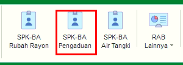

= Mengelola SPK BA Pengaduan

Fitur ini meliputi Tombol *Refresh*, *Tambah*, *Koreksi*, *Hapus Filter Pencarian* dan _Action_ Klik Kanan. Berikut adalah penjelasan masing-masing fungsi yang ada di dalam SPK Pengaduan :

1. *Refresh SPK Pengaduan*
+
Tombol *Refresh* digunakan untuk memperbarui data SPK Pengaduan yang mungkin belum masuk ketika data sudah di-_submit_.

2. *Tambah SPK Pengaduan*
+
Tombol *Tambah* digunakan untuk menambah data baru SPK Pengaduan. Berikut cara untuk menambah data baru SPK Pengaduan :
+

[arabic]
. Untuk menambahkan data SPK Pengaduan baru, klik _icon_ 3 titik untuk memilih pengaduan yang input-kan petugas pelayanan untuk dibuatkan SPK Pengaduan.
. Kemudian tambahkan data petugas untuk menentukan penugasan, klik tombol *Tambah* untuk menambahkan data petugas yang akan ditugaskan. Tombol *Hapus* digunakan untuk menghapus data petugas yang sudah ditambahkan
. Tambahkan data Keperluan untuk menentukan keperluan material dan ongkos yang akan dikerjakan dengan cara klik tombol *Material* dan tombol *Ongkos*
. Klik tombol *Simpan* untuk menambahkan data SPK Pengaduan yang baru. Tombol *Batal* digunakan untuk melakukan _cancel_ pada data yang akan ditambahkan.

3. *Koreksi SPK Pengaduan*
+
Tombol *Koreksi* digunakan untuk melakukan koreksi pada data SPK Pengaduan. Untuk melakukan Koreksi, Anda dapat memilih data pada daftar, kemudian klik tombol *Koreksi*.

4. *Hapus SPK Pengaduan*
+
Tombol _Hapus_ digunakan untuk menghapus data SPK Pengaduan dari daftar. Untuk menghapus data,, Anda dapat memilih data pada daftar, kemudian klik tombol *Hapus*.

5. *Filter Pencarian SPK Pengaduan*
+
_Field_ *Filter* digunakan untuk mencari data SPK Pengaduan sesuai dengan kebutuhan. Untuk melakukan pencarian data, Anda dapat mengisi _form_ sesuai dengan _field_ yang sudah ditentukan kemudian klik tombol *Refresh*.

6. *Action Menu saat diklik kanan*
+
Anda dapat melakukan klik kanan pada _row_ data SPK-BA Pengaduan untuk menampilkan _action menu_. Berikut adalah penjelasan untuk masing-masing _action menu_: 
+
- *Tambah* : Untuk menambah data SPK Pengaduan Baru
- *Koreksi* : Untuk melakukan koreksi (edit) terhadap data SPK Pengaduan yang dipilih
- *Cetak  SPK*: Untuk mencetak SPK Pengaduan
- *Tambah RAB* : Untuk menambahkan RAB  jika pengaduan yang diadukan memiliki atau terdapat biaya yang harus dibebankan kepada pelanggan
- *Hapus RAB* : untuk menghapus data RAB pada SPK Pengaduan yang dipilih
- *Cetak Ulang RAB* : untuk mencetak ulang data RAB yang sudah ada terhadap data SPK Pengaduan yang dipilih
- *Buat / Koreksi Berita Acara Penyelesaian Aduan* : Untuk membuat dan mengoreksi berita acara penyelesaian aduan terhadap SPK Pengaduan yang dipilih
- *Cetak Berita Acara* : Untuk mencetak Berita Acara sesuai dengan SPK Pengaduan yang dipilih
- *Cetak Keperluan* : Untuk Mencetak Keperluan dari SPK Pengaduan yang dipilih
- *Export Excel* : Untuk melakukan _export_ data SPK Pengaduan berupa file Excel