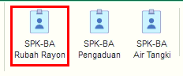

= Mengelola SPK-BA Rubah Rayon

Fitur ini digunakan untuk mengubah SPK Rayon Pelanggan. Menu ini mempunyai beberapa fungsi yang meliputi *Refresh, Filter Pencarian* dan *Klik Kanan Action*. Berikut adalah penjelasan masing - masing fungsi yang ada di dalam SPK-BA Rubah Rayon :

1. *Refresh SPK Rubah Rayon*
+
Tombol *Refresh* digunakan untuk memperbarui data SPK Rubah Rayon yang mungkin belum masuk ketika data sudah di-_submit_.

2. *Filter Pencarian SPK Rubah Rayon*
+
_Field_ *Filter* digunakan untuk mencari data SPK Rubah Rayon sesuai dengan kebutuhan. Untuk melakukan pencarian data SPK Rubah Rayon, Anda dapat mengisi _form_ sesuai dengan _field_ yang sudah ditentukan, kemudian klik tombol *Refresh*.

3. *Klik Kanan Action SPK Rubah Rayon*
+
Anda dapat melakukan klik kanan pada _row_ data SPK-BA Rubah Rayon untuk menampilkan _action menu_. Berikut adalah penjelasan untuk masing-masing _action menu_: 
+
- *Buat RAB* : digunakan untuk membuat RAB pada SPK Rubah Rayon yang dipilih
- *Hapus RAB* : digunakan untuk menghapus data RAB yang sudah ada pada data SPK Rubah Rayon yang dipilih
- *Cetak RAB* : digunakan untuk mencetak data RAB yang sudah ada pada data SPK Rubah Rayon yang dipilih
- *Buat SPK Pemasangan* : digunakan untuk membuat SPK pada data SPK Rubah Rayon yang dipilih
- *Buat BA Pemasangan* : digunakan untuk membuat Berita Acara (BA) pada data SPK Rubah Rayon yang dipilih
- *Buat SPK Kolektif* : digunakan untuk membuat SPK secara kolektif pada data SPK Rubah Rayon yang dipilih
- *Buat BA Kolektif* : digunakan untuk membuat BA secara kolektif pada data SPK Rubah Rayon yang dipilih
- *Batalkan Permohonan* : digunakan untuk membatalkan permohonan SPK Rubah Rayon pelanggan
- *Cetak Permohonan* : digunakan untuk mencetak permohonan pada data SPK Rubah Rayon yang dipilih
- *Cetak SPK Pemasangan* : digunakan untuk mencetak SPK pemasangan pada data SPK Rubah Rayon yang dipilih
- *Cetak BA Pemasangan* : digunakan untuk mencetak Berita Acara (BA) pada data SPK Rubah Rayon yang dipilih
- *Export Excel* : digunakan untuk _export_ data SPK Rubah Rayon.