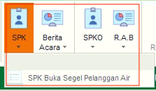
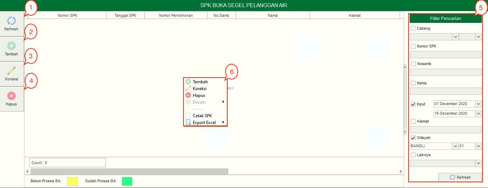
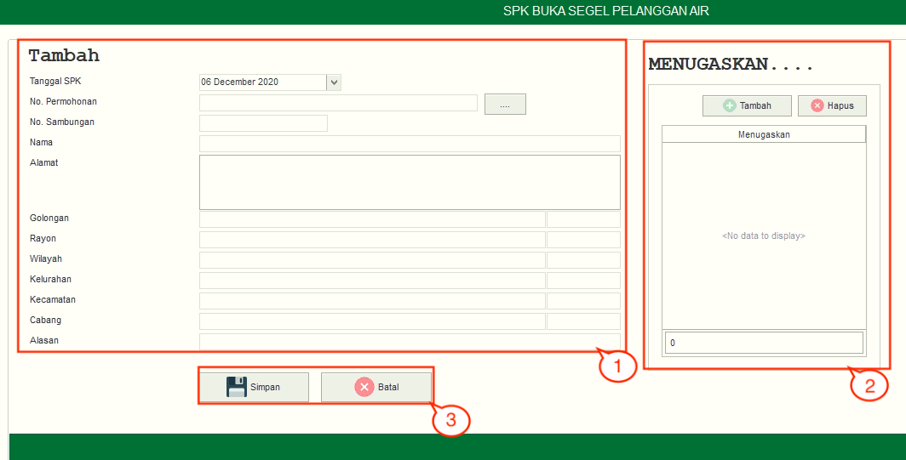

= Mengelola SPK Buka Segel Pelanggan

SPK Buka Segel memiliki sebuah sub fitur yakni,  *SPK Buka Segel Pelanggan Air*. Berikut penjelasan fungsi yang ada di dalam kedua SPK Buka Segel Pelanggan Air:

1. *Refresh SPK Buka Segel Pelanggan Air*
+
Tombol *Refresh* digunakan untuk memperbarui data SPK Buka Segel Pelanggan Air Karena Tunggakan yang mungkin belum masuk ketika data sudah di-_submit_.

2. *Tambah SPK Buka Segel Pelanggan Air*
+
Tombol *Tambah* digunakan untuk menambah data baru SPK Buka Segel Pelanggan Air Karena Tunggakan. Berikut cara untuk menambah data baru SPK Buka Segel Pelanggan Air:
+

[arabic]
. Untuk menambahkan data SPK Buka Segel Pelanggan Air. Isi _form_ yang tersedia pada menu *Tambah* data SPK Buka Segel Pelanggan Air
. Kemudian tambahkan data petugas pada kolom *Menugaskan* untuk menentukan petugas yang akan dikirim untuk melakukan pembukaan segel pada meter, klik tombol *Tambah* untuk menambahkan data petugas yang akan ditugaskan. Tombol *Hapus* digunakan untuk menghapus data petugas yang sudah ditambahkan.
. Klik tombol *Simpan* untuk menambahkan data SPK Buka Segel Pelanggan Air yang baru. Tombol *Batal* digunakan untuk melakukan _cancel_ pada data yang akan ditambahkan.

3. *Koreksi SPK Buka Segel Pelanggan Air*
+
Tombol *Koreksi* digunakan untuk melakukan koreksi pada data SPK Buka Segel Pelanggan Air. Untuk melakukan Koreksi, Anda dapat memilih data pada daftar, kemudian klik tombol *Koreksi*.

4. *Hapus  SPK Buka Segel Pelanggan Air*
+
Tombol *Hapus* digunakan untuk menghapus data SPK Buka Segel Pelanggan Air dari daftar. Untuk menghapus data, Anda dapat memilih data pada daftar, kemudian klik tombol *Hapus*.

5. *Filter SPK Buka Segel Pelanggan Air*
+
_Field_ *Filter* digunakan untuk mencari data SPK Buka Segel Pelanggan Air sesuai dengan kebutuhan. Untuk melakukan pencarian data , Anda dapat mengisi _form_ sesuai dengan _field_ yang sudah ditentukan, kemudian klik tombol *Refresh*.

6. *Action Menu saat di klik kanan*
+
Anda dapat melakukan klik kanan pada _row_ data SPK Buka Segel untuk menampilkan _action menu_. Berikut adalah penjelasan untuk masing-masing _action menu_: 
+
- *Tambah*: Untuk menambah data SPK Buka Segel Pelanggan Air
- *Koreksi*: Untuk melakukan koreksi (edit) terhadap data SPK Buka Segel Pelanggan Air yang dipilih
- *Hapus*: Untuk menghapus data yang SPK Buka Segel Pelanggan Air yang dipilih
- *Cetak SPK*: Untuk mencetak SPK Buka Segel Pelanggan Air
- *Export Excel*: Untuk _export_ data yang dipilih ke format Excel