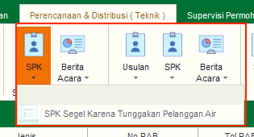
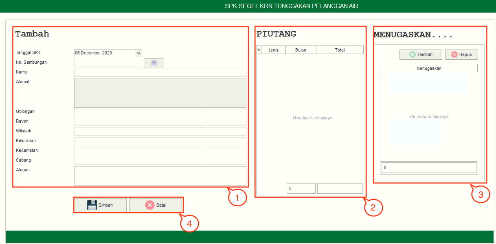
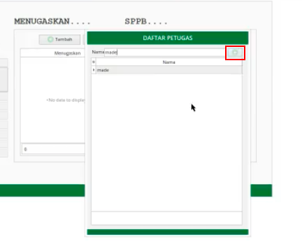

= Mengelola SPK Segel karena Tunggakan

Fitur SPK Segel karena Tunggakan* dilakukan oleh petugas jika mendapati tunggakan pelanggan air yang terlalu tinggi. Fitur ini memiliki sub fitur *SPK Segel karena Tunggakan Pelanggan Air*. Berikut penjelasan fungsi yang ada pada SPK Segel karena Tunggakan Pelanggan Air:

1. *Refresh SPK Segel karena Tunggakan Pelanggan Air*
+
Tombol *Refresh* digunakan untuk memperbarui data SPK Segel karena Tunggakan Pelanggan Air yang mungkin belum masuk ketika data sudah di-_submit_.

2. *Tambah SPK Segel karena Tunggakan Pelanggan Air*
+
Tombol *Tambah* digunakan untuk menambah data baru SPK Segel karena Tunggakan Pelanggan Air. Berikut cara untuk menambah data baru SPK Segel karena Tunggakan Pelanggan Air:
+

[arabic]
. Isi _form_ yang tersedia pada menu *Tambah* data SPK Segel karena Tunggakan Pelanggan Air
. Lihat jumlah piutang pelanggan pada kolom *Piutang*.
+

. Kemudian tambahkan data petugas pada kolom Menugaskan untuk menentukan petugas yang akan dikirim untuk melakukan penyegelan meter, klik tombol *Tambah* untuk melihat *data list petugas* yang akan ditambahkan. Tombol *Hapus* digunakan untuk menghapus data petugas yang sudah ditambahkan. JIka ingin menambahkan nama petugas namun data tidak ada pada daftar, masukkan nama petugas yang akan ditambahkan kemudian tekan tanda *plus (+)* di samping kolom nama.

. Klik tombol *Simpan* untuk menambahkan data SPK Segel karena Tunggakan Pelanggan Air yang baru. Tombol *Batal* digunakan untuk melakukan _cancel_ pada data yang akan ditambahkan.

3. *Koreksi SPK Segel karena Tunggakan Pelanggan Air*
+
Fitur *Koreksi* digunakan untuk melakukan koreksi pada data SPK Segel karena Tunggakan Pelanggan Air. Untuk melakukan Koreksi, Anda dapat memilih data pada daftar, kemudian klik tombol *Koreksi*.

4. *Hapus SPK Segel karena Tunggakan Pelanggan Air*
+
Fitur *Hapus* digunakan untuk menghapus data SPK Segel karena Tunggakan Pelanggan Air dari daftar. Untuk menghapus data, Anda dapat memilih data pada daftar, kemudian klik tombol *Hapus*.

5. *Filter SPK Segel karena Tunggakan Pelanggan Air*
+
_Field_ *Filter* digunakan untuk mencari data SPK Segel karena Tunggakan Pelanggan Air sesuai dengan kebutuhan. Untuk melakukan pencarian data, Anda dapat mengisi _form_ sesuai dengan _field_ yang sudah ditentukan, kemudian klik tombol *Refresh*.

6. *Action Menu saat diklik kanan*
+
Anda dapat melakukan klik kanan pada _row_ data SPK Segel karena Tunggakan Pelanggan Air untuk menampilkan _action menu_. Berikut adalah penjelasan untuk masing-masing _action menu_: 
+
- *Tambah*: Untuk menambah data SPK Segel karena Tunggakan Pelanggan Air
- *Koreksi*: Untuk melakukan koreksi (edit) terhadap data SPK Segel karena Tunggakan Pelanggan Air yang dipilih
- *Hapus*: Untuk menghapus data yang SPK Segel karena Tunggakan Pelanggan Air yang dipilih
- *Cetak SPK*: Untuk mencetak SPK Segel karena Tunggakan Pelanggan Air
- *Cetak Lampiran Piutang*: Untuk mencetak lampiran piutang.
- *Export Excel*: Untuk _export_ data yang dipilih ke format _excel_