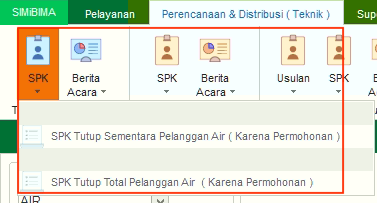
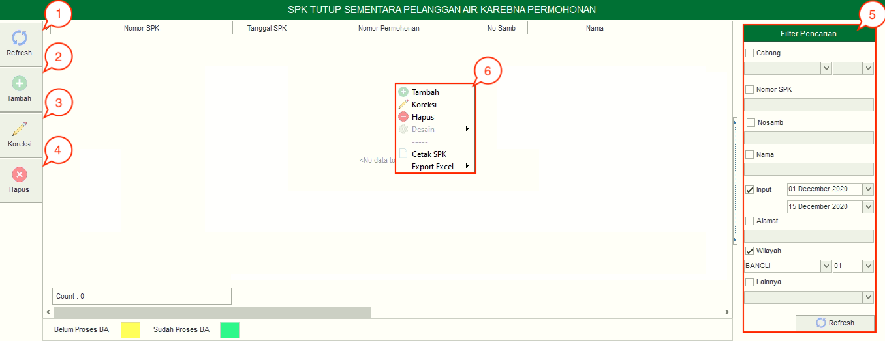
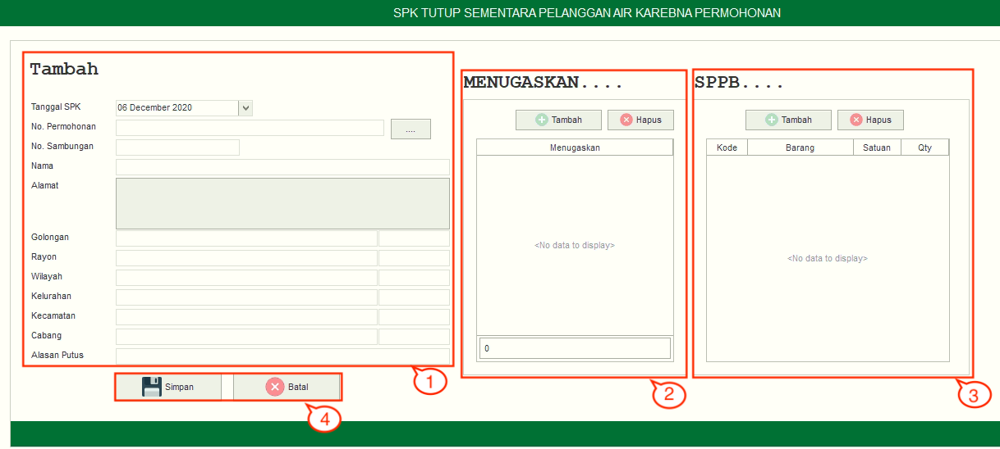
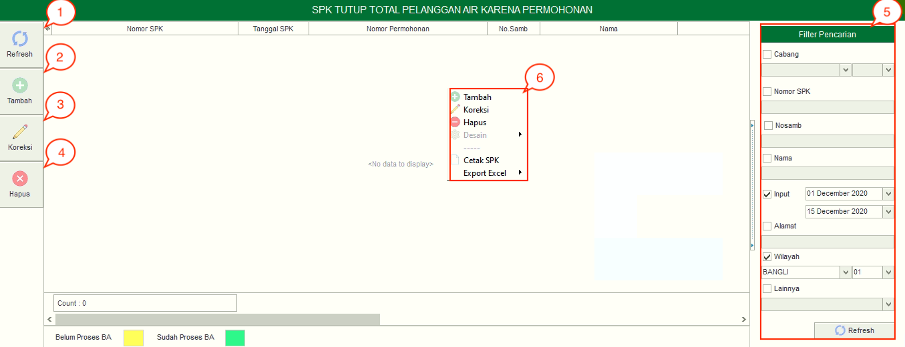
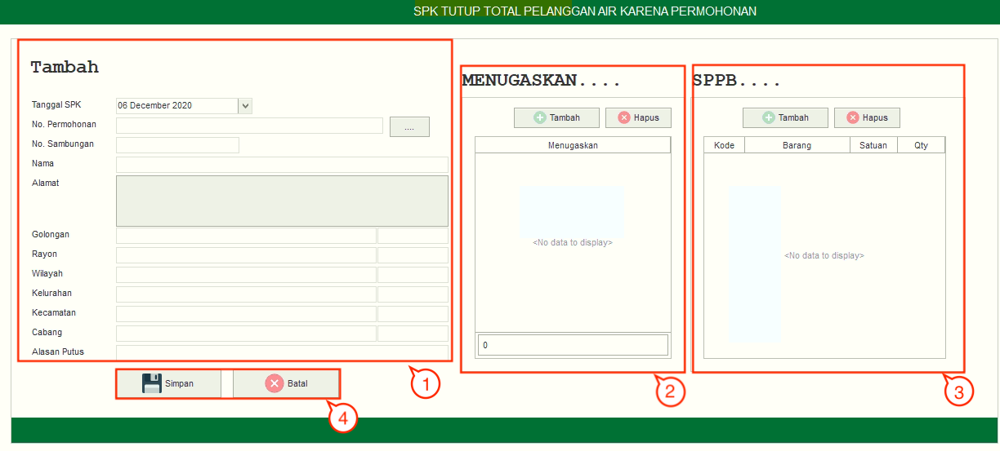

= Mengelola SPK Tutup Total karena Permohonan

SPK Tutup karena Permohonan dibedakan menjadi 2 berdasarkan periode penutupan, yaitu sementara dan total. Fitur ini berfungsi atas dasar permohonan pelanggan, sementara jika ditutup oleh petugas.

_Dropdown_ SPK berisi 2 pilihan yang disesuaikan dengan jenis permohonan, meliputi *SPK Tutup Sementara Pelanggan Air (karena Permohonan)* dan *SPK Tutup Total Pelanggan Air (karena Permohonan)*. Berikut Penjelasan fitur yang ada di dalam kedua SPK Tutup karena permohonan total dan sementara:

.*SPK Tutup Sementara Pelanggan Air (karena Permohonan)*
[%collapsible]
====

1. *Refresh SPK Tutup Sementara Pelanggan Air (karena Permohonan)*
+
Tombol *Refresh* digunakan untuk memperbarui data SPK Tutup Sementara Pelanggan Air (karena Permohonan) yang mungkin belum masuk ketika data sudah di-_submit_.

2. *Tambah SPK Tutup Sementara Pelanggan Air (karena Permohonan)*
+
Tombol *Tambah* digunakan untuk menambah data baru SPK Tutup Sementara Pelanggan Air (karena Permohonan). Berikut cara untuk menambah data baru SPK Tutup Sementara Pelanggan Air (karena Permohonan):
+

[arabic]
. Isi *form yang tersedia* pada menu tambah data *SPK Tutup Sementara Pelanggan Air* (karena Permohonan)
. Kemudian tambahkan data petugas untuk menentukan penugasan, klik tombol *Tambah* untuk menambahkan *data petugas* yang akan ditugaskan. Tombol *Hapus* digunakan untuk menghapus data petugas yang sudah ditambahkan.
. Tambahkan data *SPPB* untuk menentukan keperluan material dan ongkos yang akan dikerjakan dengan cara klik pada tombol *Material* dan tombol *Ongkos*
. Klik tombol *Simpan* untuk menambahkan data *SPK Tutup Sementara Pelanggan Air* (karena Permohonan) yang baru. Tombol *Batal* digunakan untuk melakukan _cancel_ pada data yang akan ditambahkan.

3. *Koreksi SPK Tutup Sementara Pelanggan Air (karena Permohonan)*
+
Tombol *Koreksi* digunakan untuk melakukan koreksi pada data SPK Tutup Sementara Pelanggan Air (karena Permohonan). Untuk melakukan Koreksi, Anda dapat memilih data pada daftar, kemudian klik tombol *Koreksi*.

4. *Hapus SPK Tutup Sementara Pelanggan Air (karena Permohonan)*
+
Tombol *Hapus* digunakan untuk menghapus data SPK Tutup Sementara Pelanggan Air (karena Permohonan) dari daftar. Untuk menghapus data, Anda dapat memilih data pada daftar, kemudian klik tombol *Hapus*.

5. *Filter SPK Tutup Sementara Pelanggan Air (karena Permohonan)*
+
_Field_ Filter digunakan untuk mencari data SPK Tutup Sementara Pelanggan Air (karena Permohonan) sesuai dengan kebutuhan. Untuk melakukan pencarian data, Anda dapat mengisi _form_ sesuai dengan _field_ yang sudah ditentukan, kemudian klik tombol *Refresh*.

6. *Action Menu saat diklik kanan*
+
Anda dapat melakukan klik kanan pada *row data SPK Tutup Sementara Pelanggan Air (karena Permohonan)* untuk menampilkan _action menu_. Berikut adalah penjelasan untuk masing-masing _action menu_:
+
- *Tambah*: Untuk menambah data SPK Tutup Sementara Pelanggan Air (karena Permohonan)
- *Koreksi*: Untuk melakukan koreksi (edit) terhadap data SPK Tutup Sementara Pelanggan Air (karena Permohonan) yang dipilih
- *Hapus*: Untuk menghapus data yang SPK Tutup Sementara Pelanggan Air (karena Permohonan) yang dipilih
- *Cetak SPK*: Untuk mencetak SPK Tutup Sementara Pelanggan Air (karena Permohonan)
- *Export Excel*: Untuk expo_rt data yang dipilih ke format Excel
====

.*SPK Tutup Total Pelanggan Air (karena Permohonan)*
[%collapsible]
====

+

1. *Refresh SPK Tutup Total Pelanggan Air (karena Permohonan)*
+
Tombol *Refresh* digunakan untuk memperbarui data SPK Tutup Total Pelanggan Air (karena Permohonan) yang mungkin belum masuk ketika data sudah di-_submit_.

2. *Tambah SPK Tutup Total Pelanggan Air (karena Permohonan)*
+
Tombol *Tambah SPK tutup total pelanggan air (karena permohonan)* digunakan untuk menambah data baru SPK Tutup Total Pelanggan Air (karena Permohonan). Berikut cara untuk menambah data baru SPK Tutup Total Pelanggan Air (karena Permohonan):
+

[arabic]
. Isi _form_ yang tersedia pada menu *tambah data SPK Tutup Total Pelanggan Air (karena Permohonan)*
. Kemudian tambahkan data petugas untuk menentukan penugasan, klik tombol *Tambah* untuk menambahkan *data petugas* yang akan ditugaskan. Tombol *Hapus* digunakan untuk menghapus data petugas yang sudah ditambahkan
. Tambahkan data *SPPB* untuk menentukan keperluan material dan ongkos yang akan dikerjakan dengan cara klik pada tombol *Material* dan tombol *Ongkos*
. Klik tombol *Simpan* untuk menambahkan data *SPK Tutup Total Pelanggan Air (karena Permohonan)* yang baru. Tombol *Batal* digunakan untuk melakukan _cancel_ pada data yang akan ditambahkan.

3. *Koreksi SPK Tutup Total Pelanggan Air (karena Permohonan)*
+
Tombol Koreksi digunakan untuk melakukan koreksi pada data SPK Tutup Total Pelanggan Air (karena Permohonan). Untuk melakukan Koreksi, Anda dapat memilih data pada daftar, kemudian klik tombol *Koreksi*.
+
4. *Hapus SPK Tutup Total Pelanggan Air (karena Permohonan)*
+
Tombol *Hapus* digunakan untuk menghapus data SPK Tutup Total Pelanggan Air (karena Permohonan) dalam List. Untuk menghapus data, Anda dapat memilih data pada daftar, kemudian klik tombol *Hapus*.

5. *Filter SPK Tutup Total Pelanggan Air (karena Permohonan)*
+
_Field_ *Filter* digunakan untuk mencari data SPK Tutup Total Pelanggan Air (karena Permohonan) sesuai dengan kebutuhan. Untuk melakukan pencarian data, Anda dapat mengisi _form_ sesuai dengan _field_ yang sudah ditentukan, kemudian klik tombol *Refresh*.

6. *Action Menu saat diklik kanan*
+
Anda dapat melakukan klik kanan pada _row_ data SPK Tutup Total Pelanggan Air (karena Permohonan) untuk menampilkan _action menu_. Berikut adalah penjelasan untuk masing-masing _action menu_: 
+
- *Tambah*: Untuk menambah data SPK Tutup Total Pelanggan Air (karena Permohonan)
- *Koreksi*: Untuk melakukan koreksi (edit) terhadap data SPK Tutup Total Pelanggan Air (karena Permohonan) yang dipilih
- *Hapus*: Untuk menghapus data yang SPK Tutup Total Pelanggan Air (karena Permohonan) yang dipilih
- *Cetak SPK*: Untuk mencetak SPK Tutup Total Pelanggan Air (karena Permohonan)
- *Export Excel*: Untuk _export_ data yang dipilih ke format _excel_
====