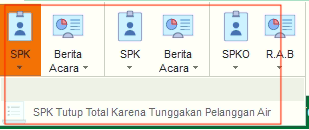
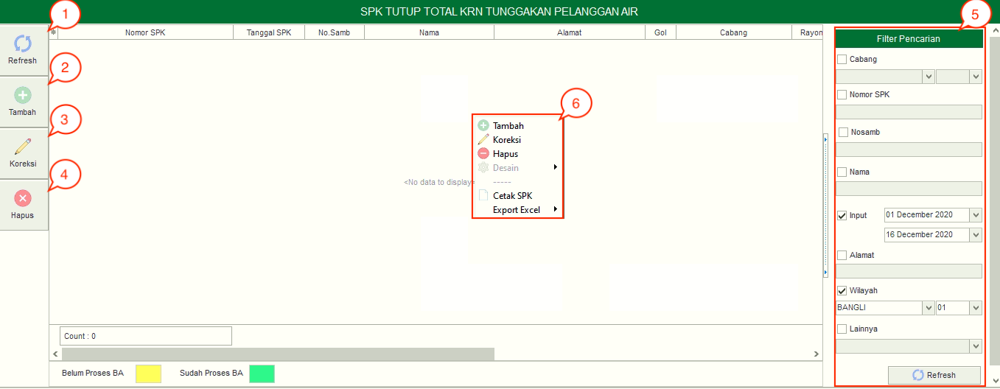
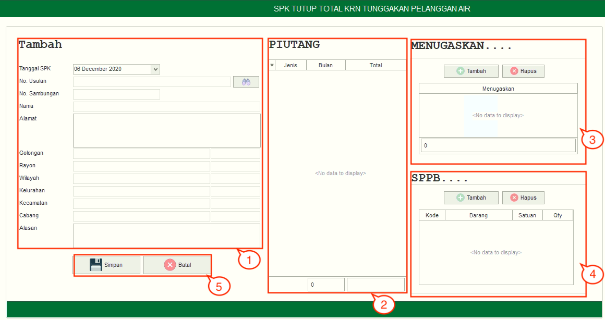

= Mengelola SPK Tutup Total karena Tunggakan

Berikut penjelasan fungsi yang ada di dalam *SPK Tutup Total karena Tunggakan Pelanggan Air*:

1. *Refresh SPK Tutup Total karena Tunggakan Pelanggan Air*
+
Tombol *Refresh* digunakan untuk memperbarui data SPK Tutup Total karena Tunggakan Pelanggan Air yang mungkin belum masuk ketika data sudah di-_submit_.

2. *Tambah SPK Tutup Total karena Tunggakan Pelanggan Air*
+
Tombol *Tambah* digunakan untuk menambah data baru SPK Tutup Total karena Tunggakan Pelanggan Air. Berikut cara untuk menambah data baru SPK Tutup Total karena Tunggakan Pelanggan Air:
+

[arabic]
. Untuk menambahkan data SPK Tutup Total karena Tunggakan Pelanggan Air baru. Isi _form_ yang tersedia pada menu tambah data SPK Tutup Total karena Tunggakan Pelanggan Air
. Setelah mengisi pada kolom *Tambah*, maka dapat dilihat jumlah piutang pelanggan pada kolom *Piutang*
. Kemudian tambahkan data petugas pada kolom Menugaskan untuk menentukan petugas yang akan dikirim untuk melakukan penyegelan meter, klik tombol *Tambah* untuk menambahkan data petugas yang akan ditugaskan. Tombol *Hapus* digunakan untuk menghapus data petugas yang sudah ditambahkan
. Tambahkan data *SPPB* untuk menentukan keperluan material dan ongkos yang akan dikerjakan dengan cara klik tombol *Material* dan tombol *Ongkos*
. Klik tombol *Simpan* untuk menambahkan data SPK Tutup Total karena Tunggakan Pelanggan Air yang baru. Tombol *Batal* digunakan untuk melakukan _cancel_ pada data yang akan ditambahkan.

3. *Koreksi SPK Tutup Total karena Tunggakan Pelanggan Air*
+
Tombol *Koreksi* digunakan untuk melakukan koreksi pada data SPK Tutup Total karena Tunggakan Pelanggan Air. Untuk melakukan Koreksi bisa, Anda dapat memilih data pada daftar, kemudian klik tombol *Koreksi*.

4. *Hapus SPK Tutup Total karena Tunggakan Pelanggan Air*
+
Tombol *Hapus* digunakan untuk menghapus data Usulan Tutup Total karena Tunggakan Pelanggan Air. Untuk menghapus data, Anda dapat memilih data pada daftar, kemudian klik tombol *Hapus*.

5. *Filter SPK Tutup Total karena Tunggakan Pelanggan Air*
+
_Field_ *Filter* digunakan untuk mencari data SPK Tutup Total karena Tunggakan Pelanggan Air sesuai dengan kebutuhan. Untuk melakukan pencarian data, Anda dapat mengisi _form_ sesuai dengan _field_ yang sudah ditentukan, kemudian klik tombol *Refresh*.

6. *Action Menu saat diklik kanan*
+
Anda dapat melakukan klik kanan pada _row_ data SPK Tutup Total karena Tunggakan Pelanggan Air untuk menampilkan _action menu_. Berikut adalah penjelasan untuk masing-masing _action menu_:
+
- *Tambah*: Untuk menambah data SPK Tutup Total karena Tunggakan Pelanggan Air
- *Koreksi*: Untuk melakukan koreksi (edit) terhadap data SPK Tutup Total karena Tunggakan Pelanggan Air yang dipilih
- *Hapus*: Untuk menghapus data yang SPK Tutup Total karena Tunggakan Pelanggan Air yang dipilih
- *Cetak SPK*: Untuk mencetak SPK Tutup Total karena Tunggakan Pelanggan Air
- *Export Excel*: Untuk _export_ data yang dipilih ke format Excel