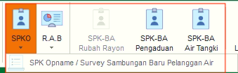
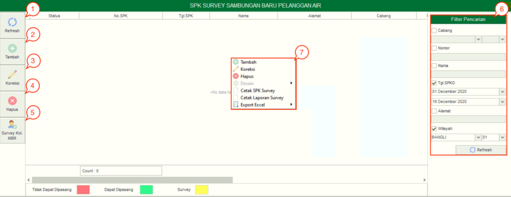
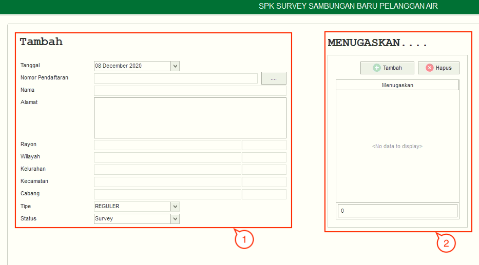

= Mengelola SPKO Sambungan Baru  

SPKO adalah Surat Perintah Kerja Opname yang terdiri dari sebuah sub fitur, yaitu *SPK Opname/ Survey Sambungan Baru Pelanggan Air*. Berikut adalah penjelasan fungsi yang ada di dalam kedua SPKO Sambungan Baru Sambungan Baru Pelanggan Air:

1. *Refresh SPK Opname/ Survey Sambungan Baru Pelanggan Air*
+
Tombol *Refresh* digunakan untuk memperbarui data SPKO Sambungan Baru Sambungan Baru Pelanggan Air yang mungkin belum masuk ketika data sudah di-_submit_.

2. *Tambah SPK Opname/ Survey Sambungan Baru Pelanggan Air*
+
Tombol *Tambah* digunakan untuk menambah data baru SPK Opname/ Survey Sambungan Baru Pelanggan Air dengan klik pada _icon_ *Tambah*. Berikut adalah cara untuk menambah data baru:
+

+
image::../images-distribusi/distribusi-SPKO-baru-4.png[align="center"]
[arabic]
. Isi _form_ yang tersedia pada menu *Tambah* data SPK Opname/ Survey Sambungan Baru Pelanggan Air
. Kemudian tambahkan data petugas pada kolom *Menugaskan* untuk menentukan petugas yang akan dikirim untuk melakukan survey meter, klik tombol *Tambah* untuk menambahkan data petugas yang akan ditugaskan. Tombol *Hapus* digunakan untuk menghapus data petugas yang sudah ditambahkan
. Klik tombol *Simpan* untuk menambahkan data SPK Opname/ Survey Sambungan Baru Pelanggan Air yang baru. Tombol *Batal* digunakan untuk melakukan _cancel_ pada data yang akan ditambahkan.
Koreksi SPK Opname/ Survey Sambungan Baru Pelanggan Air

3. *Koreksi SPK Opname/ Survey Sambungan Baru Pelanggan Air*
+
Tombol *Koreksi* digunakan untuk melakukan koreksi pada data SPK Opname/ Survey Sambungan Baru Pelanggan Air. Untuk melakukan Koreksi, Anda dapat memilih data pada daftar, kemudian klik tombol *Koreksi*.

4. *Hapus  SPK Opname/ Survey Sambungan Baru Pelanggan Air*
+
Tombol *Hapus* digunakan untuk menghapus data SPK Opname/ Survey Sambungan Baru Pelanggan Air. Untuk menghapus data, Anda dapat memilih data pada daftar, kemudian klik tombol klik tombol *Refresh*.

5. *Survey Kol. MBR*
+
Tombol *Survey Kol. MBR*  digunakan untuk mengetahui data pelanggan MBR yang termasuk dalam survey secara kolektif SPK Opname/ Survey Sambungan Baru Pelanggan Air.

6. *Filter SPK Opname/ Survey Sambungan Baru Pelanggan Air*
+
_Field_ *Filter* digunakan untuk mencari data SPK Opname/ Survey Sambungan Baru Pelanggan Air sesuai dengan kebutuhan. Untuk melakukan pencarian data, Anda dapat mengisi _form_ sesuai dengan _field_ yang sudah ditentukan kemudian klik pada *Submit*

7. *Action Menu saat diklik kanan*
+
Anda dapat melakukan klik kanan pada _row_ data SPK Opname/Survey Sambungan Baru Pelanggan Air untuk menampilkan _action menu_. Berikut adalah penjelasan untuk masing-masing _action menu_:
+
- *Tambah*: Untuk menambah data SPK Opname/ Survey Sambungan Baru Pelanggan Air
- *Koreksi*: Untuk melakukan koreksi (edit) terhadap data SPK Opname/ Survey Sambungan Baru Pelanggan Air yang dipilih
- *Hapus*: Untuk menghapus data yang SPK Opname/ Survey Sambungan Baru Pelanggan Air yang dipilih
- *Cetak SPK Survey*: Untuk mencetak SPK Survey
Cetak Laporan Survey: Untuk mencetak laporan survey
- *Export Excel*: Untuk _export_ data yang dipilih ke format Excel