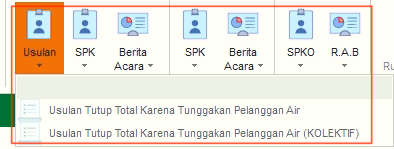
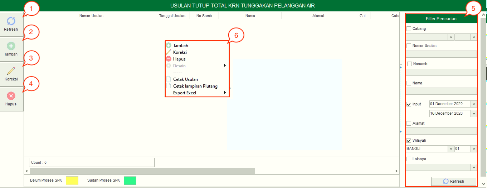
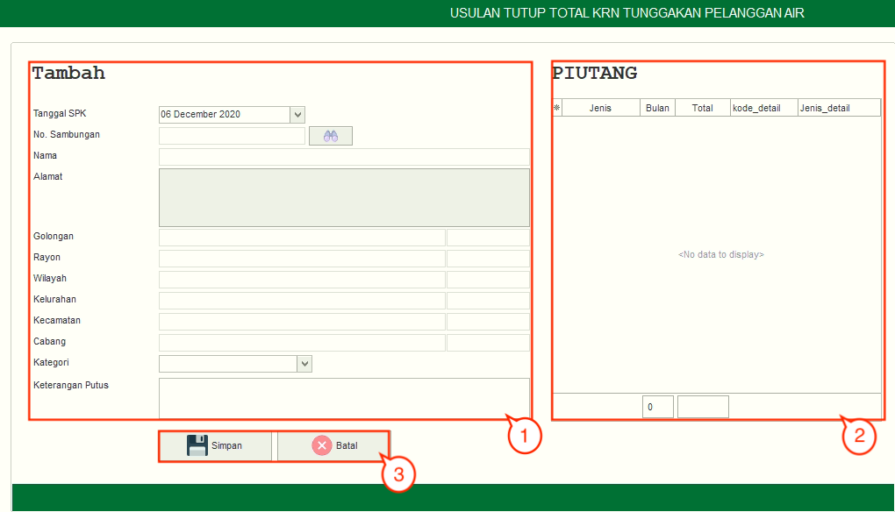
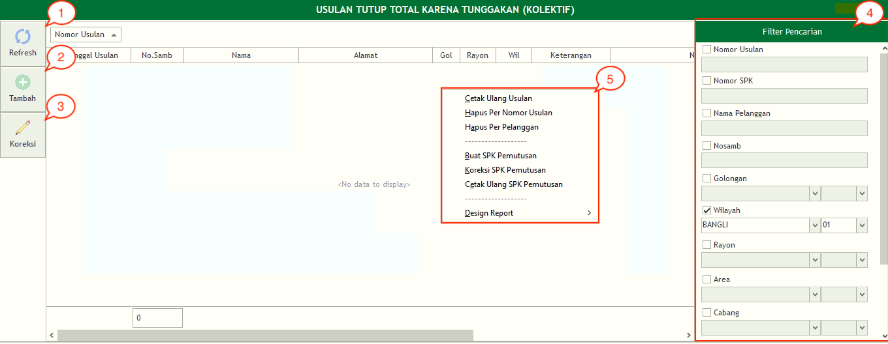
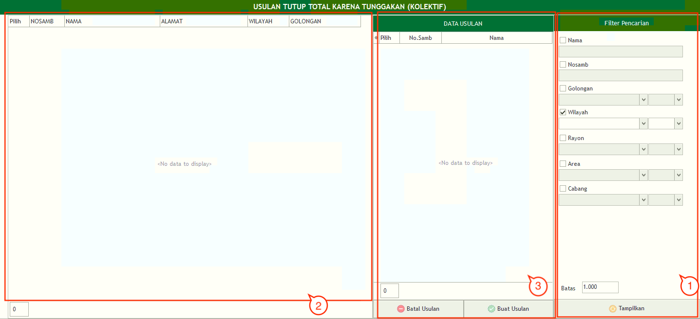

= Mengelola Usulan Tutup Total karena Tunggakan

Fitur *Usulan Tutup Total karena Tunggakan* digunakan PDAM untuk menutup atau menonaktifkan pelanggan karena memiliki tunggakan (besaran tunggakan tergantung kebijakan masing-masing PDAM, bisa 3 bulan dll). Fitur ini memiliki 2 sub fitur yang bisa diakses, meliputi *Usulan Tutup Total karena Tunggakan Pelanggan Air* dan *Pelanggan Air (Kolektif)*. Berikut penjelasan fungsi pada setiap sub-fiturnya:

.*Usulan Tutup Total karena Tunggakan Pelanggan Air*
[%collapsible]
====

1. *Refresh Usulan Tutup Total karena Tunggakan Pelanggan Air*
+
Tombol *Refresh* digunakan untuk memperbarui data Usulan Tutup Total karena Tunggakan Pelanggan Air yang mungkin belum masuk ketika data sudah di-_submit_.

2. *Tambah Usulan Tutup Total karena Tunggakan Pelanggan Air*
+
Tombol *Tambah* digunakan untuk menambah data baru Usulan Tutup Total karena Tunggakan Pelanggan Air. Berikut cara untuk menambah data baru Usulan Tutup Total karena Tunggakan Pelanggan Air:
+

[arabic]
. Untuk menambahkan data *Usulan Tutup Total karena Tunggakan Pelanggan Air* baru. Isi _form_ yang tersedia pada menu *Tambah* data *Usulan Tutup Total karena Tunggakan Pelanggan Air*
. Setelah mengisi pada kolom *Tambah*, maka dapat dilihat jumlah piutang pelanggan pada kolom *Piutang*
. Klik tombol *Simpan* untuk menambahkan data *Usulan Tutup Total karena Tunggakan Pelanggan* Air yang baru. Tombol *Batal* digunakan untuk melakukan _cancel_ pada data yang akan ditambahkan

3. *Koreksi Usulan Tutup Total karena Tunggakan Pelanggan Air*
+
Tombol *Koreksi* digunakan untuk melakukan koreksi pada data *Usulan Tutup Total karena Tunggakan Pelanggan Air*. Untuk melakukan Koreksi, Anda dapat memilih data pada daftar, kemudian klik tombol *Koreksi*.

4. *Hapus Usulan Tutup Total karena Tunggakan Pelanggan Air*
+
Tombol *Hapus* digunakan untuk menghapus data Usulan Tutup Total karena Tunggakan Pelanggan Air. Untuk menghapus data, Anda dapat memilih data pada daftar,kemudian klik tombol *Hapus*.

5. *Filter Usulan Tutup Total karena Tunggakan Pelanggan Air*
+
_Field_ *Filter* digunakan untuk mencari data Usulan Tutup Total karena Tunggakan Pelanggan Air sesuai dengan kebutuhan. Untuk melakukan pencarian data, Anda dapat mengisi _form_ sesuai dengan _field_ yang sudah ditentukan, kemudian klik tombol *Refresh*.

6. *Action Menu saat diklik kanan*
+
Anda dapat melakukan klik kanan pada _row_ data Usulan Tutup Total karena Tunggakan Pelanggan Air untuk menampilkan _action menu_. Berikut adalah penjelasan untuk masing-masing _action menu_: 
+
- *Tambah*: Untuk menambah data Usulan Tutup Total karena Tunggakan Pelanggan Air
- *Koreksi*: Untuk melakukan koreksi (edit) terhadap data Usulan Tutup Total karena Tunggakan Pelanggan Air yang dipilih
- *Hapus*: Untuk menghapus data yang Usulan Tutup Total karena Tunggakan Pelanggan Air yang dipilih
- *Desain*: Untuk melakukan kustomisasi pada  Usulan
- *Cetak Usulan*: Untuk mencetak Usulan Tutup Total karena Tunggakan Pelanggan Air
- *Cetak Lampiran Piutang*: Untuk mencetak lampiran piutang.
- *Export Excel*: Untuk _export_ data yang dipilih ke format Excel
====

.*Usulan Tutup Total karena Tunggakan Pelanggan Air (Kolektif)*
[%collapsible]
====

1. *Refresh Usulan Tutup Total karena Tunggakan Pelanggan Air (Kolektif)*
+
Tombol *Refresh* digunakan untuk memperbarui data Usulan Tutup Total karena Tunggakan Pelanggan Air (Kolektif) yang mungkin belum masuk ketika data sudah di-_submit_.

2. *Tambah Usulan Tutup Total karena Tunggakan Pelanggan Air (Kolektif)*
+
Tombol *Tambah* digunakan untuk menambah data baru Usulan Tutup Total karena Tunggakan Pelanggan Air (Kolektif). Berikut cara untuk menambah data baru Usulan Tutup Total karena Tunggakan Pelanggan Air (Kolektif):
+

[arabic]
. Untuk menambahkan data Usulan Tutup Total karena Tunggakan Pelanggan Air (Kolektif) baru, isi filter yang tersedia pada menu *Filter* untuk memunculkan data *Usulan Tutup Total karena Tunggakan Pelanggan Air (Kolektif)*
. Lihat data yang muncul pada kolom tampilan data
. Kemudian pilih data pelanggan yang ingin ditutup secara kolektif pada kolom *Data Usulan* pada kolom *Pelaksana* untuk menentukan pelaksana penutupan meter. Klik tombol *Buat Usulan* untuk melakukan proses usulan tutup kolektif. Klik tombol *Batal Usulan* untuk membatalkan usulan tutup secara kolektif

3. *Koreksi Usulan Tutup Total karena Tunggakan Pelanggan Air (Kolektif)*
+
Tombol *Koreksi* digunakan untuk melakukan koreksi pada data Usulan Tutup Total karena Tunggakan Pelanggan Air (Kolektif). Untuk melakukan Koreksi, Anda dapat memilih data pada daftar, kemudian klik tombol *Koreksi*.

4. *Filter Usulan Tutup Total karena Tunggakan Pelanggan Air (Kolektif)*
+
_Field_ *Filter* digunakan untuk mencari data Usulan Tutup Total karena Tunggakan Pelanggan Air (Kolektif) sesuai dengan kebutuhan. Untuk melakukan pencarian data, Anda dapat mengisi _form_ sesuai dengan _field_ yang sudah ditentukan kemudian klik tombol *Tampilkan*.

5. *Action Menu saat diklik kanan*
+
Anda dapat melakukan klik kanan pada _row_ data *Usulan Tutup Total karena Tunggakan Pelanggan Air (Kolektif)* untuk menampilkan _action menu_. Berikut adalah penjelasan untuk masing-masing _action menu_:
+
- *Cetak Ulang Usulan*: Untuk mencetak ulang Usulan Tutup Total karena Tunggakan Pelanggan Air (Kolektif)
- *Hapus Per Nomor Usulan*: Untuk menghapus data per nomor Usulan Tutup Total karena Tunggakan Pelanggan Air yang dipilih
- *Hapus Per Pelanggan*: Untuk menghapus data per pelanggan Usulan Tutup Total karena Tunggakan Pelanggan Air yang dipilih
- *Buat SPK Pemutusan*: Untuk membuat SPK Pemutusan
- *Koreksi SPK Pemutusan*: Untuk koreksi (edit) SPK Pemutusan yang dipilih
- *Cetak Ulang SPK Pemutusan*: Untuk mencetak SPK Pemutusan
- *Design Report*: Untuk mengubah kustomisasi rancangan laporan
====