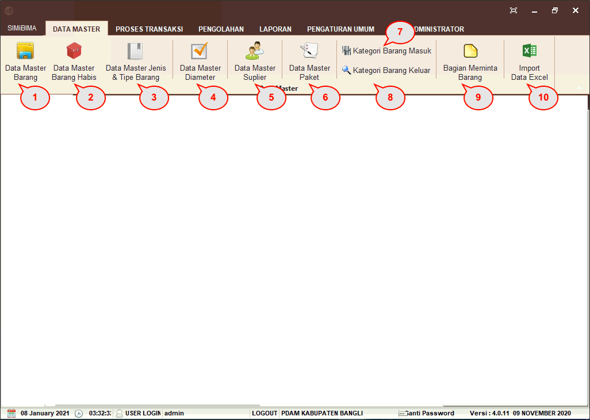
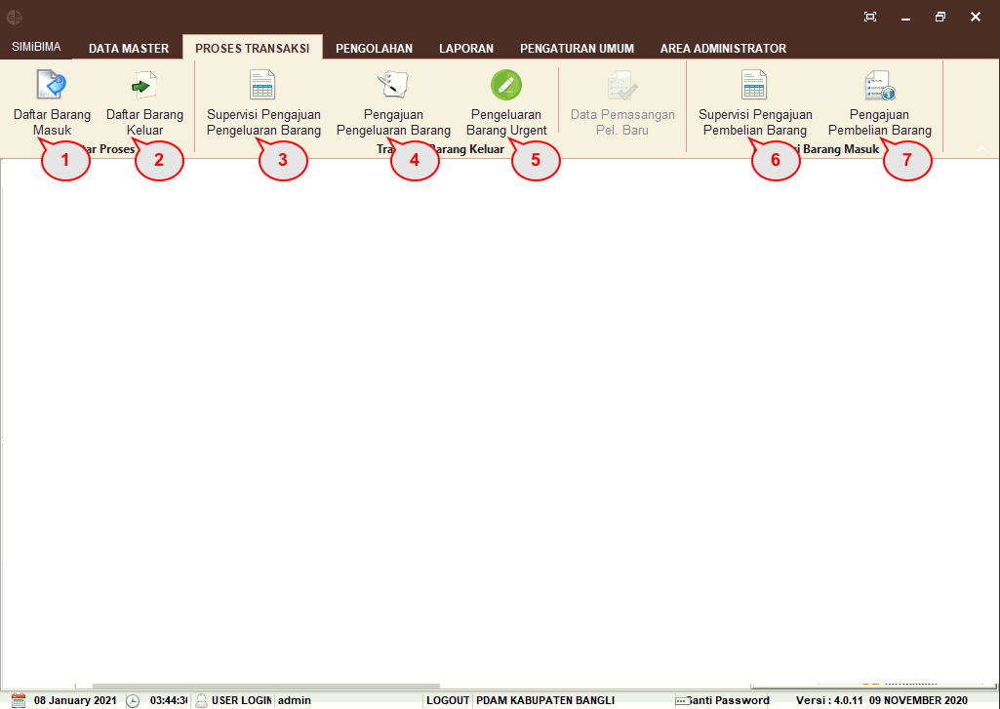
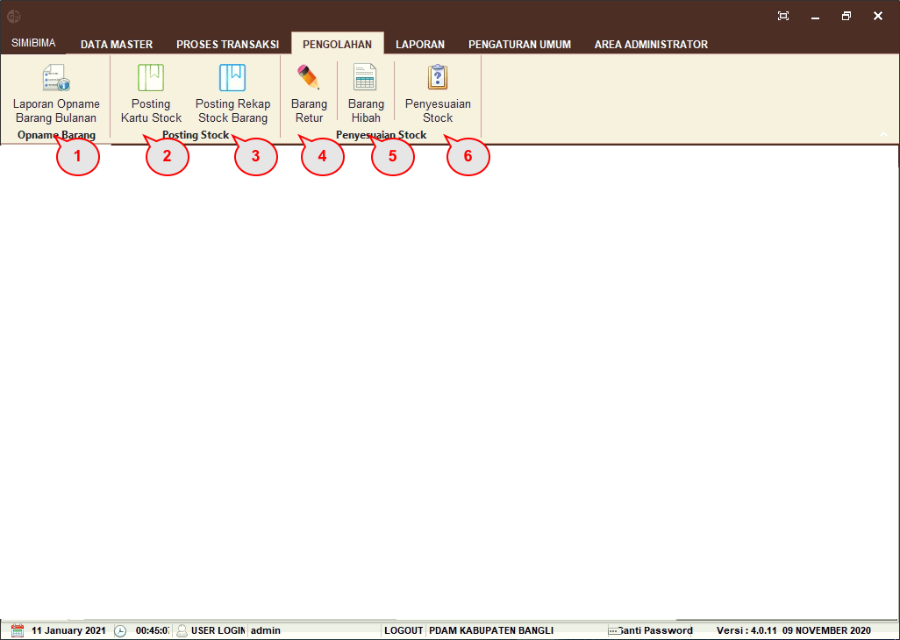
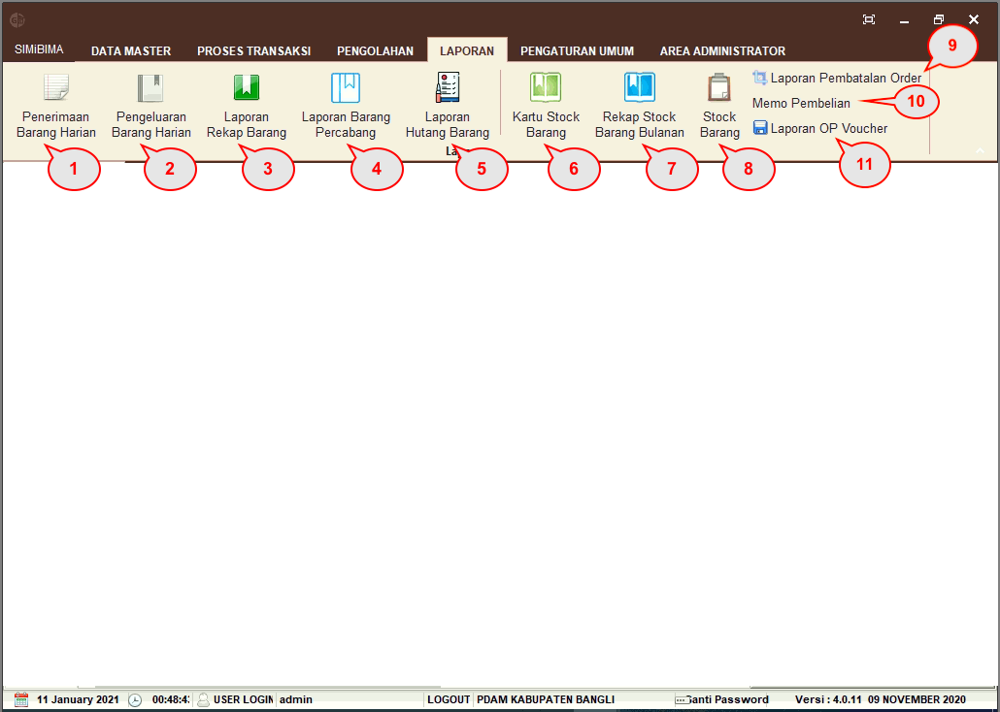
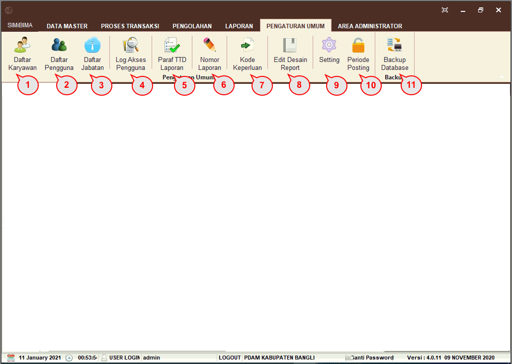
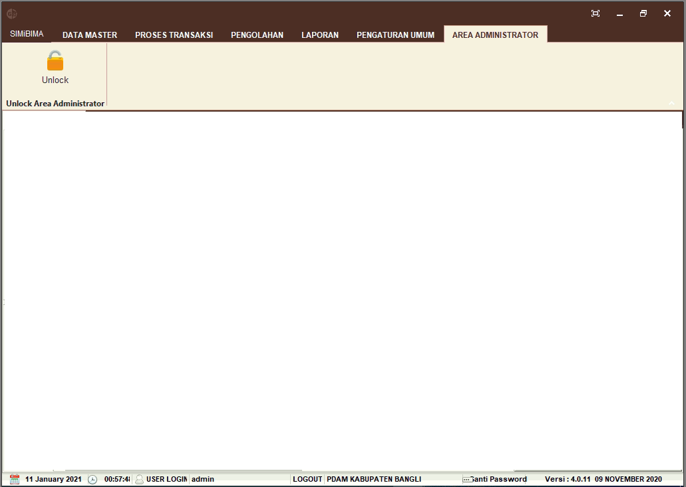

= Menu Modul Gudang

Terdapat 6 menu dalam Modul Gudang, yaitu:

1. Menu Data Master
+
.Detail Menu Data Master
[%collapsible]
====
Menu *Data Master* digunakan untuk menampilkan, menambah, mengubah, dan menghapus semua kategori data yang berhubungan dengan gudang. Data yang dapat dikelola di antaranya data barang secara keseluruhan, barang habis, jenis dan tipe barang, supplier, paket, barang masuk,  barang keluar, dan bagian/divisi peminta barang seperti gambar berikut.

Berikut adalah penjelasan setiap ikon yang terdapat pada menu *Data Master*.

1. Ikon *Data Master Barang* berfungsi untuk menambah, mengubah, dan menghapus data barang yang diperlukan oleh PDAM.
2. Ikon *Data Master Barang Habis* berfungsi untuk memasukkan data barang-barang yang jika dikeluarkan dari gudang akan dianggap habis, tidak akan retur atau ada sisanya, contohnya ATK (Alat Tulis Kantor).
3. Ikon *Data Master Jenis & Tipe Barang* berfungsi untuk memasukkan data jenis dan tipe dari barang. Sebagai contoh tipe barang instalasi jenisnya bisa berupa perpipaan, _water meter_, dan perpompaan. Menu ini biasanya disesuaikan dengan laporan akuntansi untuk bagian gudang agar nanti laporannya sinkron.
4. Ikon *Data Master Diameter* digunakan untuk menambah, mengubah, dan menghapus data diameter barang yang biasanya dipakai oleh PDAM.
5. Ikon *Data Master Supplier* berfungsi untuk menambah, mengubah, dan menghapus data supplier penyedia barang yang bekerja sama dengan PDAM.
6. Ikon *Data Master Paket* berfungsi untuk menambah, mengubah, dan menghapus data paket yang di dalamnya terdapat barang-barang yang diperlukan untuk _bundling_ paket tersebut, seperti paket Sambungan Baru, Sambungan Kembali, dan Perbaikan.
7. Ikon *Kategori Barang Masuk* berfungsi untuk menambah, mengubah, dan menghapus kategori barang yang masuk ke gudang.
8. Ikon *Kategori Barang Keluar* berfungsi untuk menambah, mengubah, dan menghapus kategori barang yang keluar dari gudang.
9. Ikon *Bagian Meminta Barang* berfungsi untuk menambah, mengubah, dan menghapus bagian/divisi pada PDAM yang biasa mengajukan permintaan barang.
10. Ikon *Import Data Excel* berfungsi untuk mengunggah data master dalam bentuk excel.
====

2. Menu Proses Transaksi
+
.Detail Menu Proses Transaksi
[%collapsible]
====
Menu *Proses Transaksi* berfungsi untuk merekap barang yang masuk dan keluar gudang, mengajukan permintaan pembelian barang dan pengeluaran barang dari gudang, serta supervisi permintaan pembelian dan pengeluaran barang.

Berikut ini merupakan penjelasan seluruh ikon yang tersedia dalam menu *Proses Transaksi*.

1. Ikon *Daftar Barang Masuk* berfungsi untuk menampilkan data barang yang masuk ke gudang per bulan.
2. Ikon *Daftar Barang Keluar* berfungsi untuk untuk menampilkan data barang yang keluar dari gudang per bulan.
3. Ikon *Supervisi Pengajuan Pengeluaran Barang* digunakan pengecekan barang yang akan keluar dari gudang beserta kuantitasnya (yang telah diajukan sebelumnya) untuk  bagian terkait.
4. Ikon *Pengajuan Pengeluaran Barang* berfungsi untuk mengajukan pengeluaran barang dari gudang untuk bagian tertentu yang meminta barang.
5. Ikon *Pengeluaran Barang Urgent* berfungsi untuk menginput data barang yang keluar, bukan dari persediaan yang ada di gudang.
6. Ikon *Supervisi Pengajuan Pembelian Barang* berfungsi untuk mengedit data harga dan kuantiti barang serta menghapus barang yang tidak disetujui saat pengajuan. Jika barang disetujui maka pindahkan ke LPB (Laporan Pembelian Barang). Sebaliknya, jika tidak sesuai kembalikan ke DPB (Daftar Pembelian Barang).
7. Ikon *Pengajuan Pembelian Barang* digunakan untuk mengajukan barang-barang yang akan dibeli jika barang gudang hampir habis.
====

3. Menu Pengolahan
+
.Detail Menu Pengolahan
[%collapsible]
====
Menu Proses Pengolahan digunakan memproses perhitungan barang. Proses tersebut mencakup barang keluar masuk, retur, hibah, penyesuaian stock, dll seperti gambar berikut.

Berikut adalah penjelasan terkait semua ikon yang terdapat dalam *Menu Pengolahan*.

1. Ikon *Laporan Opname Barang Bulanan* berfungsi untuk membuat laporan opname bulanan dari hasil proses keluar dan masuk barang pada bulan yang bersangkutan. Dapat menghapus periode opname jika diperlukan untuk hapus periode opname.
2. Ikon *Posting Kartu Stock* berfungsi untuk memproses data jumlah barang gudang per bulan yang akan menjadi laporan kartu stok.
3. Ikon *Posting Rekap Stock Barang* berfungsi untuk memproses data jumlah barang dan harga barang per bulan yang nanti akan menjadi laporan rekap stok barang versi gudang dan versi keuangan.
4. Ikon *Barang Retur* berfungsi untuk memasukkan data barang retur atau kembali ke gudang karena masih tersisa saat pengerjaan proyek selesai.
5. Ikon *Barang Hibah* digunakan untuk memasukkan data barang hibah atau barang pemberian dari pemerintah setempat untuk proyek sambungan rumah gratis.
6. Ikon *Penyesuaian Stock* berfungsi untuk menyesuaikan jumlah stok barang yang ada pada sistem dengan stok asli di gudang. Hal ini dilakukan jika terdapat perbedaan jumlah stok antara sistem dan stok asli yang disebabkan oleh kesalahan input atau kesalahan pada data awal.
====

4. Menu Laporan
+
.Detail Menu Laporan
[%collapsible]
====
Menu *Laporan* digunakan untuk menampilkan semua laporan, meliputi penerimaan barang. pengeluaran barang, rekap barang, rekap stok barang, pembatalan order, memo pembelian, maupun OP voucher. Dalam menu ini juga terdapat filter untuk menyaring data laporan.

Berikut adalah penjelasan terkait ikon yang terdapat dalam Menu Laporan.

1. Ikon *Penerimaan Barang Harian* berfungsi untuk menampilkan data penerimaan barang gudang yang dapat ditampilkan berdasarkan tanggal, kode barang, deskripsi, atau cabang.
2. Ikon *Pengeluaran Barang Harian* berfungsi untuk menampilkan data pengeluaran barang gudang yang dapat ditampilkan berdasarkan tanggal, kode barang, deskripsi, atau cabang.
3. Ikon *Laporan Rekap Barang* berfungsi untuk menampilkan hasil rekap jumlah barang gudang per tahun yang dapat ditampilkan berdasarkan kode barang, cabang, dan kategori.
4. Ikon *Laporan Barang Percabang* berfungsi jika di unit/cabang menggunakan aplikasi gudang juga dan menyetok barang, maka stok barang per cabang dapat dilihat pada menu untuk barang yang didistribusikan dulu.
5. Ikon *Laporan Hutang Barang* berfungsi untuk menampilkan laporan barang yang dipinjam oleh unit/IKK/wilayah, tetapi belum dipakai di lapangan karena status stok yang berubah.
6. Ikon *Kartu Stock Barang* berfungsi untuk menampilkan data jumlah barang gudang dalam bentuk laporan per bulan.
7. Ikon *Rekap Stock Barang Bulanan* berfungsi untuk menampilkan data jumlah dan harga barang gudang dalam bentuk laporan per bulan dan terdapat 2 versi laporan, yaitu laporan versi gudang dan versi keuangan.
8. Ikon *Stock Barang* berfungsi untuk menampilkan jumlah stok barang gudang secara realtime.
9. Ikon *Laporan Pembatalan Order* berfungsi untuk menampilkan data Daftar Pembelian Barang gudang yang dibatalkan karena tidak mendapat persetujuan dari pihak terkait.
10. Ikon *Memo Pembelian* berfungsi untuk memasukkan data barang titipan di gudang yang nanti tidak akan mempengaruhi persediaan pada aplikasi SIMiBIMA Gudang. Menu ini dikembangkan karena adanya barang Pemerintah Daerah yang dititipkan pada PDAM namun tidak masuk ke persediaan gudang PDAM.
11. Ikon *Laporan OP Voucher* berfungsi untuk menampilkan voucher pembelian dari OP (Order Pembelian) yang ada di gudang.

====

5. Menu Pengaturan Umum
+
.Detail Menu Pengaturan Umum
[%collapsible]
====
Menu *Pengaturan Umum* dapat digunakan untuk mengubah pengaturan dalam aplikasi. Dalam menu ini, _User_ dapat menambahkan dan mengubah data karyawan, data pengguna, daftar jabatan, paraf TTD yang akan dicantumkan dalam laporan, kode keperluan, dan format laporan.

Selain itu, _User_ juga dapat mengubah pengaturan notifikasi dan session serta melakukan _backup database_.

Berikut adalah ikon yang tersedia dalam Menu Pengaturan Umum.

1. Ikon *Daftar Karyawan* berfungsi untuk menambah, mengubah, dan menghapus data karyawan yang diizinkan untuk akses aplikasi Gudang.
2. Ikon *Daftar Pengguna* berfungsi untuk menambah, mengubah, dan menghapus data pengguna serta mengisi username dan password yang nanti akan digunakan untuk mengakses SIMiBIMA Gudang.
3. Ikon *Daftar Jabatan* berfungsi untuk menentukan apa saja yang dapat diakses oleh masing-masing user dalam aplikasi SIMiBIMA Gudang.
4. Ikon *Log Akses Pengguna* digunakan untuk menampilkan _history user_ pada aplikasi SIMiBIMA Gudang.
5. Ikon *Paraf TTD Laporan* berfungsi untuk menambah dan mengubah nama, jabatan, dan NIK yang akan dicantumkan pada tanda tangan di laporan.
6. Ikon *Nomor Laporan* digunakan untuk menentukan format penomoran laporan pada aplikasi Gudang.
7. Ikon *Kode Keperluan* berfungsi untuk menambah dan mengubah  kode yang akan menjadi patokan nilai barang pada aplikasi Akuntansi dan Keuangan.
8. Ikon *Edit Desain Report* berfungsi untuk menyesuaikan laporan sesuai keinginan pengguna. Dalam hal ini bisa berupa perubahan/penambahan dan koreksi jika ada kesalahan dari laporan tersebut.
9. Ikon *_Setting_* digunakan untuk mengatur notifikasi dan _session_ pada aplikasi SIMiBIMA Gudang sehingga akan ada notifikasi jika terdapat barang masuk yang belum diproses. Aplikasi juga akan kembali ke menu _login_ jika tidak ada pergerakan melebihi _session_ yang telah ditentukan.
10. Ikon *Periode Posting* berfungsi untuk mengunci transaksi (keluar masuk) dan laporan setiap bulannya. Jadi setelah selesai proses posting stok dan kartu, maka akan ditutup otomatis di bulan itu dan tidak bisa ada transaksi lagi. Jika ingin membuka, cukup dengan membuka di menu periode posting.
11. Ikon *_Backup Database_* digunakan untuk melakukan _backup database_ aplikasi SIMiBIMA Gudang.

====

6. Menu Area Administrator
+
.Detail Menu Administrator
[%collapsible]
====
Menu *Area Administrator* dapat digunakan untuk _setting_ semua pengaturan yang ada dalam modul SIMiBIMA Gudang.

