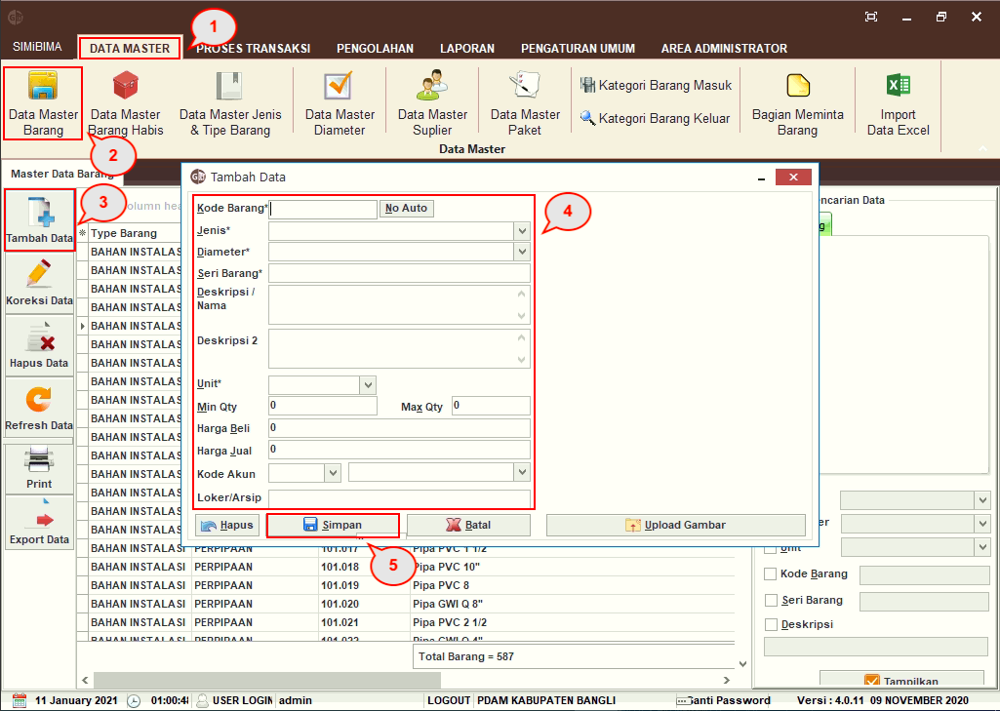
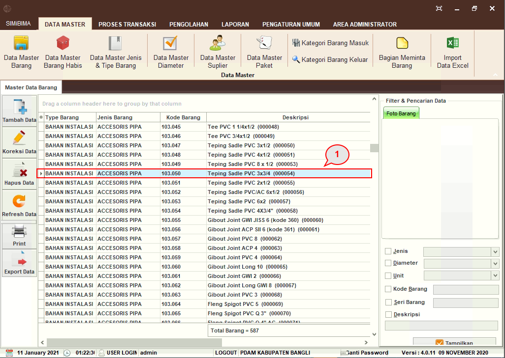
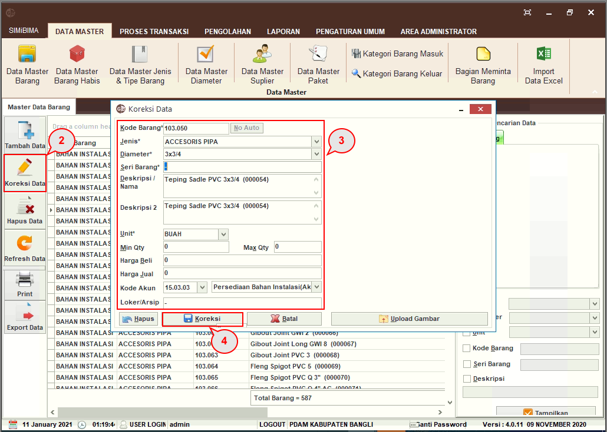
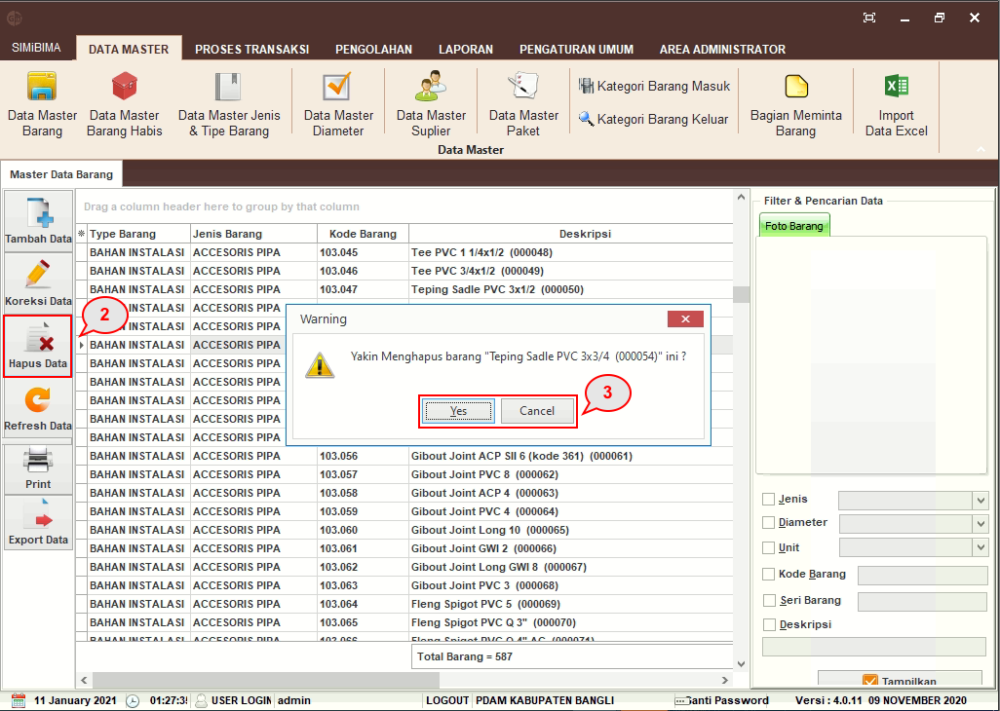

= Menambah, Mengubah, dan Menghapus Data Barang

Fitur ini berfungsi untuk pencatatan barang-barang yang ada dalam unit PDAM. Melalui fitur ini, _User_ dapat melihat, menambah, mengubah, dan menghapus data barang. Berikut ini merupakan langkah-langkah yang dapat digunakan.

*[underline]#Tambah Data#*

1. Pilih menu *Data Master*
2. Klik pada ikon *Data Master Barang*
3. Klik pada ikon *Tambah Data*
4. Isi _field_ *Kode Barang**, *Jenis**, *Diameter**, *Seri Barang**, *Deskripsi/Nama*, *Deskripsi 2*, *Unit**, *_Minimum Quantity_*, *_Maximum Quantity_*, *Harga Beli*, *Harga Jual*, *Kode Akun*, dan *Loker/Arsip*
5. Klik pada tombol *Simpan* untuk menyimpan data.

*[underline]#Koreksi Data#*

1. Pilih salah satu tipe barang, _supplier_, atau data lainnya
+

2. Klik pada ikon *Koreksi Data*
3. Ubah informasi pada _field_ yang ingin diubah
4. Klik pada tombol *Koreksi*

*[underline]#Hapus Data#*

1. Pilih salah satu tipe barang, _supplier_, atau data lainnya
+

2. Klik pada ikon *Hapus Data*
3. _Warning pop up_ akan muncul, klik pada tombol *Hapus* untuk menghapus data.