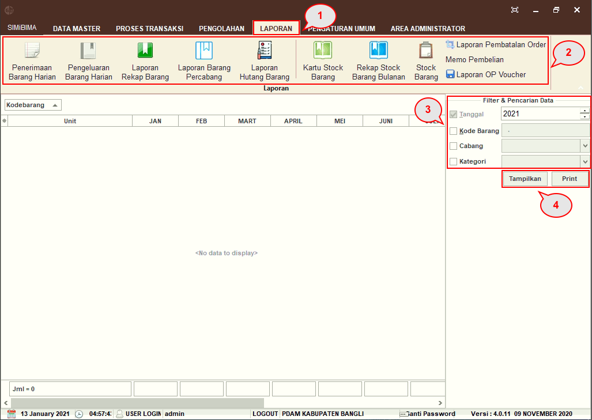

= Menampilkan dan Mencetak Laporan

Fitur ini dapat digunakan untuk menampilkan dan mencetak laporan. Untuk menampilkan laporan, ikuti langkah-langkah berikut.

1. Klik pada menu *Laporan*
2. Pilih ikon *Laporan* yang ingin ditampilkan
3. Filter data laporan dengan menu *Filter dan Pencarian Data*
4. Klik pada tombol *Tampilkan* untuk menampilkan atau tombol *_Print_* untuk mencetak laporan