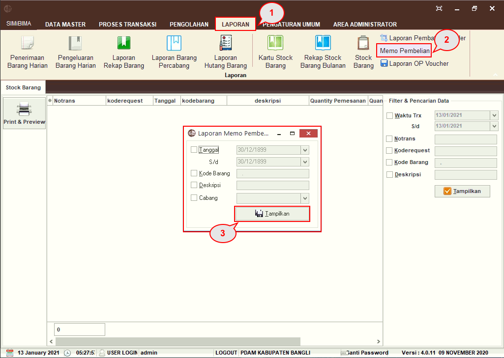

= Menampilkan dan Mencetak Memo Pembelian

1. Klik pada menu *Laporan*
2. Pilih ikon *Memo Pembelian*  
3. Muncul _pop up_ data laporan dengan menu *Filter dan Pencarian Data* yang telah disediakan pada aplikasi. _User_ dapat menampilkan data laporan berdasarkan Tanggal, Kode Barang, Deskripsi, dan / atau Cabang. Klik pada tombol *Tampilkan* untuk menampilkan laporan
4. Data yang dicari akan ditampilkan.
