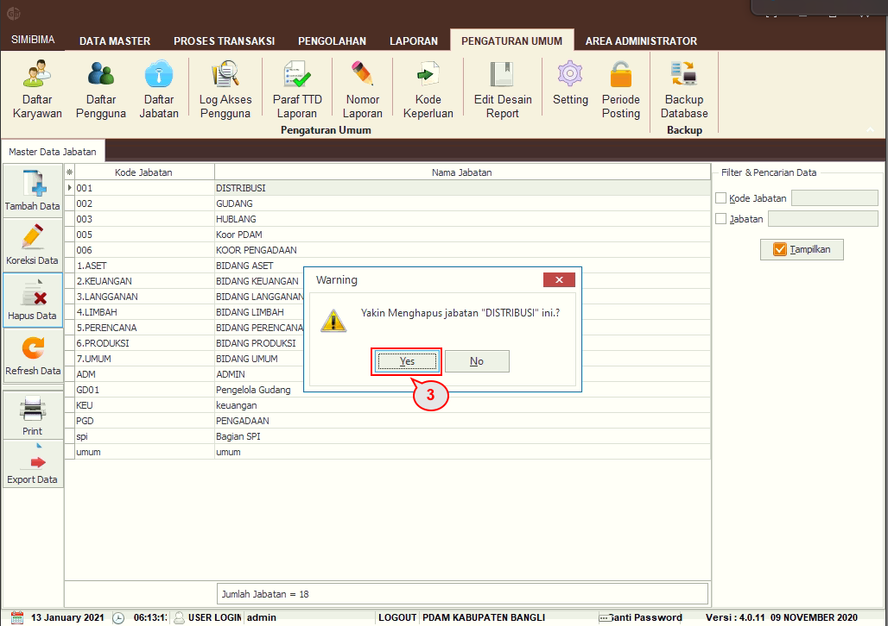

= Menambah, Mengubah, dan Menghapus Daftar Jabatan

Untuk menambah data jabatan, _User_ dapat mengikuti langkah-langkah berikut.

1. Pilih menu *Pengaturan Umum*
2. Klik pada ikon *Daftar Jabatan* hingga muncul daftar jabatan
3. Klik pada ikon *Tambah Data*
+

4. Selanjutnya muncul _form_ untuk menambah data akan muncul, isi _field_ *Kode Jabatan* dan *Nama Jabatan*, kemudian centang akses yang akan diberikan
5. Klik pada tombol *Simpan*.

Untuk mengubah data, _User_  dapat mengikuti langkah berikut.

1. Klik pada salah satu data jabatan
2. Klik pada tombol *Koreksi Data*
+

3. _Pop up_ koreksi data akan muncul, User dapat mengubah akses untuk jabatan yang perlu diubah
4. Klik pada tombol *Koreksi*.

Untuk menghapus data, _User_ dapat mengikuti langkah berikut.

1. Klik pada salah satu data jabatan
2. Klik pada tombol *Hapus Data*
+

3. _Pop up_ untuk menghapus data akan muncul. Klik pada tombol *Yes* untuk menghapus data.
