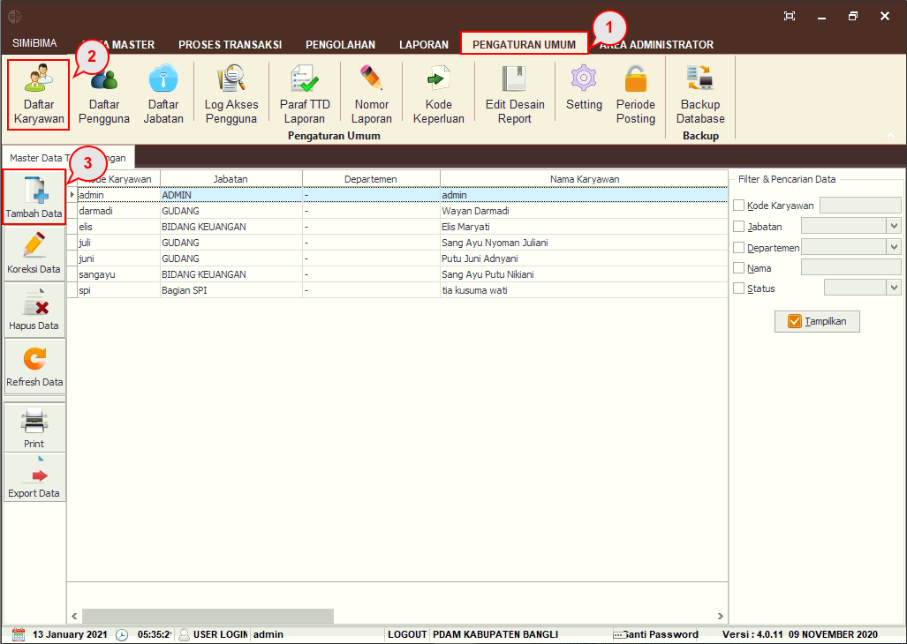
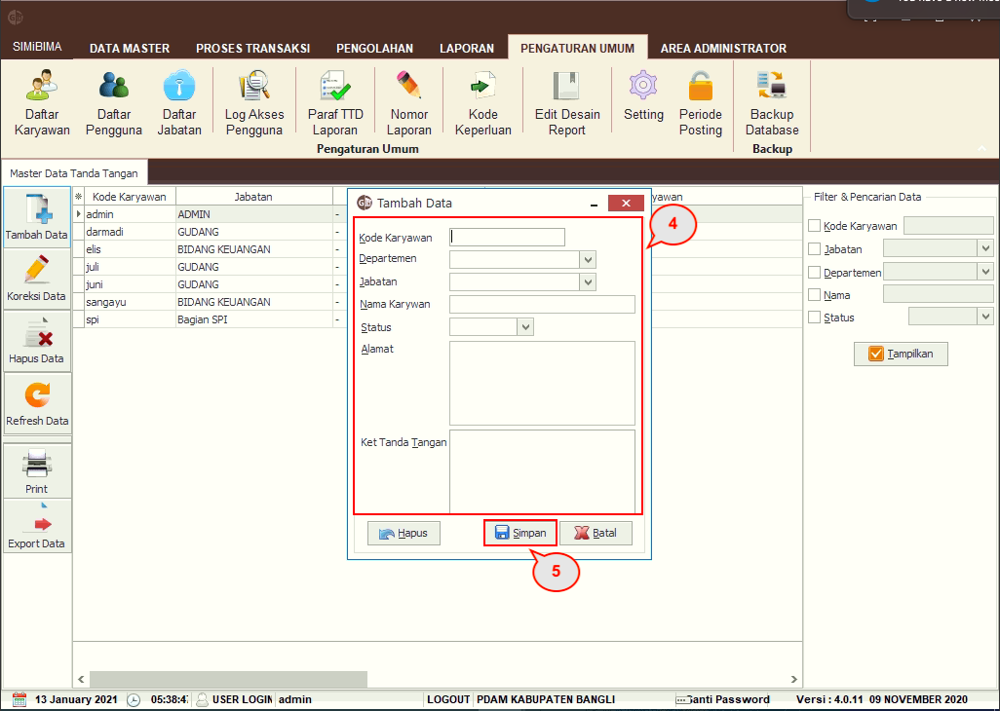
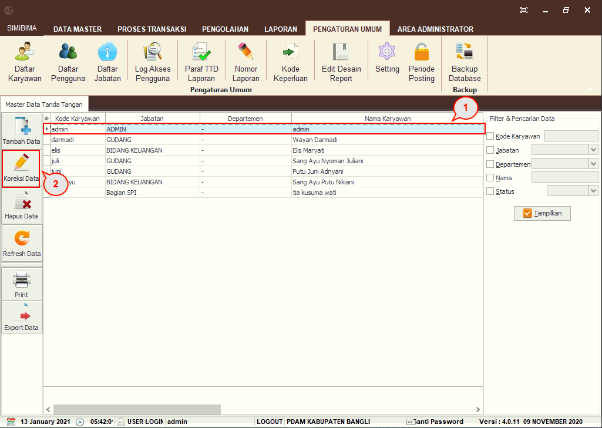
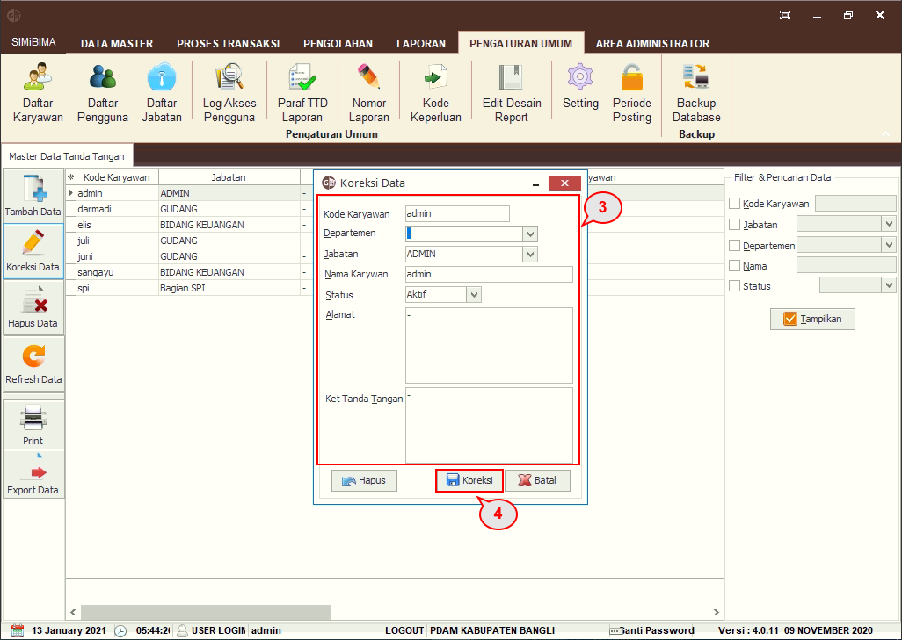
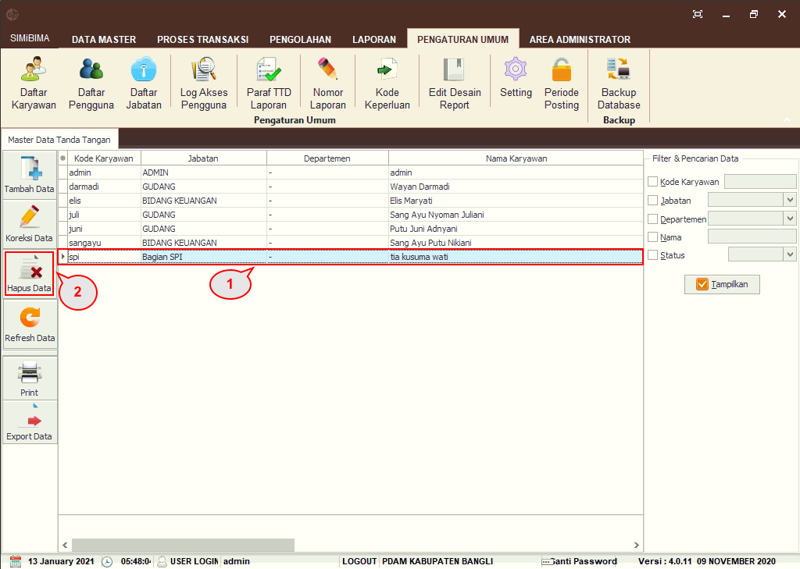
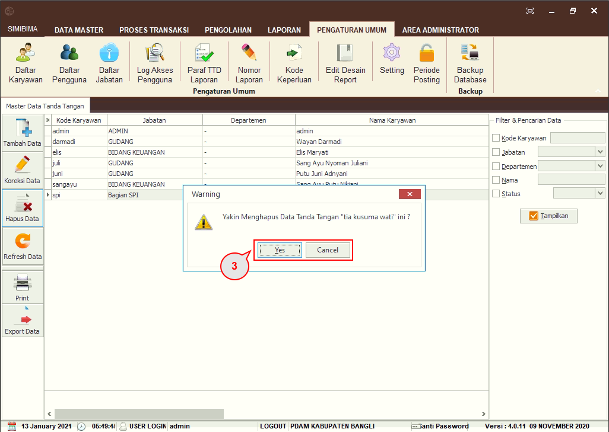

= Menambah, Mengubah, dan Menghapus Daftar Karyawan

Untuk menambah data karyawan, ikuti langkah-langkah berikut.

1. Pilih menu *Pengaturan Umum*
2. Klik pada ikon *Daftar Karyawan* hingga muncul daftar karyawan
3. Klik pada ikon *Tambah Data*
+

4. Selanjutnya _form_ untuk menambah data akan muncul, lengkapi _field_ *Kode Karyawan, Departemen, Jabatan, Nama Karyawan, Status, Alamat,* dan *Keterangan Tanda Tangan*
5. Klik pada tombol *Simpan*.

Untuk mengubah data, _User_ dapat mengikuti langkah berikut.

1. Klik pada salah satu data karyawan
2. Klik pada tombol *Koreksi Data*
+

3. _Pop up_ koreksi data akan muncul, _User_ dapat mengubah informasi yang perlu diubah
4. Klik pada tombol *Koreksi*.

Untuk menghapus data, _User_ dapat mengikuti langkah berikut.

1. Klik pada salah satu data karyawan
2. Klik pada tombol *Hapus Data*
+

3. _Pop up_ untuk menghapus data akan muncul. Klik pada tombol *Yes* untuk menghapus data.