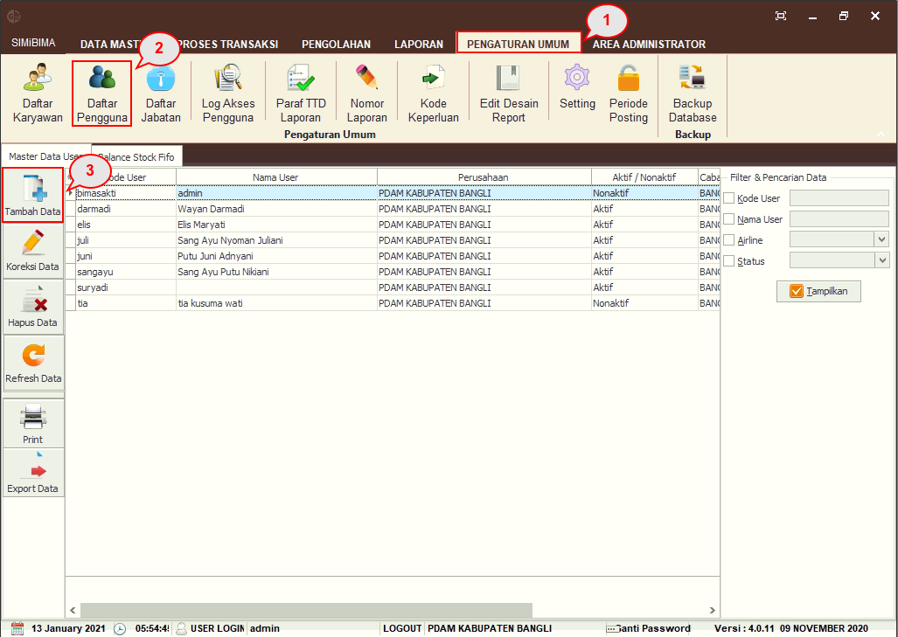
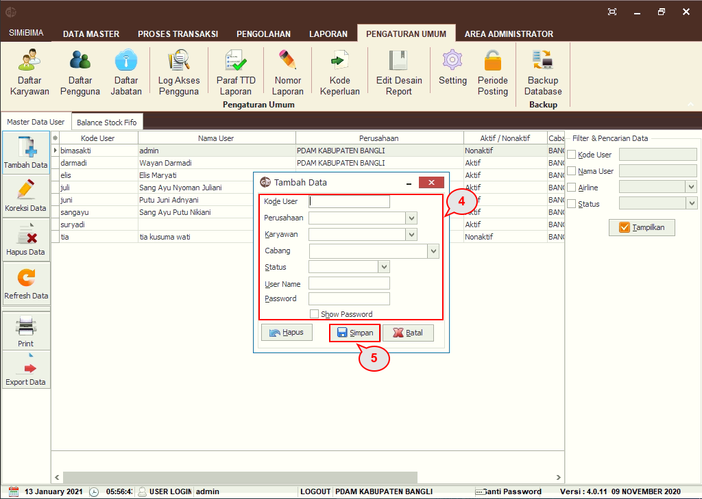
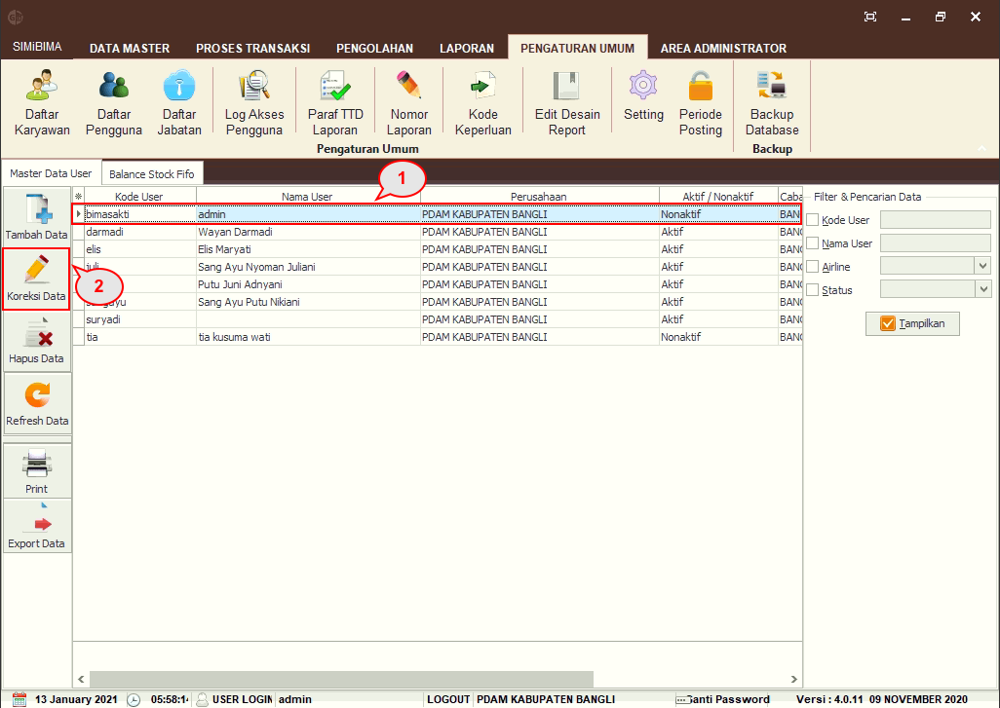
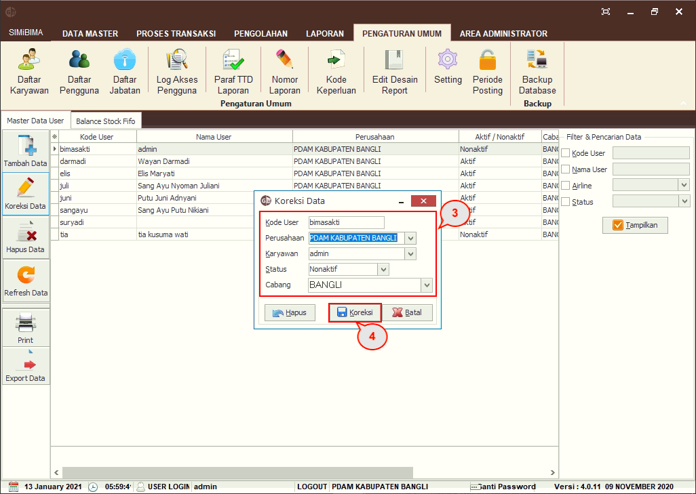
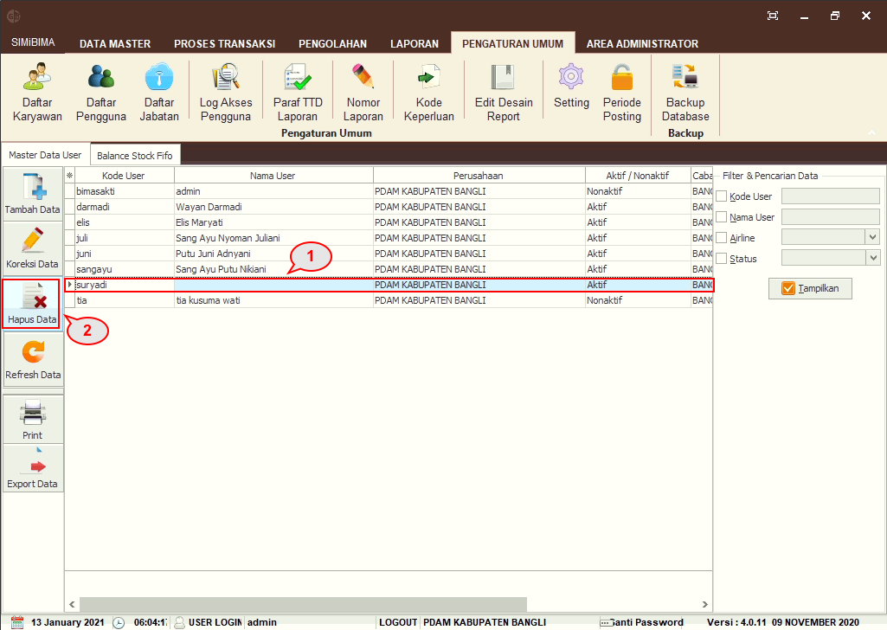
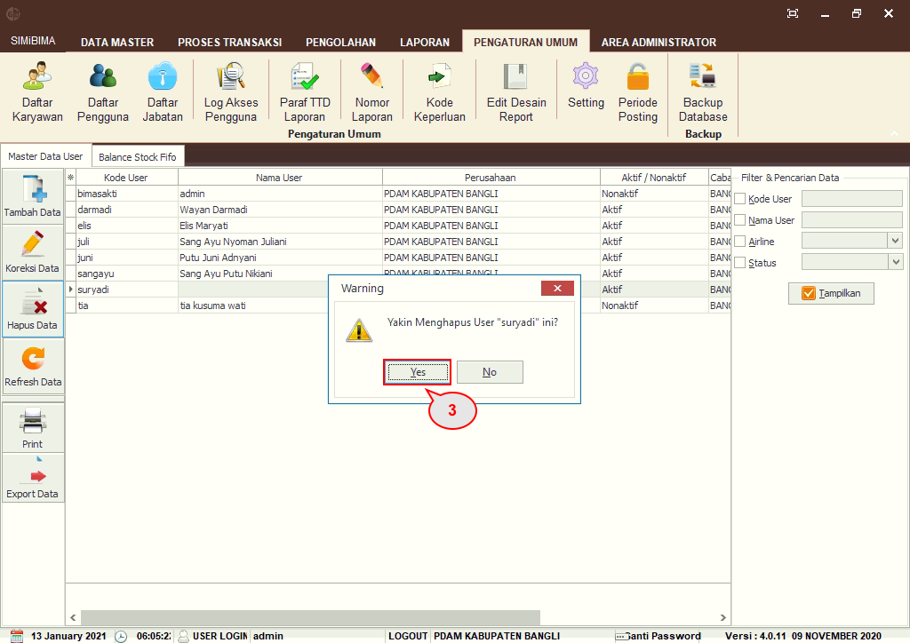

= Menambah, Mengubah, dan Menghapus Daftar Pengguna

Untuk menambah data pengguna, ikuti langkah-langkah berikut.

1. Pilih menu *Pengaturan Umum*
2. Klik pada ikon *Daftar Pengguna* hingga muncul daftar pengguna
3. Klik pada ikon *Tambah Data*
+

4. Selanjutnya akan muncul _form_ untuk menambah data akan muncul, lengkapi _field_ *Kode User, Perusahaan, Karyawan, Status, User Name,* dan *_Password_*
5. Klik pada tombol *Simpan*.

Untuk mengubah data, _User_ dapat mengikuti langkah berikut.

1. Klik pada salah satu data pengguna
2. Klik pada tombol *Koreksi Data*
+

3. _Pop up_ koreksi data akan muncul, Anda dapat mengubah informasi yang perlu diubah
4. Klik pada tombol *Koreksi*

Untuk menghapus data, _User_ dapat mengikuti langkah berikut.

1. Klik pada salah satu data pengguna
2. Klik pada tombol *Hapus Data*
+

3. _Pop up_ untuk menghapus data akan muncul. Klik pada tombol *Yes* untuk menghapus data.