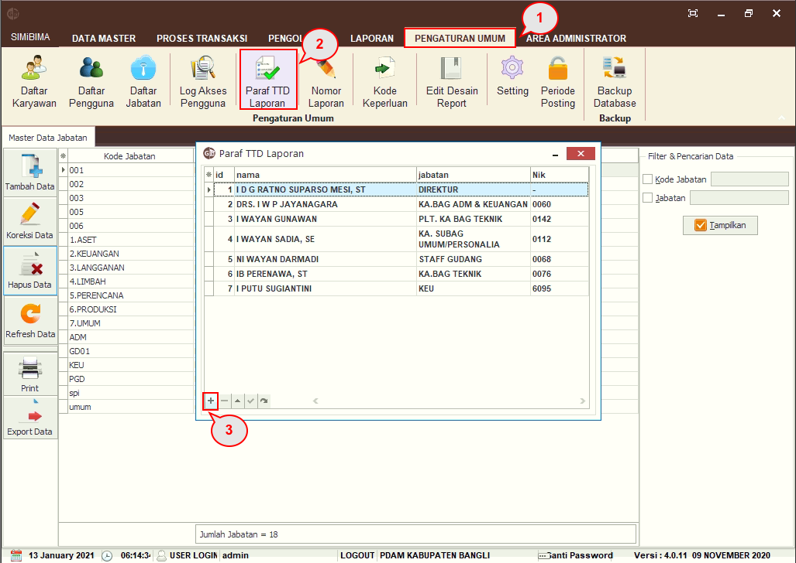
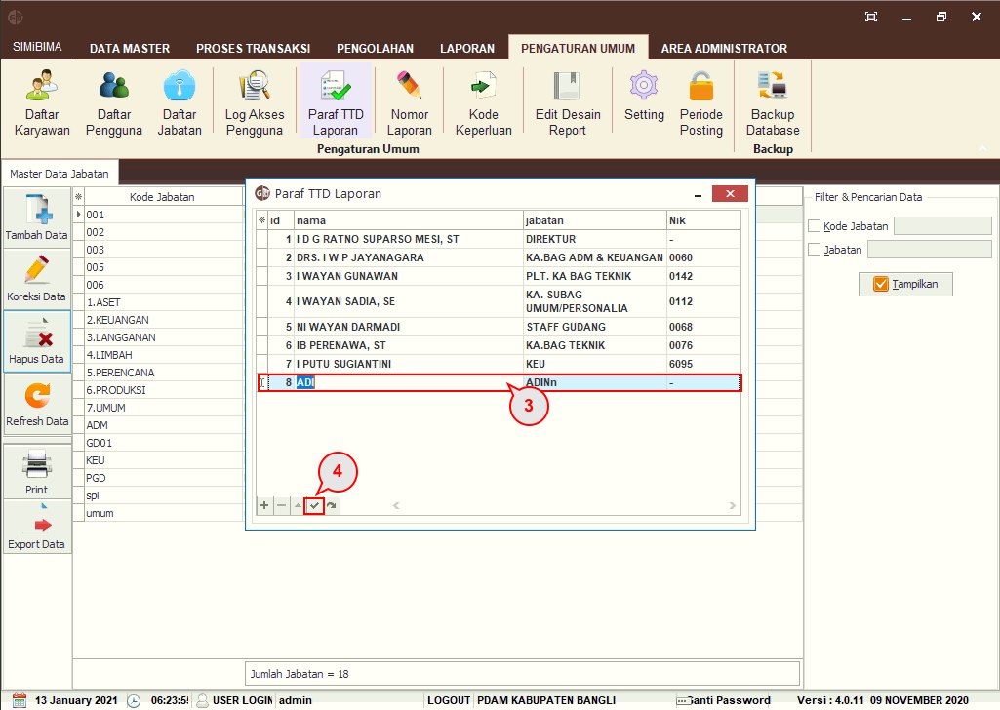

= Setting Paraf TTD Laporan

Untuk _setting_ paraf TTD Laporan, _User_ dapat mengikuti langkah-langkah berikut.

1. Pilih menu *Pengaturan Umum*
2. Klik pada ikon *Paraf TTD Laporan*
3. _Pop up_ data paraf TTD laporan akan muncul, klik pada tombol *plus (+)* di pojok kiri bawah
+

4. Tambahkan *nama, jabatan,* dan *NIK* pada row yang baru saja muncul. Klik pada ikon centang *(✓)* setelah _entry_ data

Untuk mengubah data Paraf TTD Laporan, anda bisa memilih data Paraf pada daftar data Paraf TTD Laporan, kemudian ubah data.

