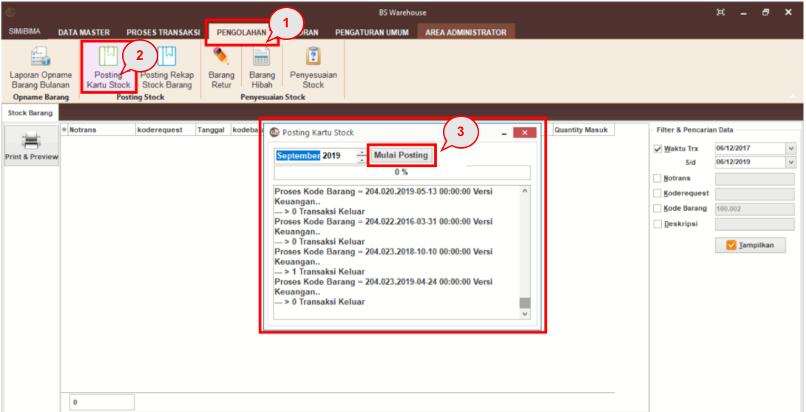
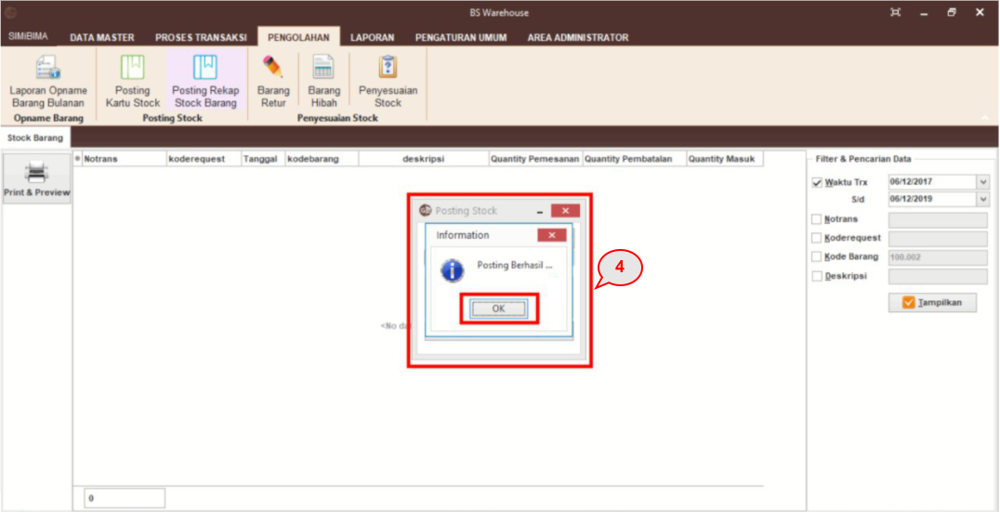

= Memposting Kartu Stok

Fitur ini dapat digunakan untuk posting kartu stok. Hasil posting tersebut dapat dilihat di dalam menu laporan stok barang.

Posting kartu stok dapat dilakukan dengan mengikuti langkah-langkah berikut.

1. Pilih menu *Pengolahan*
2. Klik pada ikon *Posting Kartu Stock*
3. Pada _pop up_ Posting Kartu Stock pilih bulan dan tahun yang ingin di posting. Setelah sesuai maka klik tombol *Mulai Posting*
+

4. Tunggu hingga _loading_ menjadi 100% dan _pop up information_ akan keluar. Kemudian tekan tombol *OK*.
