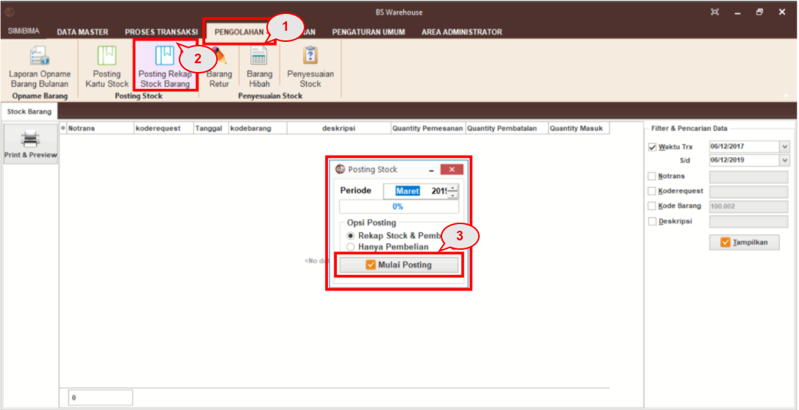
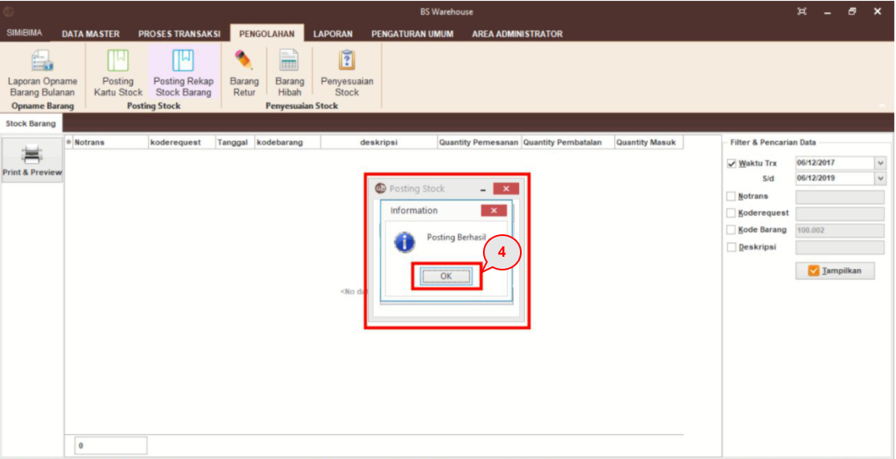

= Memposting Kartu Stok Barang

Fitur ini dapat digunakan untuk posting rekap stok barang. Hasil posting tersebut dapat dilihat di dalam menu laporan rekap stok barang bulanan.

_Posting_ kartu stok barang dapat dilakukan dengan mengikuti langkah-langkah berikut.

1. Pilih menu *Pengolahan*
2. Klik pada ikon *Posting Rekap Stock Barang*
3. Pada _pop up_ Posting Kartu Stock pilih *Periode* dan *Opsi Posting* yang ingin. Setelah sesuai maka klik tombol *Mulai Posting*
+

4. Tunggu hingga loading menjadi 100%. _Pop up information_ akan keluar, tekan tombol *OK*.
