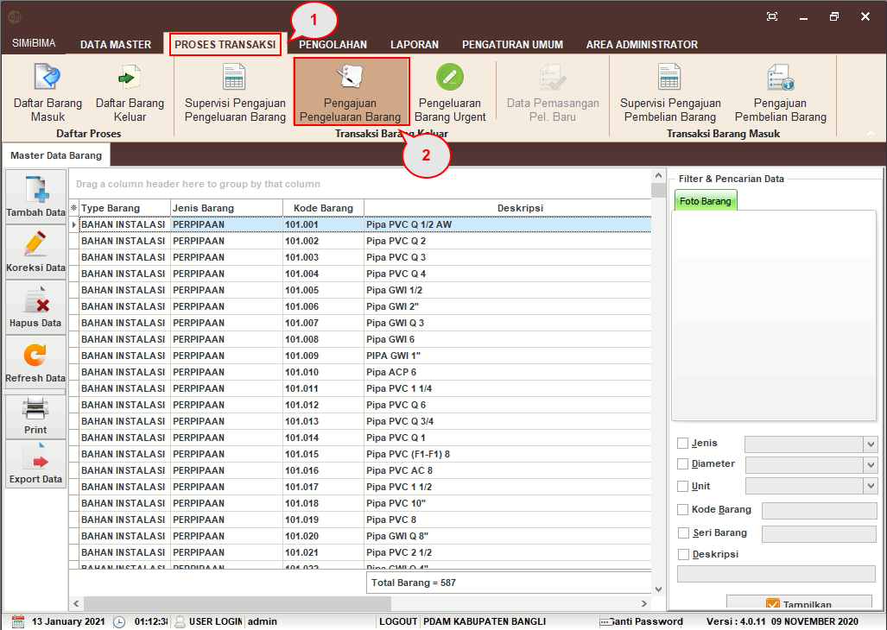
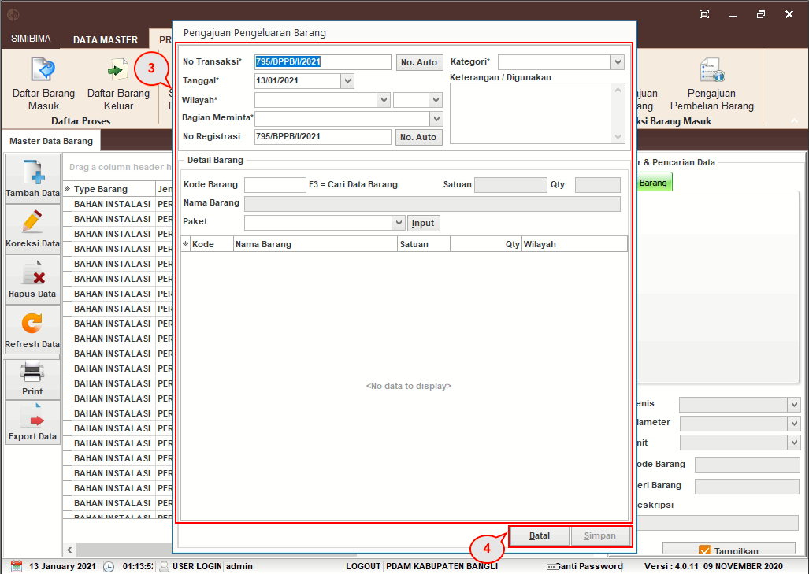

= Membuat Permintaan Pengeluaran Barang

Mengajukan pengeluaran barang yang akan diminta oleh bagian tertentu, _User_ dapat mengikuti langkah-langkah di bawah ini.

1. Pilih menu *Proses Transaksi*
2. Klik pada ikon *Pengajuan Pengeluaran Barang*
+

3. Form Pengajuan Pengeluaran Barang akan muncul. Isi *Tanggal, Wilayah, Bagian yang Meminta, Kategori, dan Keterangan Penggunaan*. Untuk Nomor Transaksi dan Nomor Registrasi akan otomatis terisi, kemudian ketik/tekan *F3* pada keyboard untuk memunculkan nama barang dan pilih barang yang diperlukan. Lakukan sampai barang yang diperlukan sudah terinput semua
4. Klik pada tombol *Simpan* hingga muncul _pop up_  data berhasil disimpan
5. Klik *OK* pada _pop up_, maka Data Pengajuan Pengeluaran Data akan ditampilkan dalam PDF _Viewer_. _User_ dapat mencetak pengajuan tersebut.