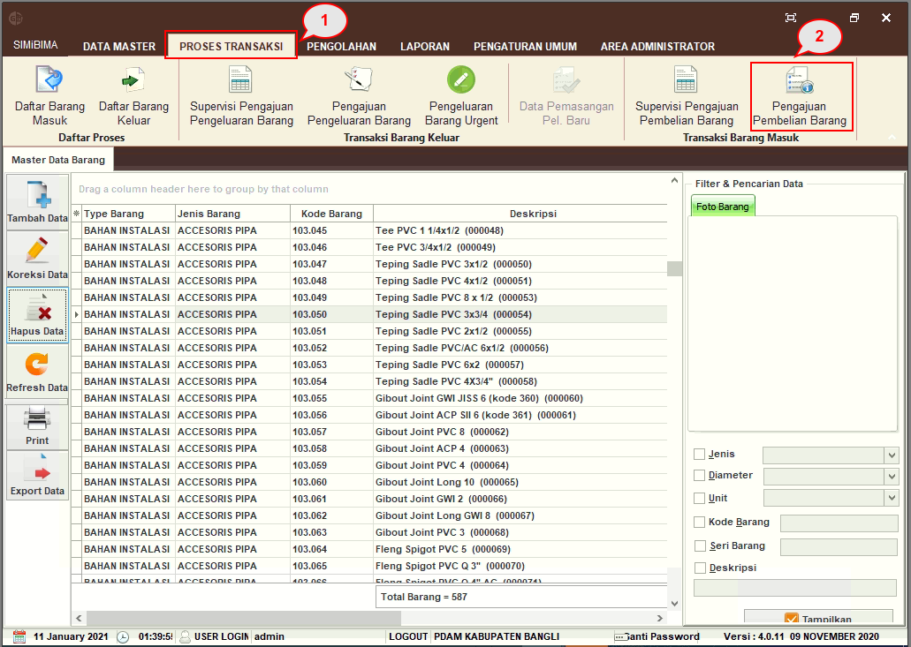
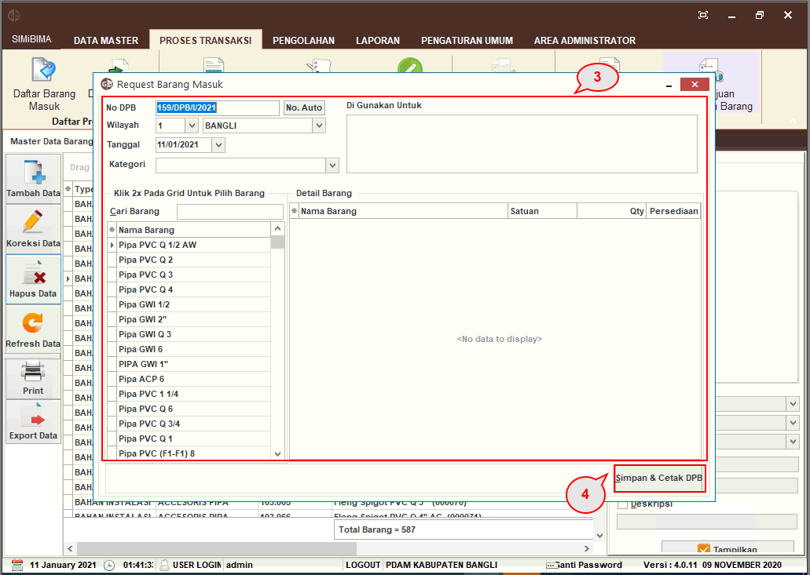
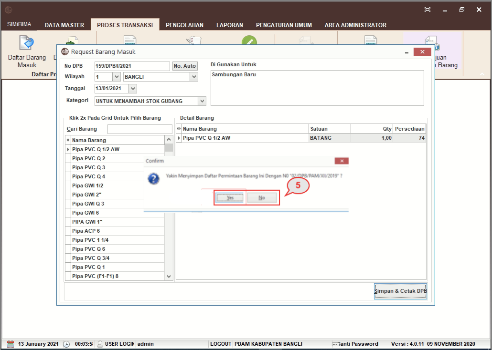
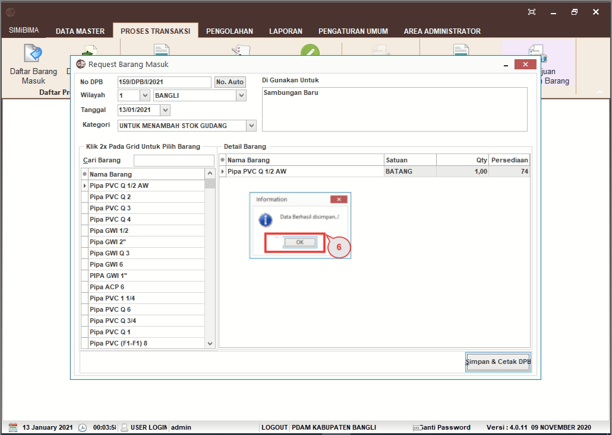

= Request Barang Masuk

Ikuti langkah di bawah ini untuk mengajukan pembelian barang yang akan diminta oleh bagian tertentu.

1. Pilih menu *Pengelolaan Barang*
2. Klik pada ikon *Pengajuan Pembelian Barang*
+

3. Form Pengajuan Pengeluaran Barang akan muncul. *Isi Nomor DPB, Wilayah, Tanggal, Kategori, Kegunaan,* dan *Barang yang akan dikeluarkan*
4. Klik pada tombol *Simpan dan Cetak DPB*
+

5. Akan muncul _pop up_ konfirmasi untuk menyimpan data _request_, klik *Yes* jika data sudah benar
+

6. _Pop up_ bahwa data telah berhasil disimpan akan muncul, klik pada tombol *OK*, maka akan muncul _preview_ PDF Daftar Permintaan Barang (PDB) yang dapat dicetak kemudian.