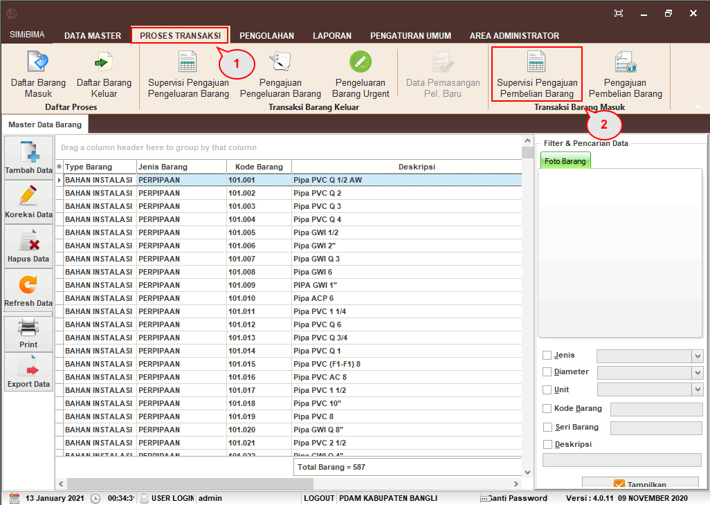
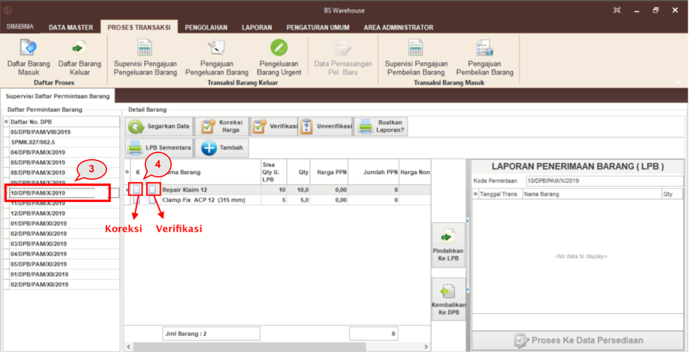
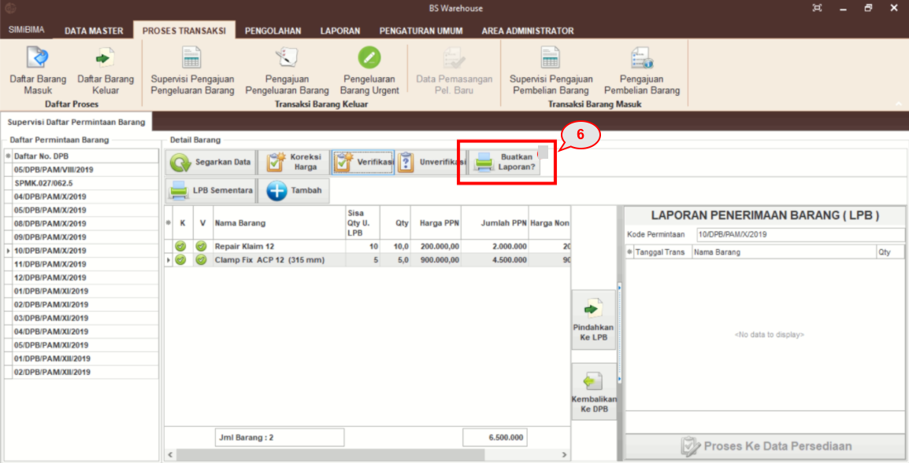
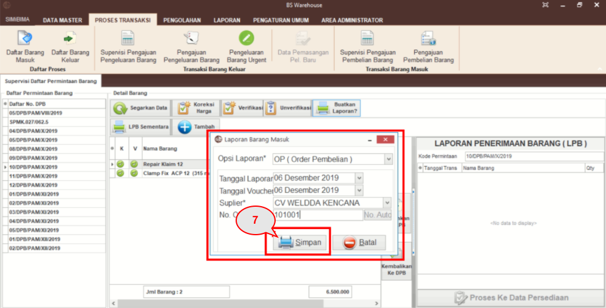
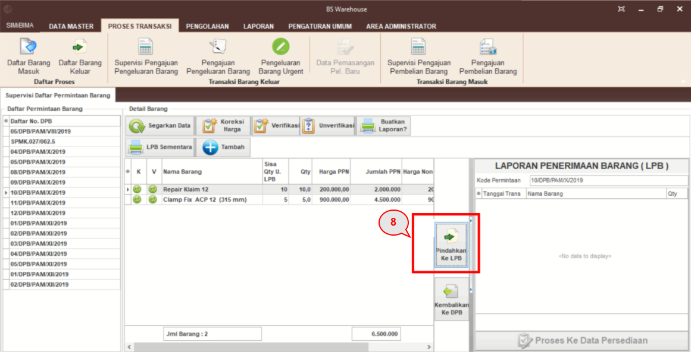
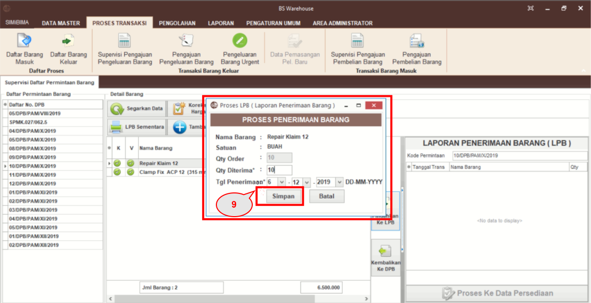
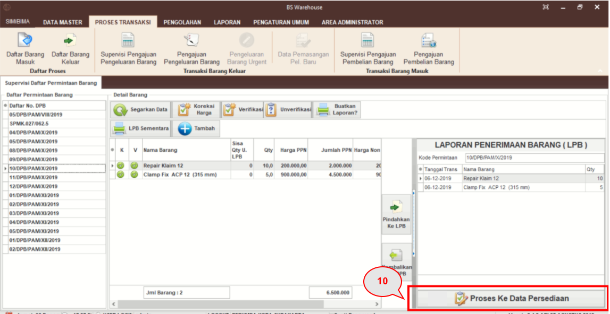
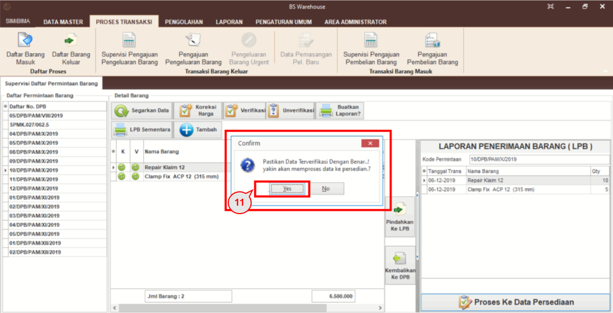
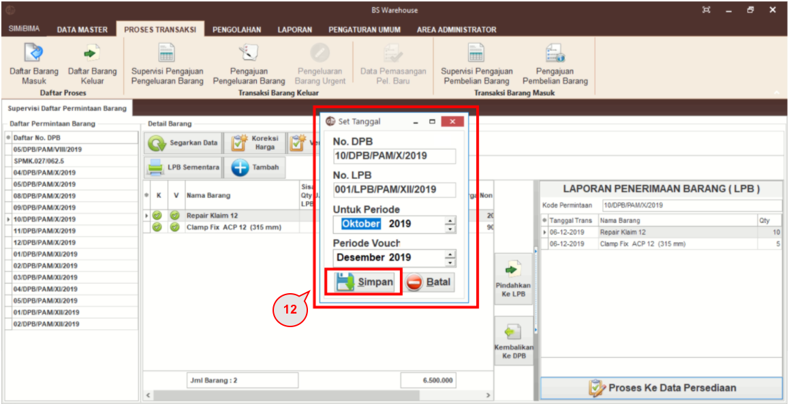
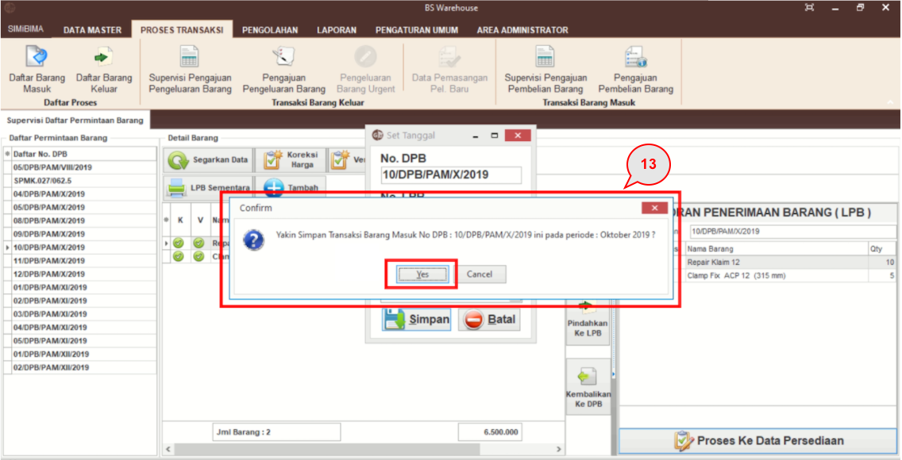

= Supervisi Pengajuan Pembelian Barang

Ikuti langkah di bawah ini untuk menggunakan fitur *Pengklarifikasian Bukti Pembelian Barang*.

1. Pilih menu *Pengelolaan Barang*
2. Klik pada ikon *Supervisi Pengajuan Pembelian Barang*
+

3. Daftar Permintaan Barang (DPB) akan muncul, klik pada salah satu DPB
4. Pada masing-masing data barang, lakukan koreksi harga dan _verifikasi_. Klik dua kali pada _checkbox_ *Koreksi* untuk mengoreksi harga sesudah PPN
+

5. Klik tombol *Verifikasi* sampai muncul tanda centang pada _checkbox_ verifikasi
+

6. Tulis laporan dengan klik tombol *Buatkan Laporan*
+

7. Isi _field_ *Opsi Laporan, Tanggal Laporan, Tanggal Voucher, Supplier, dan No.OP*, kemudian klik pada tombol *Simpan*
+

8. Setelah laporan selesai dibuat, pindahkan data DPB yang sudah diverifikasi ke Laporan Penerimaan Barang (LPB) dengan klik tombol *Pindahkan ke LPB*. Pemindahan data ini dilakukan apabila barang yang ada pada data DPB tersebut sudah diterima pihak PDAM.
+

9. _Pop Up_ Proses Laporan Penerimaan Barang (LPB) akan muncul, isi *Quantity* barang yang diterima sesuai jumlah barang yang diterima, kemudian klik pada tombol *Simpan*. Jika _qty_ penerimaan barang belum sesuai atau kurang dengan _qty_ OP, maka dapat menggunakan fitur laporan LPB Sementara. Sehingga ketika semua barang sudah diterima sesuai dengan _qty_ pada OP, maka proses dapat dilanjutkan ke Proses ke Data Persediaan.
+

10. Setelah data dipindahkan ke LPB, klik pada *Proses ke Data Persediaan*. Proses ke data persediaan ini dilakukan apabila data barang di LPB sudah semua diterima oleh pihak PDAM
+

11. _Pop up_ konfirmasi untuk memproses pada data persediaan akan muncul, klik pada tombol *Yes* jika semua data sudah terverifikasi dengan benar
+

12. _Pop up *Set_ Tanggal* akan muncul, pastikan nomor DPB dan LPB sudah benar, isi _field_ Periode yang tersedia. Untuk Periode Voucher, isi dengan bulan di mana voucher tersebut sudah diakui, kemudian klik *Simpan*
+

13. Setelah menentukan periode, akan muncul _pop up_ konfirmasi kembali untuk menyimpan transaksi barang masuk. Klik pada tombol *Yes* untuk menyimpan data hingga muncul _pop up_ data berhasil disimpan
14. Klik *OK* pada _pop up_ sehingga muncul LPB dalam versi PDF yang dapat dicetak.