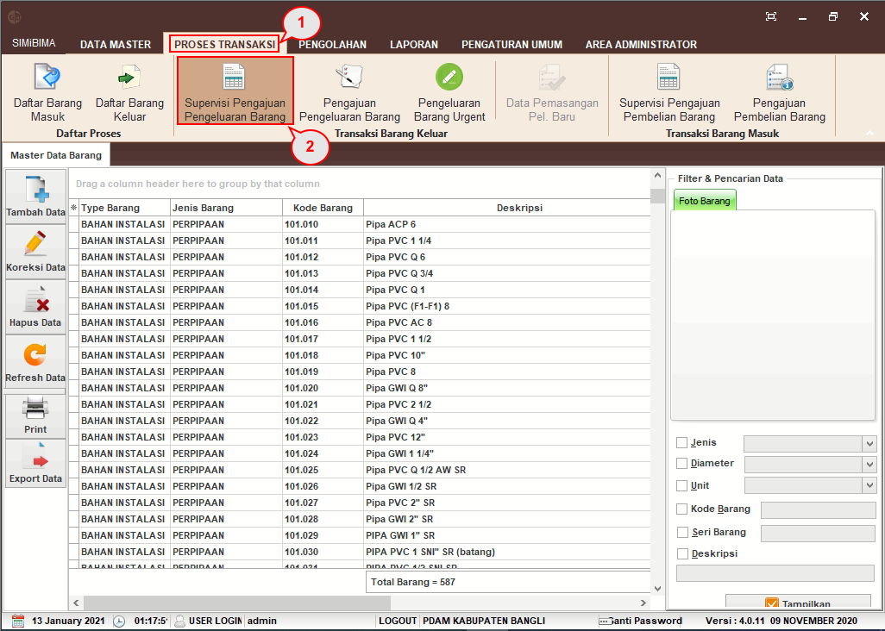
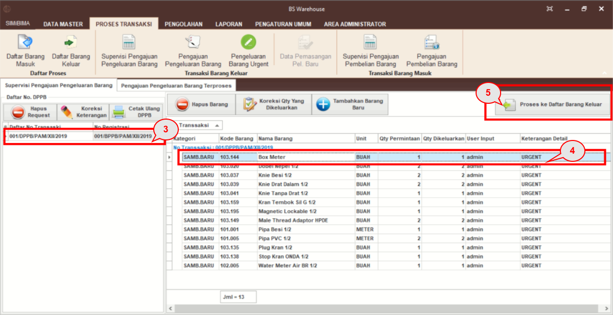
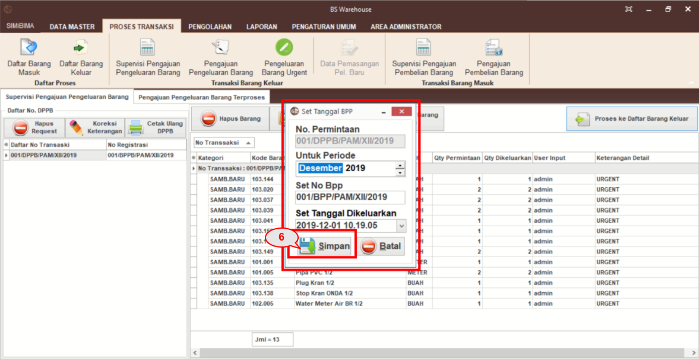

= Supervisi Pengajuan Pengeluaran Barang

Proses klarifikasi bukti permintaan pengeluaran dapat dilakukan dengan mengikuti langkah-langkah berikut.

1. Pilih menu *Proses Transaksi*
2. Klik pada ikon *Supervisi Pengajuan Pengeluaran Barang*
+

3. Daftar Pengajuan Pengeluaran Barang (DPPB) akan muncul, klik pada salah satu DPPB
4. Pada masing-masing data barang, lakukan pengecekan kembali untuk memastikan data yang di _input_ sudah benar. Lalu, koreksi _Quantity_ (hal ini dilakukan apabila kuantitas tersebut dianggap salah atau salah ketik waktu penginputan data). Kemudian, klik dua kali pada data barang, setelah itu koreksi dengan memasukkan _Quantity_ yang benar. Jika terdapat data yang kurang atau kelebihan, _User_ dapat juga menambah dan menghapusnya
5. Jika semua data telah dikoreksi, klik pada *Proses ke Daftar Barang Keluar*
+

6. _Pop Up *Set_ Tanggal* BPP akan muncul, masukkan *Periode*, No.BPP, dan Tanggal Dikeluarkan, kemudian klik tombol *Simpan*
7. Aplikasi akan melakukan _generate_ data, kemudian Bukti Permintaan dan Pengeluaran barang akan muncul dalam versi PDF. _User_ dapat mencetak BPP tersebut.
