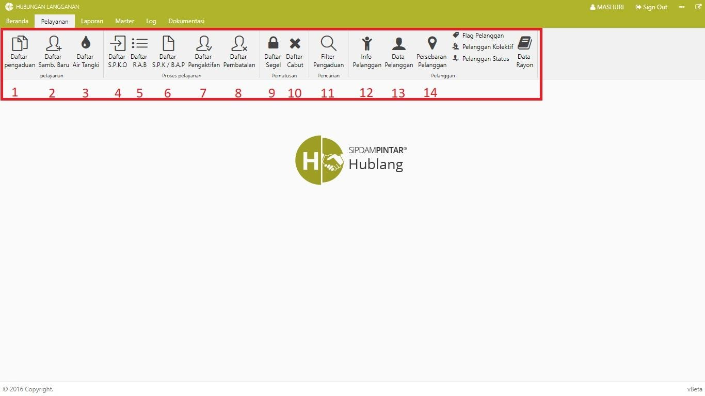
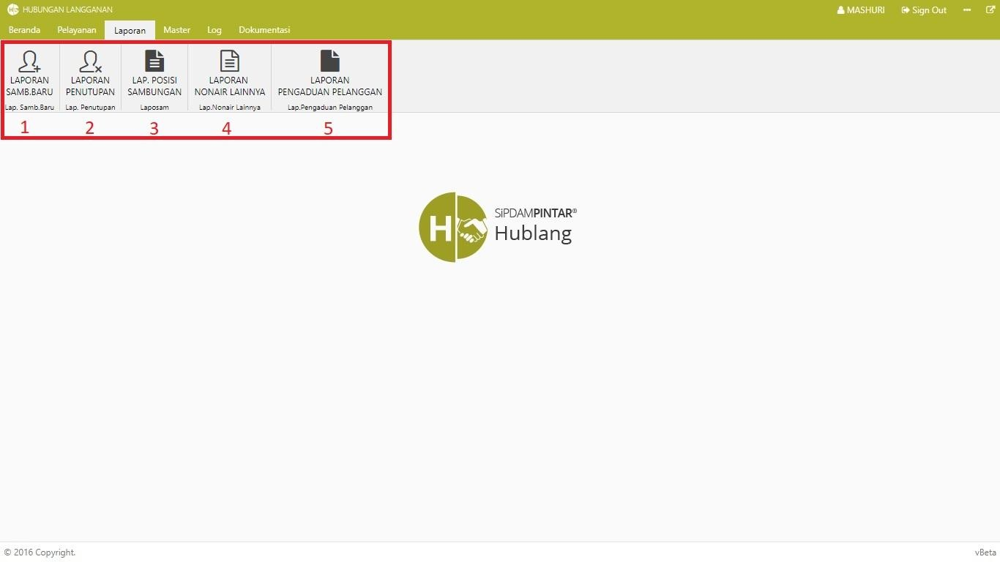
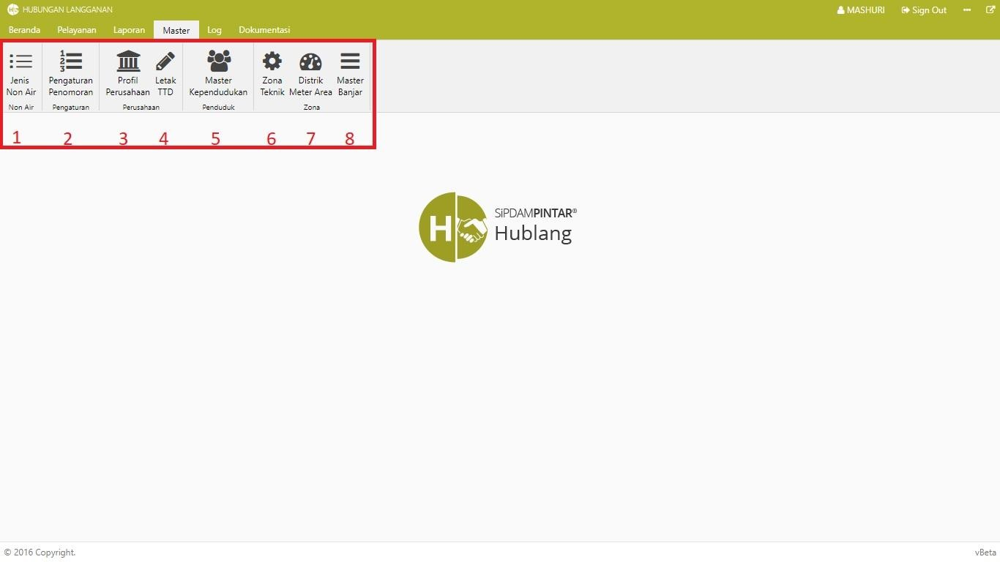
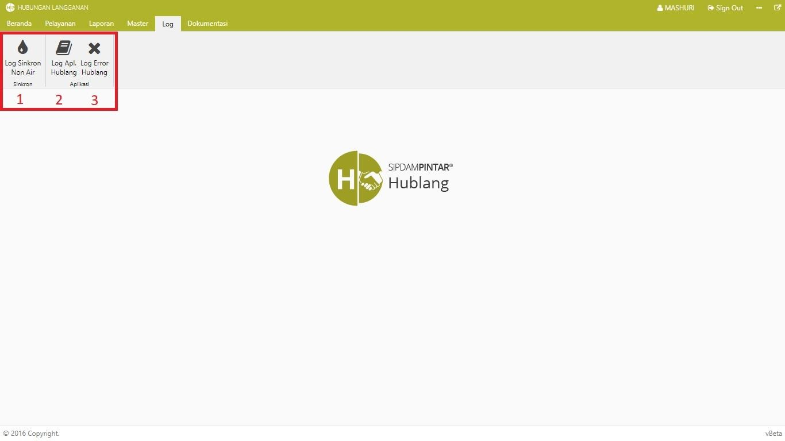

= Menu Modul Hublang (Web Version)

Berikut adalah deskripsi secara umum dari menu Modul Hublang (Web Version): 

.Menu Pelayanan
[%collapsible]
====

Berikut adalah penjelasan dari ikon di setiap poin:

1. Ikon *Daftar Pengaduan* menyediakan fasilitas untuk memasukkan/menambahkan pengaduan dari pelanggan maupun non pelanggan seperti sambungan baru, sambungan kembali, pindah alamat, pipa bocor, balik nama dll.

2. Ikon *Daftar Sambungan Baru* menyediakan fasilitas untuk memasukkan data sambungan baru non-pelanggan yang akan data sesuai regulasi sistem.

3. Ikon *Daftar Air Tangki* menyediakan fasilitas untuk memasukkan data pembelian atau pembayaran air satu tangki dimana data yang  harga jual bisa dimasukkan sesuai harga di lapangan.

4. Ikon *Daftar S.P.K.O* menyediakan fasilitas untuk pembuatan S.P.K.O (Surat Perintah Kerja Opname) atas pengaduan yang dimasukkan.

5. Ikon *Daftar R.A.B* menyediakan fasilitas rincian daftar RAB yang telah dibuat sebelumnya oleh perencanaan

6. Ikon *S.P.K/B.A.P* menyediakan fasilitas daftar SPK (Surat Perintah Kerja /(Berita Acara Pemasangan) yang telah dibuat sebelumnya di bagian teknik.

7. Ikon* Daftar Pengaktifan* menyediakan fasilitas pengaktifan pelanggan baru setelah proses pemasangan dinyatakan selesai atau Berita Acara Pemasangannya telah selesai dilakukan.

8. Ikon *Daftar Pembatalan* menyediakan fasilitas untuk membatalkan segala macam pengaduan yang telah dimasukkan sebelumnya.

9. Ikon *Daftar Segel* menyediakan fasilitas untuk menampilkan daftar SEGEL dari pelanggan yang memiliki tunggakan sesuai dengan kebijakan PDAM (misalnya 2 bulan atau lebih).

10. Ikon *Daftar Cabut* menyediakan fasilitas untuk menampilkan daftar CABUT dari pelanggan yang memiliki tunggakan sesuai dengan kebijakan PDAM (misalnya 3 bulan atau lebih).

11. Ikon *Filter Pengaduan Pelanggan *menyediakan fasilitas filter / pencarian berdasarkan parameter/rujukan yang diinginkan dengan tujuan agar user/pengguna lebih mudah mencari data yang diinginkan.

12. Ikon *Info Pelanggan* menyediakan fasilitas untuk menampilkan informasi pelanggan PDAM, seperti keterangan tagihan dan riwayat pengaduan.

13. Ikon *Data Pelanggan* menyediakan fasilitas untuk menampilkan informasi seluruh pelanggan yang sudah terdaftar pada PDAM

14. Ikon *Pemetaan Pelanggan* menyediakan fasilitas persebaran pelanggan yang ditampilkan melalui map sehingga titik lokasi rumah pelanggan dapat dilihat dan memudahkan petugas PDAM dalam menemukan rumah pelanggan
====

.Menu Laporan
[%collapsible]
====

Berikut adalah penjelasan dari ikon di setiap poin:

1. Ikon *Laporan Sambungan Baru* menyajikan laporan daftar calon pelanggan PDAM yang telah membayar

2. Ikon *Laporan Penutupan* menyajikan laporan daftar sambungan yang akan segera ditutup percabang daerah

3. Ikon *Laporan Posisi Sambungan* menyajikan laporan status data lengkap sambungan langganan PDAM.

4. Ikon *Laporan Non Air Lainnya* menyajikan laporan RAB dari langganan PDAM yang berhubungan dengan kebutuhan non-air.

5. Ikon *Laporan Pengaduan Pelanggan* menyajikan laporan tentang pengaduan masalah dari  pelanggan PDAM serta penanganan yang dilakukan.
====

.Menu Master
[%collapsible]
====

Berikut penjelasan ikon di setiap poinnya :

1. Ikon *Jenis Non Air* menyediakan fasilitas untuk memanipulasi jenis non-air yang ada di PDAM

2. Ikon *Pengaturan Penomoran* menyediakan fasilitas untuk mengatur format penomoran surat

3. Ikon *Profil Perusahaan* menyediakan fasilitas untuk menambahkan data yang menyangkut profil perusahaan.

4. Ikon *Letak TTD* menyediakan fasilitas untuk mengubah tata letak TTD serta nama, jabatan dan NIP pegawai yang bertandatangan.

5. Ikon *Master Kependudukan* menyediakan fasilitas untuk memanipulasi data master kependudukan PDAM.

6. Ikon *Zona Teknik* menyediakan fasilitas untuk memanipulasi data zona teknik PDAM.

7. Ikon *Distrik Meter Area* menyediakan fasilitas untuk memanipulasi data master area PDAM.

8. Ikon *Master Banjar* menyediakan fasilitas untuk memanipulasi data Banjar PDAM.
====

.Menu Log
[%collapsible]
====

Berikut penjelasan ikon di setiap poinnya :

1. Ikon *Log Sinkron Non Air* menyediakan fasilitas pencatatan sinkronisasi yang dilakukan.

2. Ikon *Log Aplikasi Hublang* menyediakan fasilitas pencatatan aktivitas pada saat penggunaan modul hublang.

3. Ikon *Log Error Hublang* menyediakan fasilitas pencatatan aktifitas error yang terjadi saat penggunaan mode hublang.
====

