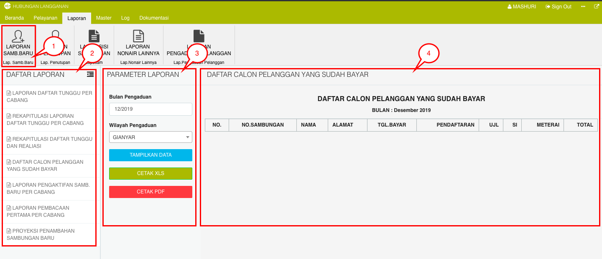
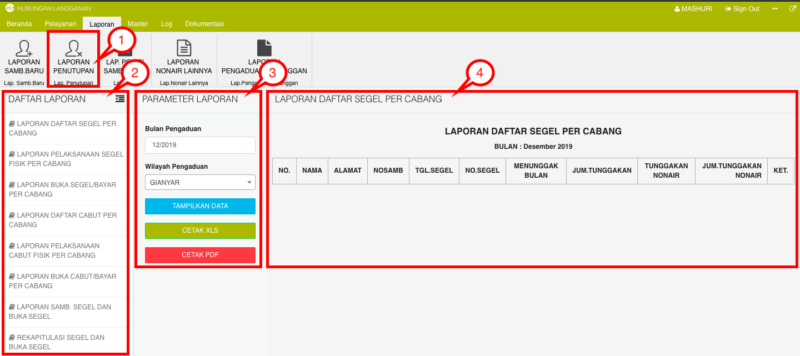
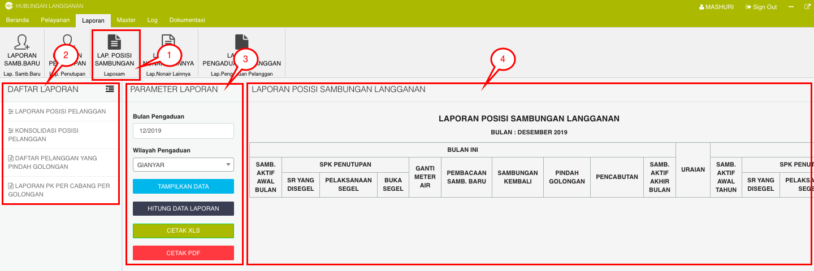
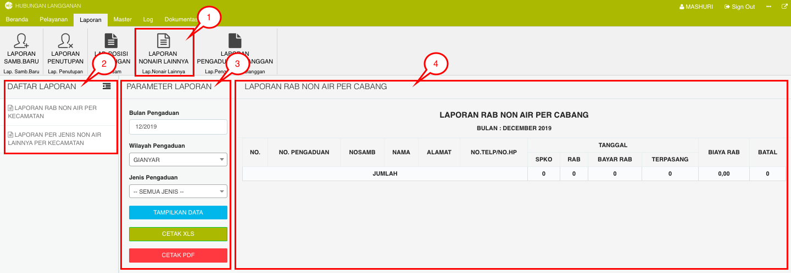
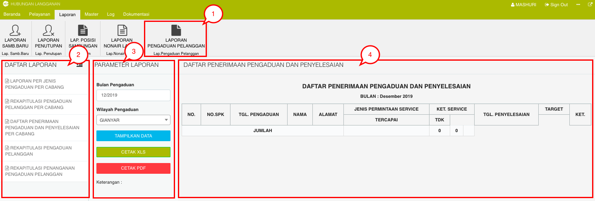

= Menampilkan laporan

Dalam Modul Hublang (Web version) terdapat lima (5) jenis laporan yang dapat ditampilkan. Berikut adalah cara untuk menampilkan masing-masing laporan : 

.*Laporan Sambungan Baru*
[%collapsible]
====

Berikut cara untuk menampilkan data laporan :

1. Klik ikon *Laporan Sambungan Baru* untuk menampilkan seluruh jenis laporan sambungan baru PDAM.

2. Pilih pada bagian opsi *Daftar Laporan* untuk menentukan jenis laporan, sistem secara otomatis akan menampilkan daftar laporan calon pelanggan baru yang telah melakukan pembayaran.

3. Pilih pada kolom *Parameter Laporan* untuk melakukan filtering data laporan yang ingin ditampilkan berdasarkan bulan dan wilayah. Anda dapat menampilkan data secara langsung dengan menekan tombol *Tampilkan Data* atau Anda dapat mempresentasikan data tersebut ke dalam format excel maupun pdf.

4. Tampilan _preview_ opsi laporan terpilih sebelumnya
====

.*Laporan Penutupan*
[%collapsible]
====

Berikut cara untuk menampilkan data laporan :

1. Klik ikon *Laporan Penutupan* untuk menampilkan seluruh jenis laporan segel atau penutupan saluran PDAM pelanggan.

2. Pilih pada bagian opsi *Daftar Laporan *untuk menentukan jenis laporan, sistem secara otomatis akan menampilkan daftar segel percabang.

3. Pilih pada kolom *Parameter Laporan* untuk melakukan filtering data laporan yang ingin ditampilkan berdasarkan bulan dan wilayah. Anda dapat menampilkan data secara langsung dengan menekan tombol *Tampilkan Data* atau Anda dapat mempresentasikan data tersebut ke dalam format excel maupun pdf.

4. Tampilan _preview_ opsi laporan terpilih sebelumnya
====

.*Laporan Posisi Sambungan*
[%collapsible]
====

Berikut cara untuk menampilkan data laporan :

1. Klik ikon *Laporan Posisi Sambungan* untuk menampilkan laporan informasi posisi dan status saluran PDAM pelanggan.

2. Pilih pada bagian opsi *Daftar Laporan* untuk menentukan jenis laporan, sistem secara otomatis akan menampilkan daftar segel percabang.

3. Pilih pada kolom *Parameter Laporan* untuk melakukan filtering data laporan yang ingin ditampilkan berdasarkan bulan dan wilayah. Anda dapat menampilkan data secara langsung dengan menekan tombol *Tampilkan Data* atau Anda dapat mempresentasikan data tersebut ke dalam format excel maupun pdf.

4. Tampilan *preview* opsi laporan terpilih sebelumnya
====

.*Laporan Non Air Lainnya*
[%collapsible]
====

Berikut cara untuk menampilkan data laporan :

1. Klik ikon *Laporan Non Air Lainnya* untuk menampilkan laporan informasi tentang maintenance dan kegiatan pendukung saluran PDAM.

2. Pilih pada bagian opsi *Daftar Laporan* untuk menentukan jenis laporan, sistem secara otomatis akan menampilkan daftar segel percabang.

3. Pilih pada kolom *Parameter Laporan* untuk melakukan filtering data laporan yang ingin ditampilkan berdasarkan bulan dan wilayah. Anda dapat menampilkan data secara langsung dengan menekan tombol *Tampilkan Data* atau Anda dapat mempresentasikan data tersebut ke dalam format excel maupun pdf. 

4. Tampilan _preview_ opsi laporan terpilih sebelumnya
====

.*Laporan Pengaduan Pelanggan*
[%collapsible]
====

Berikut cara untuk menampilkan data laporan :

1. Klik ikon Laporan Pengaduan untuk menampilkan laporan informasi tentang permasalahan dan penyelesaian yang terjadi pada pelanggan saluran PDAM.
Pilih pada bagian opsi Daftar Laporan untuk menentukan jenis laporan, sistem secara otomatis akan menampilkan daftar segel percabang.
Pilih pada kolom Parameter Laporan untuk melakukan filtering data laporan yang ingin ditampilkan berdasarkan bulan dan wilayah. Anda dapat menampilkan data secara langsung dengan menekan tombol Tampilkan Data atau Anda dapat mempresentasikan data tersebut ke dalam format excel maupun pdf. 
Tampilan preview opsi laporan terpilih sebelumnya
====